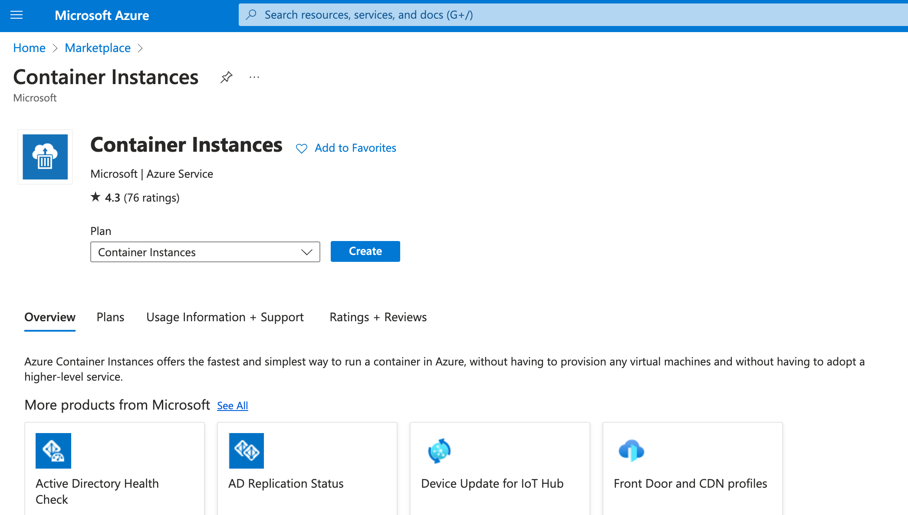
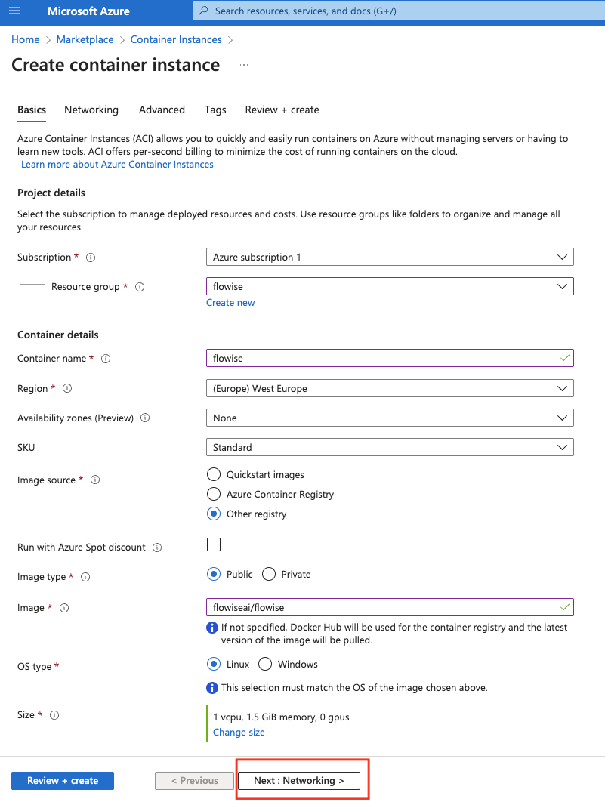
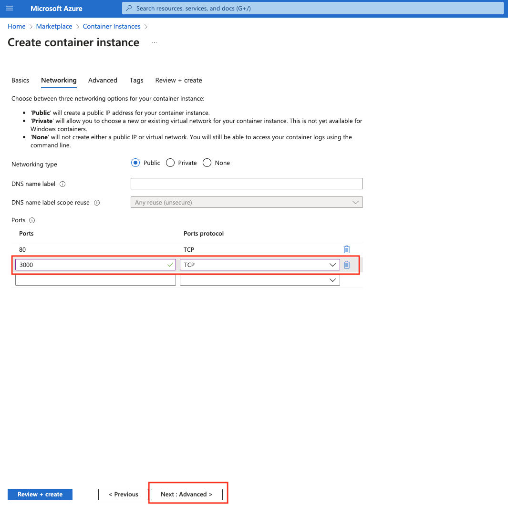
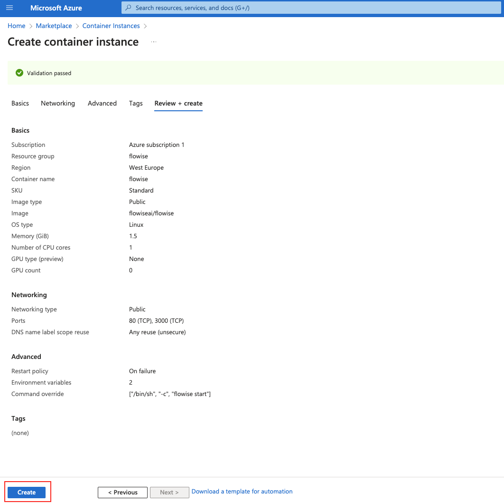
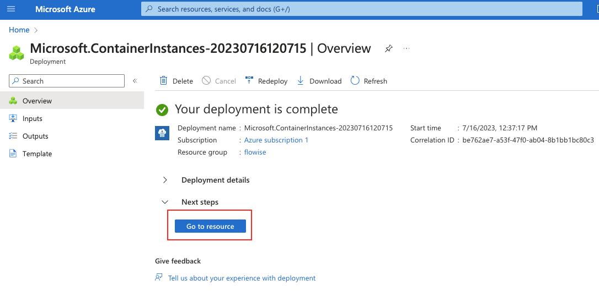
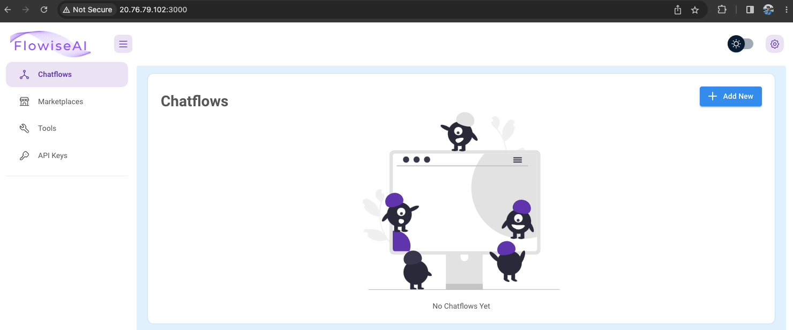

# Azure

***

## Flowise 部署到 Azure 应用服务 (使用 PostgreSQL)：使用 Terraform

### 预备条件

1. **Azure 帐户**: 确保您拥有一个具有活动订阅的 Azure 帐户。如果您没有帐户，请在 [Azure 门户](https://portal.azure.com/) 注册。
2. **Terraform**: 在您的机器上安装 Terraform CLI。您可以从 [Terraform 官网](https://www.terraform.io/downloads.html) 下载。
3. **Azure CLI**: 安装 Azure CLI。说明可在 [Azure CLI 文档页面](https://docs.microsoft.com/en-us/cli/azure/install-azure-cli) 找到。

### 设置您的环境

1. **登录 Azure**: 打开您的终端或命令提示符，并使用以下命令登录 Azure CLI：

```bash
az login --tenant <您的订阅 ID> --use-device-code 
```

按照提示完成登录过程。

2. **设置订阅**: 登录后，使用以下命令设置 Azure 订阅：

```bash
az account set --subscription <您的订阅 ID>
```

3. **初始化 Terraform**:

如果您的 Terraform 项目目录中不存在 `terraform.tfvars` 文件，请创建该文件，并添加以下内容：

```hcl
subscription_name = "订阅名称"
subscription_id = "订阅 ID"
project_name = "WebApp 名称"
db_username = "PostgreSQL用户名"
db_password = "强PostgreSQL密码"
flowise_username = "Flowise用户名"
flowise_password = "强Flowise密码"
flowise_secretkey_overwrite = "长而强的密钥"
webapp_ip_rules = [
  {
    name = "允许的IP"
    ip_address = "X.X.X.X/32"
    headers = null
    virtual_network_subnet_id = null
    subnet_id = null
    service_tag = null
    priority = 300
    action = "Allow"
  }
]
postgres_ip_rules = {
  "ValbyOfficeIP" = "X.X.X.X"
  // 根据需要添加更多键值对
}
source_image = "flowiseai/flowise:latest"
tagged_image = "flow:v1"
```

将占位符替换为您设置的实际值。

文件树结构如下：

```
flow
├── database.tf
├── main.tf
├── network.tf
├── output.tf
├── providers.tf
├── terraform.tfvars
├── terraform.tfvars.example
├── variables.tf
├── webapp.tf
├── .gitignore // 忽略您的 .tfvars 和 .lock.hcf, .terraform

```

Terraform 配置中的每个 `.tf` 文件可能包含基础架构代码的不同方面：

<details>

<summary>`database.tf` 定义 PostgreSQL 数据库的配置。</summary>

```yaml

// database.tf

// 数据库实例
resource "azurerm_postgresql_flexible_server" "postgres" {
  name                         = "postgresql-${var.project_name}"
  location                     = azurerm_resource_group.rg.location
  resource_group_name          = azurerm_resource_group.rg.name
  sku_name                     = "GP_Standard_D2s_v3"
  storage_mb                   = 32768
  version                      = "11"
  delegated_subnet_id          = azurerm_subnet.dbsubnet.id
  private_dns_zone_id          = azurerm_private_dns_zone.postgres.id
  backup_retention_days        = 7
  geo_redundant_backup_enabled = false
  auto_grow_enabled            = false
  administrator_login          = var.db_username
  administrator_password       = var.db_password
  zone                         = "2"

  lifecycle {
    prevent_destroy = false
  }
}

// 防火墙
resource "azurerm_postgresql_flexible_server_firewall_rule" "pg_firewall" {
  for_each         = var.postgres_ip_rules
  name             = each.key
  server_id        = azurerm_postgresql_flexible_server.postgres.id
  start_ip_address = each.value
  end_ip_address   = each.value
}

// 数据库
resource "azurerm_postgresql_flexible_server_database" "production" {
  name      = "production"
  server_id = azurerm_postgresql_flexible_server.postgres.id
  charset   = "UTF8"
  collation = "en_US.utf8"

  # 防止意外的数据丢失
  lifecycle {
    prevent_destroy = false
  }
}

// 关闭传输
resource "azurerm_postgresql_flexible_server_configuration" "postgres_config" {
  name      = "require_secure_transport"
  server_id = azurerm_postgresql_flexible_server.postgres.id
  value     = "off"
}
```

</details>

<details>

<summary>`main.tf` 可能是主配置文件，它可能包含 Azure 提供程序配置并定义 Azure 资源组。</summary>

```yaml
// main.tf
resource "random_string" "resource_code" {
  length  = 5
  special = false
  upper   = false
}

// 资源组
resource "azurerm_resource_group" "rg" {
  location = var.resource_group_location
  name     = "rg-${var.project_name}"
}

// 存储帐户
resource "azurerm_storage_account" "sa" {
  name                     = "${var.subscription_name}${random_string.resource_code.result}"
  resource_group_name      = azurerm_resource_group.rg.name
  location                 = azurerm_resource_group.rg.location
  account_tier             = "Standard"
  account_replication_type = "LRS"

  blob_properties {
    versioning_enabled = true
  }

}

// 文件共享
resource "azurerm_storage_share" "flowise-share" {
  name                 = "flowise"
  storage_account_name = azurerm_storage_account.sa.name
  quota                = 50
}

```

</details>

<details>

<summary>`network.tf` 包含网络资源，例如虚拟网络、子网和网络安全组。</summary>

```yaml
// network.tf

// Vnet
resource "azurerm_virtual_network" "vnet" {
  name                = "vn-${var.project_name}"
  location            = azurerm_resource_group.rg.location
  resource_group_name = azurerm_resource_group.rg.name
  address_space       = ["10.3.0.0/16"]
}

resource "azurerm_subnet" "dbsubnet" {
  name                                      = "db-subnet-${var.project_name}"
  resource_group_name                       = azurerm_resource_group.rg.name
  virtual_network_name                      = azurerm_virtual_network.vnet.name
  address_prefixes                          = ["10.3.1.0/24"]
  private_endpoint_network_policies_enabled = true
  delegation {
    name = "delegation"
    service_delegation {
      name = "Microsoft.DBforPostgreSQL/flexibleServers"
    }
  }
  lifecycle {
    ignore_changes = [
      service_endpoints,
      delegation
    ]
  }
}

resource "azurerm_subnet" "webappsubnet" {

  name                 = "web-app-subnet-${var.project_name}"
  resource_group_name  = azurerm_resource_group.rg.name
  virtual_network_name = azurerm_virtual_network.vnet.name
  address_prefixes     = ["10.3.8.0/24"]

  delegation {
    name = "delegation"
    service_delegation {
      name = "Microsoft.Web/serverFarms"
    }
  }
  lifecycle {
    ignore_changes = [
      delegation
    ]
  }
}

resource "azurerm_private_dns_zone" "postgres" {
  name                = "private.postgres.database.azure.com"
  resource_group_name = azurerm_resource_group.rg.name
}

resource "azurerm_private_dns_zone_virtual_network_link" "postgres" {
  name                  = "private-postgres-vnet-link"
  resource_group_name   = azurerm_resource_group.rg.name
  private_dns_zone_name = azurerm_private_dns_zone.postgres.name
  virtual_network_id    = azurerm_virtual_network.vnet.id
}

```

</details>

<details>

<summary>`providers.tf` 定义 Terraform 提供程序，例如 Azure。</summary>

```yaml
// providers.tf
terraform {
  required_version = ">=0.12"

  required_providers {
    azurerm = {
      source  = "hashicorp/azurerm"
      version = "=3.87.0"
    }
    random = {
      source  = "hashicorp/random"
      version = "~>3.0"
    }
  }
}

provider "azurerm" {
  subscription_id = var.subscription_id
  features {}
}
```

</details>

<details>

<summary>`variables.tf` 声明所有 `.tf` 文件中使用的变量。</summary>

```yaml
// variables.tf
variable "resource_group_location" {
  default     = "westeurope"
  description = "资源组的位置。"
}

variable "container_rg_name" {
  default     = "acrllm"
  description = "容器注册表名称。"
}

variable "subscription_id" {
  type        = string
  sensitive   = true
  description = "服务订阅 ID"
}

variable "subscription_name" {
  type        = string
  description = "服务订阅名称"
}


variable "project_name" {
  type        = string
  description = "项目名称"
}

variable "db_username" {
  type        = string
  description = "数据库用户名"
}

variable "db_password" {
  type        = string
  sensitive   = true
  description = "数据库密码"
}

variable "flowise_username" {
  type        = string
  description = "Flowise 用户名"
}

variable "flowise_password" {
  type        = string
  sensitive   = true
  description = "Flowise 用户密码"
}

variable "flowise_secretkey_overwrite" {
  type        = string
  sensitive   = true
  description = "Flowise 密钥"
}

variable "webapp_ip_rules" {
  type = list(object({
    name                      = string
    ip_address                = string
    headers                   = string
    virtual_network_subnet_id = string
    subnet_id                 = string
    service_tag               = string
    priority                  = number
    action                    = string
  }))
}

variable "postgres_ip_rules" {
  description = "防火墙规则的 IP 地址及其对应名称的映射"
  type        = map(string)
  default     = {}
}

variable "flowise_image" {
  type        = string
  description = "来自 Docker Hub 的 Flowise 镜像"
}

variable "tagged_image" {
  type        = string
  description = "Flowise 镜像版本的标签"
}
```

</details>

<details>

<summary>`webapp.tf`  Azure 应用服务，包括服务计划和 Linux Web 应用</summary>

```yaml
// webapp.tf
# 创建 Linux 应用服务计划
resource "azurerm_service_plan" "webappsp" {
  name                = "asp${var.project_name}"
  resource_group_name = azurerm_resource_group.rg.name
  location            = azurerm_resource_group.rg.location
  os_type             = "Linux"
  sku_name            = "P3v3"
}

resource "azurerm_linux_web_app" "webapp" {
  name                = var.project_name
  resource_group_name = azurerm_resource_group.rg.name
  location            = azurerm_resource_group.rg.location
  service_plan_id     = azurerm_service_plan.webappsp.id

  app_settings = {
    DOCKER_ENABLE_CI                    = true
    WEBSITES_CONTAINER_START_TIME_LIMIT = 1800
    WEBSITES_ENABLE_APP_SERVICE_STORAGE = false
    APIKEY_PATH                         = "/root"
    DATABASE_TYPE                       = "postgres"
    DATABASE_HOST                       = azurerm_postgresql_flexible_server.postgres.fqdn
    DATABASE_NAME                       = azurerm_postgresql_flexible_server_database.production.name
    DATABASE_USER                       = azurerm_postgresql_flexible_server.postgres.administrator_login
    DATABASE_PASSWORD                   = azurerm_postgresql_flexible_server.postgres.administrator_password
    DATABASE_PORT                       = 5432
    FLOWISE_USERNAME                    = var.flowise_username
    FLOWISE_PASSWORD                    = var.flowise_password
    FLOWISE_SECRETKEY_OVERWRITE         = var.flowise_secretkey_overwrite
    PORT                                = 3000
    SECRETKEY_PATH                      = "/root"
    DOCKER_IMAGE_TAG                    = var.tagged_image
  }

  storage_account {
    name         = "${var.project_name}_mount"
    access_key   = azurerm_storage_account.sa.primary_access_key
    account_name = azurerm_storage_account.sa.name
    share_name   = azurerm_storage_share.flowise-share.name
    type         = "AzureFiles"
    mount_path   = "/root"
  }


  https_only = true

  site_config {
    always_on              = true
    vnet_route_all_enabled = true
    dynamic "ip_restriction" {
      for_each = var.webapp_ip_rules
      content {
        name       = ip_restriction.value.name
        ip_address = ip_restriction.value.ip_address
      }
    }
    application_stack {
      docker_image_name        = var.flowise_image
      docker_registry_url      = "https://${azurerm_container_registry.acr.login_server}"
      docker_registry_username = azurerm_container_registry.acr.admin_username
      docker_registry_password = azurerm_container_registry.acr.admin_password
    }
  }

  logs {
    http_logs {
      file_system {
        retention_in_days = 7
        retention_in_mb   = 35
      }

    }
  }

  identity {
    type = "SystemAssigned"
  }

  lifecycle {
    create_before_destroy = false

    ignore_changes = [
      virtual_network_subnet_id
    ]
  }

}

resource "azurerm_app_service_virtual_network_swift_connection" "webappvnetintegrationconnection" {
  app_service_id = azurerm_linux_web_app.webapp.id
  subnet_id      = azurerm_subnet.webappsubnet.id

  depends_on = [azurerm_linux_web_app.webapp, azurerm_subnet.webappsubnet]
}

```

</details>

注意：`.terraform` 目录由 Terraform 在初始化项目 (`terraform init`) 时创建，其中包含 Terraform 运行所需的插件和二进制文件。`.terraform.lock.hcl` 文件用于记录正在使用的确切提供程序版本，以确保在不同的机器上安装一致。

导航到您的 Terraform 项目目录并运行：

```bash
terraform init
```

这将初始化 Terraform 并下载所需的提供程序。

### 配置 Terraform 变量


### 使用 Terraform 部署

1. **计划部署**: 运行 Terraform plan 命令以查看将创建哪些资源：

    ```bash
    terraform plan
    ```
2. **应用部署**: 如果你对计划满意，请应用更改：

    ```bash
    terraform apply
    ```

    在提示时确认操作，Terraform 将开始创建资源。
3. **验证部署**: Terraform 完成后，它将输出任何已定义的输出，例如 IP 地址或域名。在您的 Azure 门户中验证资源是否已正确部署。

***

## Azure 容器实例：使用 Azure 门户 UI 或 Azure CLI

### 预备条件

1. _(可选)_ 如果你想按照基于 CLI 的命令操作，请 [安装 Azure CLI](https://learn.microsoft.com/en-us/cli/azure/install-azure-cli)


## 创建无持久存储的容器实例

如果没有持久性存储，您的数据将保存在内存中。这意味着在容器重新启动时，您存储的所有数据都将消失。

### 在门户中

1. 在市场中搜索容器实例，然后单击“创建”：

<figure><figcaption><p>Azure 市场中的容器实例条目</p></figcaption></figure>

2. 选择或创建一个资源组、容器名称、区域、镜像源“其他注册表”、镜像类型、镜像 `flowiseai/flowise`、操作系统类型和大小。然后单击“下一步：网络”以配置 Flowise 端口：

<figure><figcaption><p>容器实例创建向导的第一页</p></figcaption></figure>

3. 在默认的 `80 (TCP)` 旁边添加一个新的端口 `3000 (TCP)`。然后选择“下一步：高级”：

<figure><figcaption><p>容器实例创建向导的第二页。它询问网络类型和端口。</p></figcaption></figure>

4. 将重启策略设置为“失败时”。接下来，添加 2 个环境变量 `FLOWISE_USERNAME` 和 `FLOWISE_PASSWORD`。添加命令覆盖 `["/bin/sh", "-c", "flowise start"]`。最后单击“查看 + 创建”：

<figure><figcaption><p>容器实例创建向导的第三页。它询问重启策略、环境变量和容器启动时运行的命令。</p></figcaption></figure>

5. 查看最终设置并单击“创建”：

<figure><figcaption><p>容器实例的最终查看和创建页面。</p></figcaption></figure>

6. 创建完成后，单击“转到资源”

<figure><figcaption><p>Azure 中的资源创建结果页面。</p></figcaption></figure>

7. 通过复制 IP 地址并添加 :3000 作为端口来访问您的 Flowise 实例：

<figure><figcaption><p>容器实例概述页面</p></figcaption></figure>

<figure><figcaption><p>作为容器实例部署的 Flowise 应用程序</p></figcaption></figure>

### 使用 Azure CLI 创建

1. 创建一个资源组（如果您还没有）：

```bash
az group create --name flowise-rg --location "西美国"
```

2. 创建一个容器实例：

```bash
az container create -g flowise-rg \
	--name flowise \
	--image flowiseai/flowise \
	--command-line "/bin/sh -c 'flowise start'" \
	--environment-variables FLOWISE_USERNAME=flowise-user FLOWISE_PASSWORD=flowise-password \
	--ip-address public \
	--ports 80 3000 \
	--restart-policy OnFailure
```

3. 访问上面命令输出中打印的 IP 地址（包括端口 :3000）。

## 创建具有持久存储的容器实例

只有使用 CLI 才能创建具有持久存储的容器实例：

1. 创建一个资源组（如果您还没有）：

```bash
az group create --name flowise-rg --location "西美国"
```

2. 在上面的资源组中创建存储帐户资源（或使用现有的资源）。您可以查看 [此处](https://learn.microsoft.com/en-us/azure/storage/files/storage-how-to-use-files-portal?tabs=azure-portal) 如何操作。
3. 在 Azure 存储中创建新的文件共享。您可以查看 [此处](https://learn.microsoft.com/en-us/azure/storage/files/storage-how-to-use-files-portal?tabs=azure-portal) 如何操作。
4. 创建一个容器实例：

```bash
az container create -g flowise-rg \
	--name flowise \
	--image flowiseai/flowise \
	--command-line "/bin/sh -c 'flowise start'" \
	--environment-variables FLOWISE_USERNAME=flowise-user FLOWISE_PASSWORD=flowise-password DATABASE_PATH=/opt/flowise/.flowise APIKEY_PATH=/opt/flowise/.flowise SECRETKEY_PATH=/opt/flowise/.flowise LOG_PATH=/opt/flowise/.flowise/logs BLOB_STORAGE_PATH=/opt/flowise/.flowise/storage \
	--ip-address public \
	--ports 80 3000 \
	--restart-policy OnFailure \
	--azure-file-volume-share-name  您的文件共享名称 \
	--azure-file-volume-account-name 您的存储帐户名称 \
	--azure-file-volume-account-key 您的存储帐户访问密钥 \
	--azure-file-volume-mount-path /opt/flowise/.flowise
```

5. 访问上面命令输出中打印的 IP 地址（包括端口 :3000）。
6. 从现在开始，您的数据将存储在您可以在文件共享中找到的 SQLite 数据库中。

观看关于部署到 Azure 容器实例的视频教程：




This translation maintains the original structure and code blocks while translating the text into Chinese.  Placeholders like `<Your Subscription ID>` are translated to their Chinese equivalents.  The comments within the code blocks are also translated for clarity.  The image descriptions are also translated.
