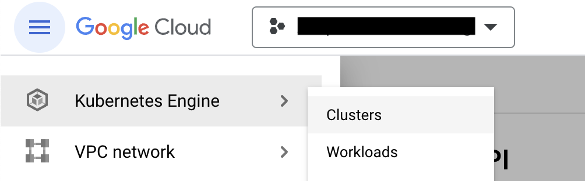
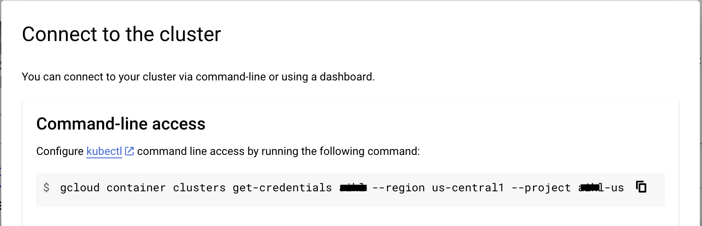
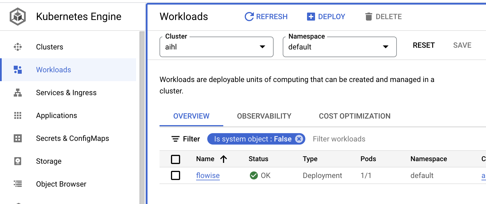

# 在GCP上部署Flowise

***

## 预备条件

1. 记下您的Google Cloud项目ID（`[ProjectId]`）。
2. 安装[Git](https://git-scm.com/book/en/v2/Getting-Started-Installing-Git)。
3. 安装[Google Cloud CLI](https://cloud.google.com/sdk/docs/install-sdk)。
4. 安装[Docker Desktop](https://docs.docker.com/desktop/)。

## 设置Kubernetes集群

1. 如果您还没有Kubernetes集群，请创建一个。

<figure><figcaption>点击“集群”创建一个。</figcaption></figure>

2. 为集群命名，选择正确的资源位置，使用“Autopilot”模式，并保留所有其他默认配置。
3. 集群创建完成后，点击操作菜单中的“连接”菜单。

<figure><figcaption></figcaption></figure>

4. 复制命令并将其粘贴到您的终端中，然后按Enter键连接您的集群。
5. 运行以下命令并选择正确的上下文名称，该名称类似于`gke_[ProjectId]_[DataCenter]_[ClusterName]`：

代码块0
```bash
kubectl config get-contexts
```
代码块1

6. 设置当前上下文：

代码块2
```bash
kubectl config use-context gke_[ProjectId]_[DataCenter]_[ClusterName]
```
代码块3

## 构建和推送Docker镜像

运行以下命令以构建Docker镜像并将其推送到GCP容器注册表。

1. 克隆Flowise仓库：

代码块4
```bash
git clone https://github.com/FlowiseAI/Flowise.git
```
代码块5

2. 构建Flowise：

代码块6
```bash
cd Flowise
pnpm install
pnpm build
```
代码块7

3. 更新`Dockerfile`文件：

> 指定nodejs平台：
>
> 代码块8
> ```dockerfile
> FROM --platform=linux/amd64 node:18-alpine
> ```
> 代码块9
>
> 添加python3、make和g++进行安装：
>
> 代码块10
> ```dockerfile
> RUN apk add --no-cache python3 make g++
> ```
> 代码块11

4. 构建Docker镜像，确保Docker Desktop应用程序正在运行：

代码块12
```bash
docker build -t gcr.io/[ProjectId]/flowise:dev .
```

5. 将Docker镜像推送到GCP容器注册表：

```bash
docker push gcr.io/[ProjectId]/flowise:dev
```

## 部署到GCP

1. 在项目中创建一个名为`yamls`的根文件夹。
2. 将`deployment.yaml`文件添加到该文件夹中。

```yaml
# deployment.yaml
apiVersion: apps/v1
kind: Deployment
metadata:
  name: flowise
  labels:
    app: flowise
spec:
  selector:
    matchLabels:
      app: flowise
  replicas: 1
  template:
    metadata:
      labels:
        app: flowise
    spec:
      containers:
      - name: flowise
        image: gcr.io/[ProjectID]/flowise:dev
        imagePullPolicy: Always
        resources:
          requests:
            cpu: "1"
            memory: "1Gi"
```

3. 将`service.yaml`文件添加到该文件夹中。

```yaml
# service.yaml
apiVersion: "v1"
kind: "Service"
metadata:
  name: "flowise-service"
  namespace: "default"
  labels:
    app: "flowise"
spec:
  ports:
  - protocol: "TCP"
    port: 80
    targetPort: 3000
  selector:
    app: "flowise"
  type: "LoadBalancer"
```

最终效果如下所示：

<figure><figcaption></figcaption></figure>

4. 通过运行以下命令部署yaml文件：

```bash
kubectl apply -f yamls/deployment.yaml
kubectl apply -f yamls/service.yaml
```

5. 在GCP中转到“工作负载”，您可以看到您的Pod正在运行。

<figure><figcaption></figcaption></figure>

6. 转到“服务和入口”，您可以点击托管Flowise的“端点”。

<figure><figcaption></figcaption></figure>

## 祝贺！

您已成功在GCP上托管Flowise应用程序 [🥳](https://emojipedia.org/partying-face/)

## 超时设置

默认情况下，GCP为代理分配了30秒的超时时间。当响应时间超过30秒阈值时，这会导致问题。为了解决这个问题，请对YAML文件进行以下更改：

注意：例如，要将超时设置为10分钟，我们在下面指定600秒。

1. 创建一个包含以下内容的`backendconfig.yaml`文件：

```yaml
apiVersion: cloud.google.com/v1
kind: BackendConfig
metadata:
  name: flowise-backendconfig
  namespace: your-namespace # 请替换为您的命名空间
spec:
  timeoutSec: 600
```

2. 执行：`kubectl apply -f backendconfig.yaml`

3. 使用以下内容更新您的`service.yaml`文件，以引用`BackendConfig`：

```yaml
apiVersion: v1
kind: Service
metadata:
  annotations:
    cloud.google.com/backend-config: '{"default": "flowise-backendconfig"}'
  name: flowise-service
  namespace: your-namespace # 请替换为您的命名空间
...
```

4. 执行：`kubectl apply -f service.yaml`


This translation maintains the original formatting and numbering,  and adds clarifications where necessary, such as specifying the need to replace `your-namespace` with the actual namespace.
