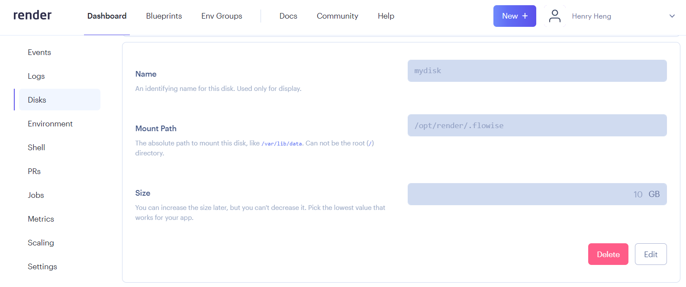

## 在 Render 上部署 Flowise

### 步骤

1. Fork [Flowise 官方仓库](https://github.com/FlowiseAI/Flowise)
2. 前往您的 GitHub 个人资料，确保已成功创建 Fork。
3. 登录 [Render](https://dashboard.render.com)
4. 点击 **新建 +**

<figure><figcaption></figcaption></figure>

5. 选择 **Web 服务**

<figure><figcaption></figcaption></figure>

6. 连接您的 GitHub 账户
7. 选择您已 Fork 的 Flowise 仓库并点击 **连接**

<figure><figcaption></figcaption></figure>

8. 填写您首选的 **名称** 和 **区域**。
9. 选择 `Docker` 作为您的 **运行时**

<figure><figcaption></figcaption></figure>

10. 选择一个 **实例**

<figure><figcaption></figcaption></figure>

11. _(可选)_ 添加应用级授权，点击 **高级** 并添加 `环境变量`：

* `FLOWISE_USERNAME`
* `FLOWISE_PASSWORD`

<figure><figcaption></figcaption></figure>

添加 `NODE_VERSION`，值为 `18.18.1`，作为运行实例的 Node 版本。

您可以配置多个环境变量。请参考 [environment-variables.md](../environment-variables.md "mention")

12. 点击 **创建 Web 服务**

<figure><figcaption></figcaption></figure>

13. 导航到已部署的 URL，完成！ [🚀](https://emojipedia.org/rocket/)[🚀](https://emojipedia.org/rocket/)

<figure><figcaption></figcaption></figure>

### 持久性磁盘

在 Render 上运行的服务默认使用临时文件系统。Flowise 数据不会在部署和重启之间持久化。为了解决这个问题，我们可以使用 [Render 磁盘](https://render.com/docs/disks)。

1. 在左侧边栏，点击 **磁盘**
2. 为您的磁盘命名，并将 **挂载路径** 指定为 `/opt/render/.flowise`

<figure><figcaption></figcaption></figure>

3. 点击 **环境** 部分，并添加以下新的环境变量：

* `DATABASE_PATH` - `/opt/render/.flowise`
* `APIKEY_PATH` - `/opt/render/.flowise`
* `LOG_PATH` - `/opt/render/.flowise/logs`
* `SECRETKEY_PATH` - `/opt/render/.flowise`
* `BLOB_STORAGE_PATH` - `/opt/render/.flowise/storage`

<figure><figcaption></figcaption></figure>

4. 点击 **手动部署**，然后选择 **清除构建缓存并部署**

<figure><figcaption></figcaption></figure>

5. 现在尝试创建一个流程并在 Flowise 中保存它。然后尝试重启服务或重新部署，您应该仍然能够看到之前保存的流程。

部署到 Render 的视频教程：




