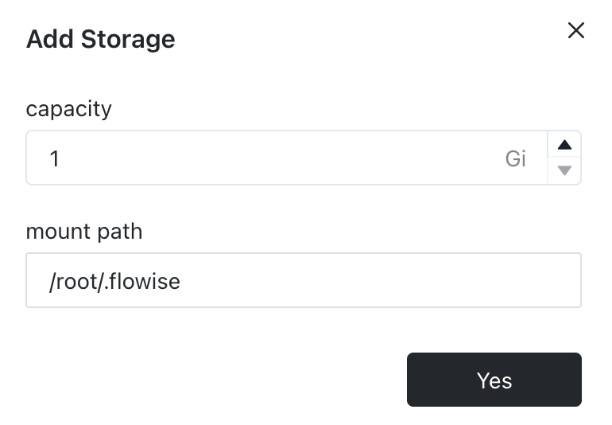

# Sealos

***

1. 点击以下预构建的[模板](https://template.cloud.sealos.io/deploy?templateName=flowise)
2. 添加授权
   * FLOWISE\_USERNAME
   * FLOWISE\_PASSWORD

<figure><figcaption></figcaption></figure>

3. 在模板页面点击“部署应用”以开始部署。
4. 部署完成后，点击“详情”以导航到应用程序的详细信息页面。

<figure><figcaption></figcaption></figure>

5. 等待应用程序状态切换到运行中。之后，点击外部链接，通过外部域名直接打开应用程序的 Web 界面。

<figure><figcaption></figcaption></figure>

## 持久化卷

在应用详情页面右上角点击“更新”，然后点击“高级” -> “添加卷”，填写“挂载路径”的值：`/root/.flowise`。

<figure><figcaption></figcaption></figure>

最后，点击“部署”按钮。

现在尝试创建一个流程并在 Flowise 中保存它。然后尝试重启服务或重新部署，您应该仍然能够看到之前保存的流程。
