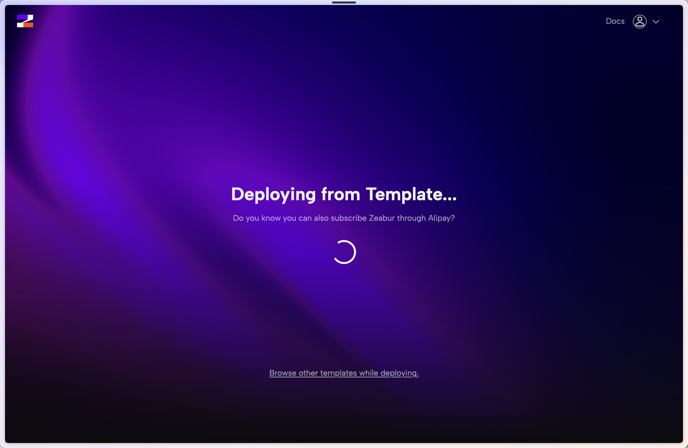
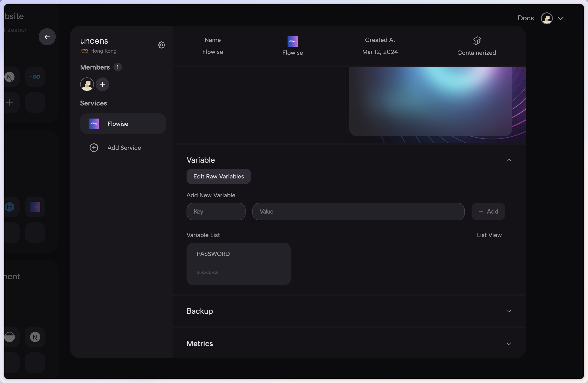

# Zeabur

***


请注意，以下 Zeabur 提供的模板已过期（2024年1月24日）。


1. 点击以下预构建[模板](https://zeabur.com/templates/2JYZTR)或下面的按钮。

2. 点击“部署”

<figure><figcaption></figcaption></figure>

3. 选择您喜欢的区域并继续

<figure><figcaption></figcaption></figure>

4. 您将被重定向到 Zeabur 的仪表板，您将看到部署过程

<figure><figcaption></figcaption></figure>

5. 要添加授权，请导航到“变量”选项卡并添加：

* FLOWISE\_USERNAME
* FLOWISE\_PASSWORD

<figure><figcaption></figcaption></figure>

6. 您可以配置一系列环境变量。请参考 [environment-variables.md](../environment-variables.md "提及")

就是这样！您现在已在 Zeabur 上部署了 Flowise [🎉](https://emojipedia.org/party-popper/)[🎉](https://emojipedia.org/party-popper/)

## 持久卷

Zeabur 将自动为您创建一个持久卷，因此您无需担心它。
