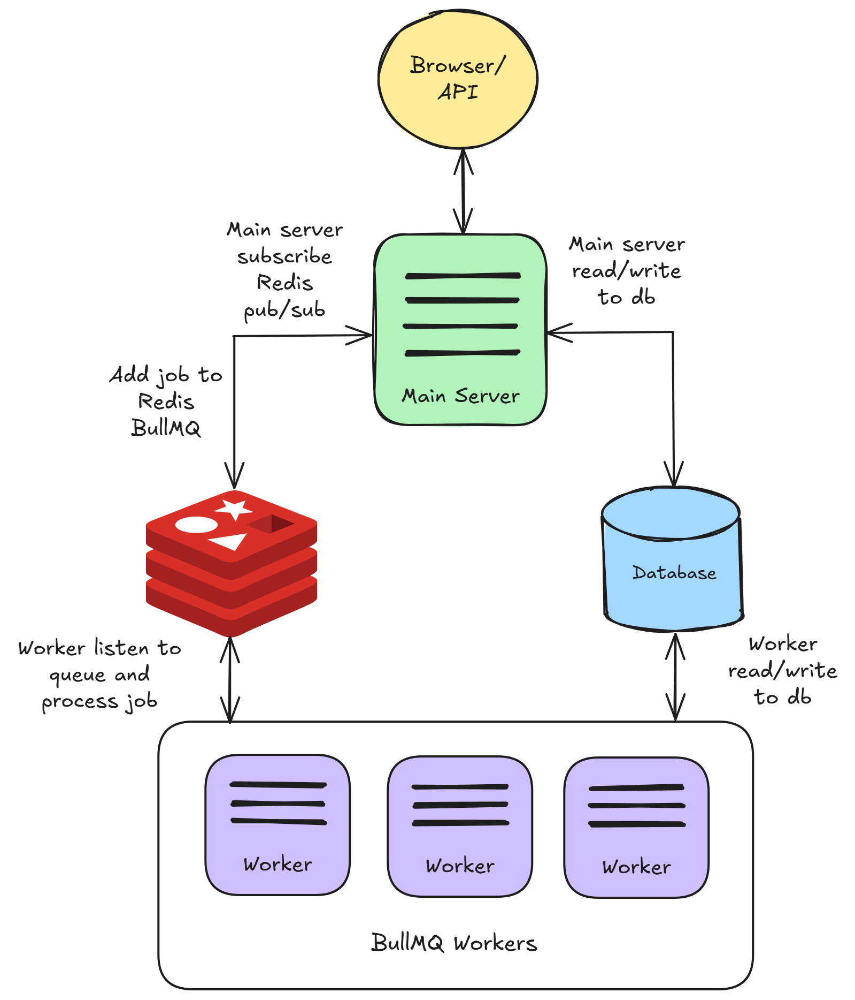

# 使用队列运行 Flowise

Flowise 默认在 NodeJS 主线程中运行。但是，对于大量的预测任务，这种方式的可扩展性不佳。因此，您可以配置两种模式：`main`（默认）和 `queue`。

## 队列模式

使用以下环境变量，您可以以 `queue` 模式运行 Flowise。

<table><thead><tr><th width="263">变量</th><th>描述</th><th>类型</th><th>默认值</th></tr></thead><tbody><tr><td>MODE</td><td>Flowise 运行模式</td><td>枚举字符串：<code>main</code>, <code>queue</code></td><td><code>main</code></td></tr><tr><td>WORKER_CONCURRENCY</td><td>每个工作进程允许并行处理的任务数量。如果您只有一个工作进程，则表示它可以处理多少个并发预测任务。更多 <a href="https://docs.bullmq.io/guide/workers/concurrency">信息</a></td><td>数字</td><td>10000</td></tr><tr><td>QUEUE_NAME</td><td>消息队列的名称</td><td>字符串</td><td>flowise-queue</td></tr><tr><td>QUEUE_REDIS_EVENT_STREAM_MAX_LEN</td><td>事件流会自动裁剪，以防止其大小增长过大。更多 <a href="https://docs.bullmq.io/guide/events">信息</a></td><td>数字</td><td>10000</td></tr><tr><td>REDIS_HOST</td><td>Redis 主机</td><td>字符串</td><td>localhost</td></tr><tr><td>REDIS_PORT</td><td>Redis 端口</td><td>数字</td><td>6379</td></tr><tr><td>REDIS_USERNAME</td><td>Redis 用户名（可选）</td><td>字符串</td><td></td></tr><tr><td>REDIS_PASSWORD</td><td>Redis 密码（可选）</td><td>字符串</td><td></td></tr><tr><td>REDIS_TLS</td><td>Redis TLS 连接（可选）更多 <a href="https://redis.io/docs/latest/operate/oss_and_stack/management/security/encryption/">信息</a></td><td>布尔值</td><td>false</td></tr><tr><td>REDIS_CERT</td><td>Redis 自签名证书文件路径</td><td>字符串</td><td></td></tr><tr><td>REDIS_KEY</td><td>Redis 自签名证书密钥文件路径</td><td>字符串</td><td></td></tr><tr><td>REDIS_CA</td><td>Redis 自签名证书 CA 文件路径</td><td>字符串</td><td></td></tr></tbody></table>

在 `queue` 模式下，主服务器负责处理请求并将作业发送到消息队列。主服务器不会执行作业。一个或多个工作进程从队列接收作业，执行它们并将结果返回。

这允许动态扩展：您可以添加工作进程来处理增加的工作负载，或在负载较轻时移除它们。

工作原理如下：

1. 主服务器接收来自 Web 的预测或其他请求，并将它们作为作业添加到队列中。
2. 这些作业队列是等待处理的任务列表。工作进程（本质上是单独的进程或线程）获取这些作业并执行它们。
3. 作业完成后，工作进程：
   * 将结果写入数据库。
   * 发送事件以指示作业完成。
4. 主服务器接收事件并将结果发送回 UI。
5. Redis 发布/订阅也用于将数据流式传输回 UI。

<figure><figcaption></figcaption></figure>

## 启动 Redis

在启动主服务器和工作进程之前，需要先运行 Redis。您可以在单独的机器上运行 Redis，但请确保服务器和工作进程实例可以访问它。

例如，您可以按照此 [指南](https://www.docker.com/blog/how-to-use-the-redis-docker-official-image/) 在 Docker 上运行 Redis。

## 配置主服务器

这与默认运行 Flowise 相同，只是需要配置上面提到的环境变量。

## 配置工作进程

与主服务器相同，必须配置上述环境变量。我们建议对主服务器和工作进程实例使用相同的 `.env` 文件。唯一的区别在于运行工作进程的方式。


主服务器和工作进程需要共享相同的密钥。请参考 [#for-credentials](environment-variables.md#for-credentials "mention")。对于生产环境，我们建议使用 Postgres 数据库以提高性能。


### 使用 NPM 在本地运行 Flowise

```bash
npx flowise worker # 请记住传入环境变量！
```

### Docker Compose

您可以使用 [此处](https://github.com/FlowiseAI/Flowise/tree/main/docker/worker) 提供的 `docker-compose.yml`，或者重用您用于主服务器的 `docker-compose.yml`，但将入口点从 `flowise start` 更改为 `flowise worker`：

```docker
version: '3.1'

services:
    flowise:
        image: flowiseai/flowise
        restart: always
        environment:
            - PORT=${PORT}
            ....
            - MODE=${MODE}
            - WORKER_CONCURRENCY=${WORKER_CONCURRENCY}
            ....
        ports:
            - '${PORT}:${PORT}'
        volumes:
            - ~/.flowise:/root/.flowise
        entrypoint: /bin/sh -c "sleep 3; flowise worker"
```

### Git Clone

在第一个终端运行主服务器

```bash
pnpm start
```

在其他终端运行工作进程

```bash
pnpm start-worker
```

### AWS Terraform

_即将推出_

## 队列仪表盘

您可以通过导航到 `<your-flowise-url.com>/admin/queues` 查看所有作业、其状态、结果和数据。

<figure><figcaption></figcaption></figure>
