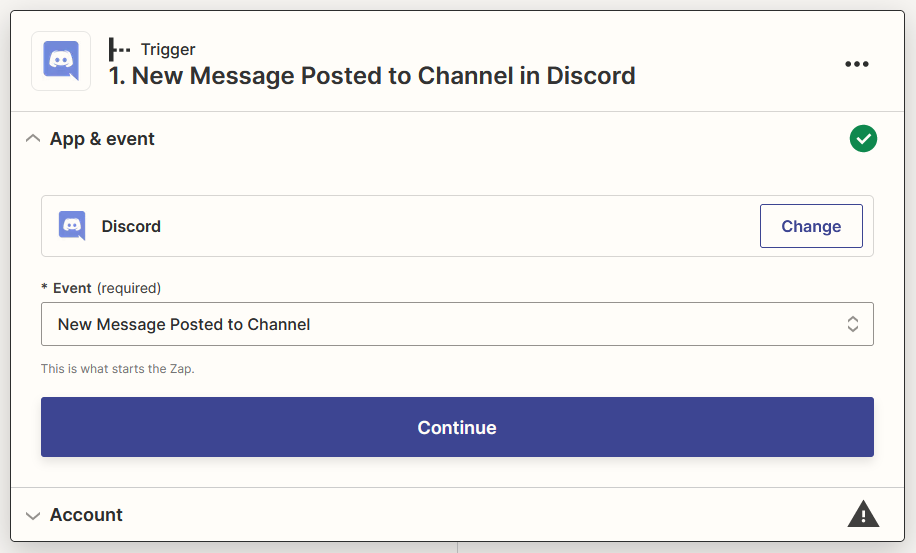
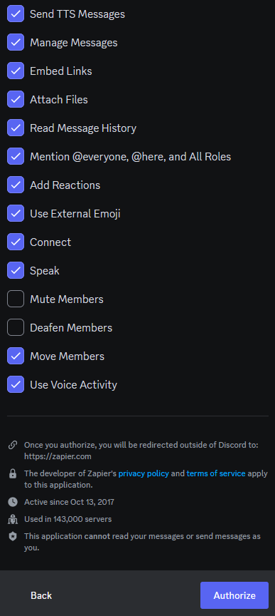
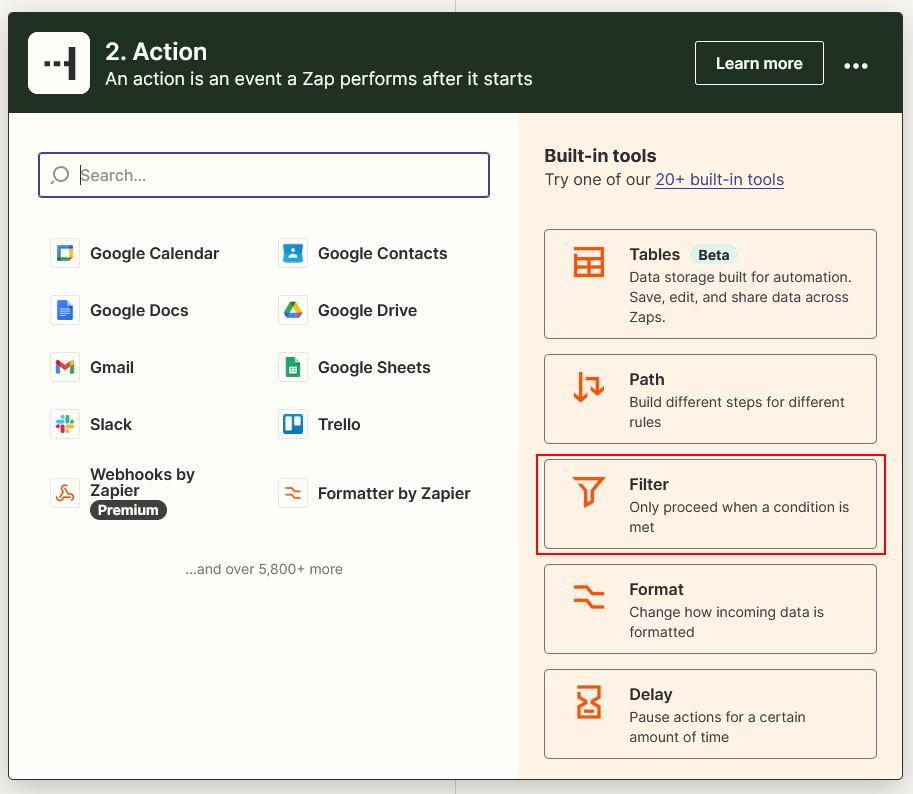
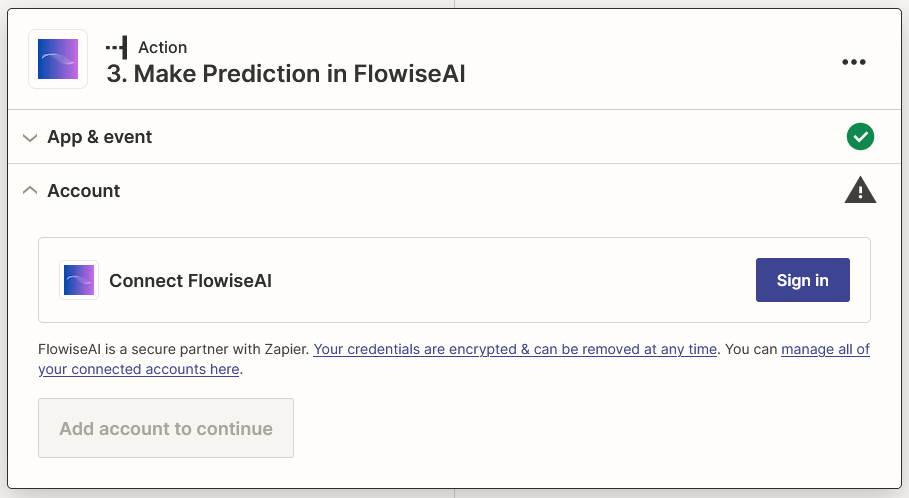

# Zapier Zaps

***

## Prerequisites

1. Log in to Zapier: [https://zapier.com/app/login](https://zapier.com/app/login) or sign up: [https://zapier.com/sign-up](https://zapier.com/sign-up)
2. Deploy a cloud-hosted version of Flowise (see [deployment instructions](../../configuration/deployment/)).

## Setup

1. Go to Zapier Zaps: [https://zapier.com/app/zaps](https://zapier.com/app/zaps)
2. Click **Create**.

<figure><figcaption></figcaption></figure>

### Receiving Trigger Messages

1. Click or search for **Discord**.

    <figure><figcaption></figcaption></figure>
2. Select the **New Message Posted to Channel** event and click **Continue**.

    <figure><figcaption></figcaption></figure>
3. Sign in to your Discord account.

    <figure><figcaption></figcaption></figure>
4. Add the **Zapier Bot** to your desired server.

    <figure><figcaption></figcaption></figure>
5. Grant the necessary permissions, click **Authorize**, and then click **Continue**.

    <figure><figcaption></figcaption></figure>

    <figure><figcaption></figcaption></figure>
6. Select your desired channel to interact with the Zapier Bot and click **Continue**.

    <figure><figcaption></figcaption></figure>
7. Send a test message to the selected channel (from step 6).

    <figure><figcaption></figcaption></figure>
8. Click **Test trigger**.

    <figure><figcaption></figcaption></figure>
9. Select your message and click **Continue with the selected record**.

    <figure><figcaption></figcaption></figure>

### Filtering Out Zapier Bot Messages

1. Click or search for **Filter**.

    <figure><figcaption></figcaption></figure>
2. Configure the **Filter** to prevent continuation if the message is from the **Zapier Bot**, then click **Continue**.

    <figure><figcaption></figcaption></figure>

### FlowiseAI Result Generation

1. Click **+**, then click or search for **FlowiseAI**.

    <figure><figcaption></figcaption></figure>
2. Select the **Make Prediction** event and click **Continue**.

    <figure><figcaption></figcaption></figure>
3. Click **Sign in**, enter your credentials, and click **Yes, Continue to FlowiseAI**.

    <figure><figcaption></figcaption></figure>

    <figure><figcaption></figcaption></figure>
4. Select **Content** from Discord and your Flow ID, then click **Continue**.

    <figure><figcaption></figcaption></figure>
5. Click **Test action** and wait for the result.

    <figure><figcaption></figcaption></figure>

### Sending Result Messages

1. Click **+**, then click or search for **Discord**.

    <figure><figcaption></figcaption></figure>
2. Select the **Send Channel Message** event and click **Continue**.

    <figure><figcaption></figcaption></figure>
3. Select the signed-in Discord account and click **Continue**.

    <figure><figcaption></figcaption></figure>
4. Select your desired channel, select **Text**, and select **String Source** (if available) from FlowiseAI for the Message Text, then click **Continue**.

    <figure><figcaption></figcaption></figure>
5. Click **Test action**.

    <figure><figcaption></figcaption></figure>
6. The message should now appear in your Discord channel. 🎉

    <figure><figcaption></figcaption></figure>
7. Finally, rename your Zap and publish it.

    <figure><figcaption></figcaption></figure>
