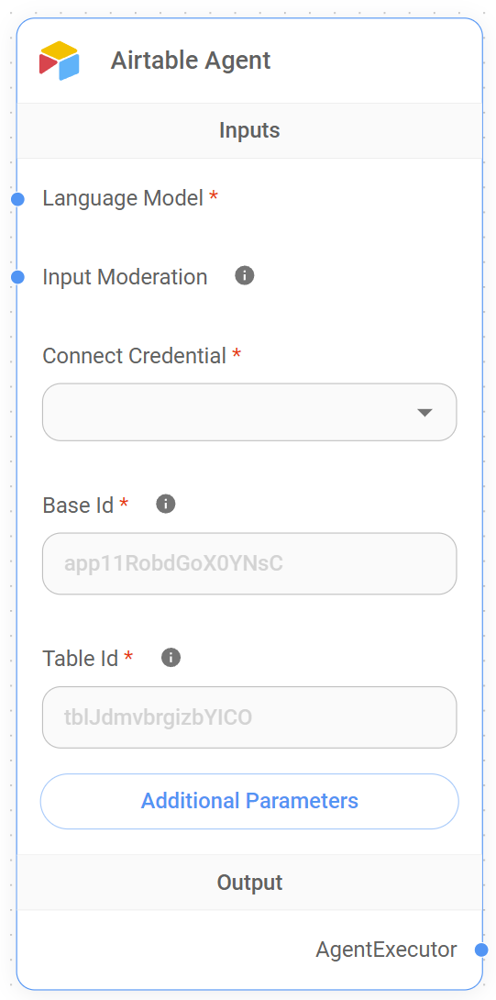

# Airtable 代理

<figure><figcaption>
Airtable 代理节点
</figcaption></figure>

## Airtable 代理功能

Airtable 代理旨在促进 Flowise AI 与 Airtable 表格之间的交互，使用户能够以对话方式查询 Airtable 数据。通过使用此代理，用户可以询问其 Airtable 数据库内容的问题，并根据存储的数据接收相关回复。这对于快速提取特定信息、自动化工作流程或根据 Airtable 中存储的数据生成摘要特别有用。

例如，Airtable 代理可用于回答以下问题：

* “我的项目跟踪表中还有多少任务未完成？”
* “CRM 中列出的客户的联系方式是什么？”
* “给我一份过去一周添加的所有记录的摘要。”

此功能帮助用户无需浏览 Airtable 界面即可从其 Airtable 数据库中获取见解，从而更轻松地以无缝的交互方式管理和分析其数据。

## 输入

Airtable 代理需要以下输入才能有效运行：

* **语言模型**: 用于处理查询的语言模型。此输入是必需的，有助于确定代理提供的响应的质量和准确性。
* **输入审核**: 可选输入，用于启用内容审核。这有助于确保查询适当且不包含攻击性或有害内容。
* **连接凭据**: 连接到 Airtable 的必需输入。用户必须选择具有访问其 Airtable 数据权限的相应凭据。
* **数据库 ID**: 要连接到的 Airtable 数据库的 ID。这是必需字段，可以在 Airtable API 文档或数据库设置中找到。如果您的表格 URL 类似于 `https://airtable.com/app11RobdGoX0YNsC/tblJdmvbrgizbYlCO/viw9UrP77idOCE4ee`，则 `app11RobdGoX0YNsC` 是数据库 ID。它用于指定哪个 Airtable 数据库包含要查询的数据。
* **表格 ID**: Airtable 数据库中特定表格的 ID。这也是必需字段，可帮助代理定位正确的表格以进行数据检索。在示例 URL `https://airtable.com/app11RobdGoX0YNsC/tblJdmvbrgizbYlCO/viw9UrP77idOCE4ee` 中，`tblJdmvbrgizbYlCO` 是表格 ID。
* **附加参数**: 可用于自定义代理行为的可选参数。这些参数可以根据具体的用例进行配置。
  * **返回所有记录**: 此选项允许用户返回指定表格中的所有记录。如果启用，将检索所有记录；否则，仅返回有限数量的记录。
  * **限制**: 如果未启用**返回所有记录**，则指定要返回的记录的最大数量。默认值为 `100`。

**注意**: 本节正在建设中。感谢您提供任何帮助来完成本节。请查看我们的 [贡献指南](../../../contributing/) 以开始。
