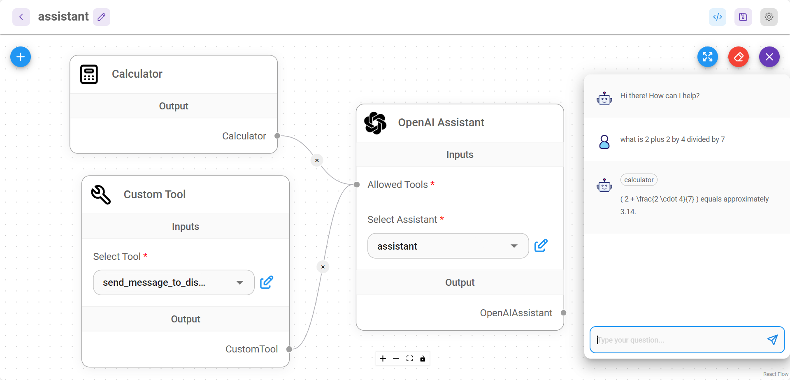

# 线程

[线程](https://platform.openai.com/docs/assistants/how-it-works/managing-threads-and-messages) 仅在使用 OpenAI 助手时才使用。它代表助手和用户之间的一次会话。线程存储消息并自动处理截断，以使内容适合模型的上下文。

<figure><figcaption></figcaption></figure>

## 多用户间的独立会话

### UI 和嵌入式聊天

默认情况下，UI 和嵌入式聊天会自动为多用户会话分离线程。这是通过为每次新的交互生成唯一的 **`chatId`** 来实现的。此逻辑由 Flowise 在后台处理。

### 预测 API

POST `/api/v1/prediction/{your-chatflowid}`，指定 **`chatId`**。相同的 `chatId` 将使用相同的线程。

```json
```json
{
    "question": "hello!",
    "chatId": "user1"
}
```

### 消息 API

* GET `/api/v1/chatmessage/{your-chatflowid}`
* DELETE `/api/v1/chatmessage/{your-chatflowid}`

您也可以通过 **`chatId`** 进行筛选 - `/api/v1/chatmessage/{your-chatflowid}?chatId={your-chatid}`

所有会话都可以在 UI 中进行可视化和管理：

<figure><figcaption></figcaption></figure>
