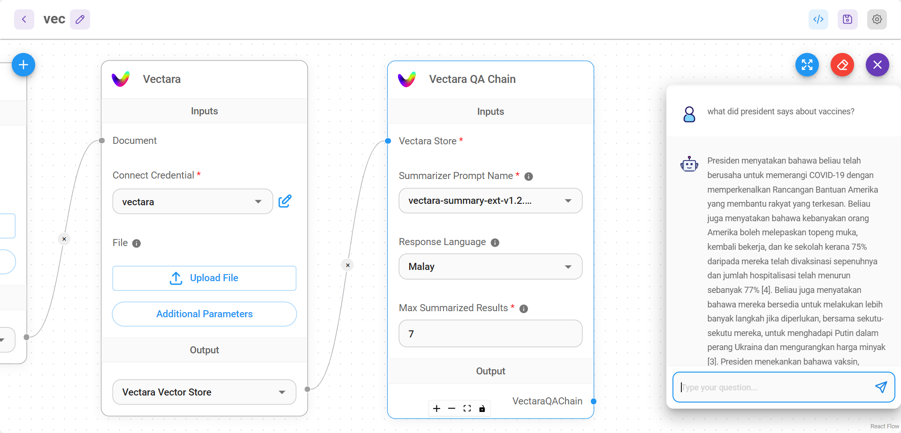

# Vectara QA 链

用于执行 Vectara 问答任务的链。

<figure><figcaption></figcaption></figure>

## 定义

**基于检索的问答链**，它与 Vectara 检索组件集成，允许您配置输入参数并执行问答任务。

## 输入

* [Vectara 存储](../vector-stores/vectara_zh.md)

## 参数

| 名称                   | 描述                                                   |
| ---------------------- | ------------------------------------------------------------- |
| 摘要器提示名称         | 用于生成摘要的模型                                           |
| 响应语言               | 期望的响应语言                                             |
| 最大摘要结果数         | 用于摘要的顶级结果数量（默认为 7）                         |

## 输出

| 名称           | 描述                   |
| -------------- | ----------------------------- |
| VectaraQAChain | 返回响应的最终节点       |
