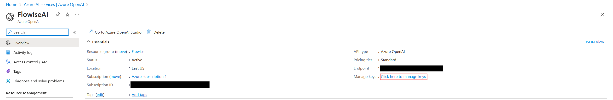
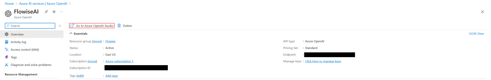
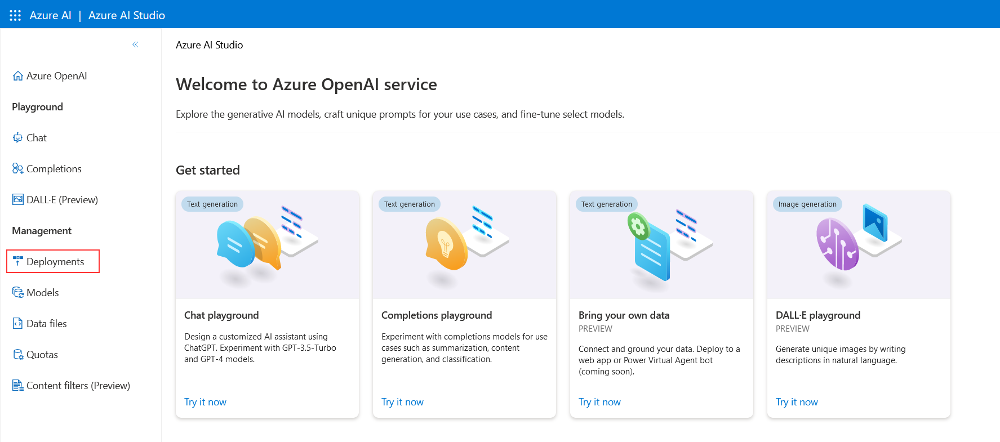
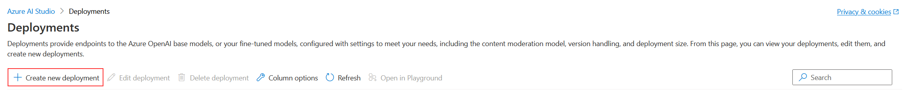
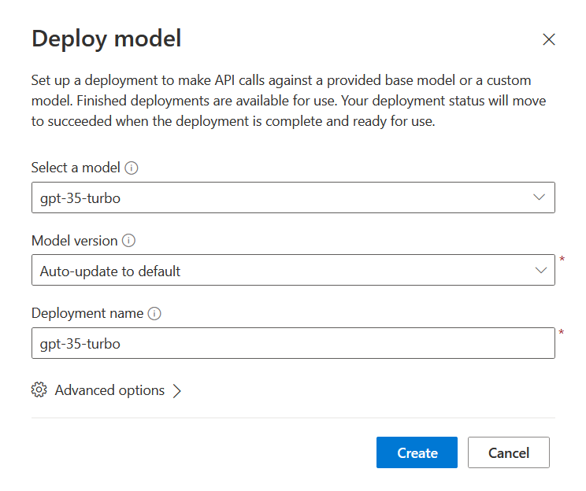
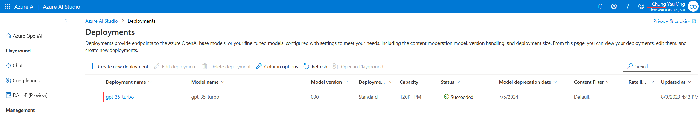
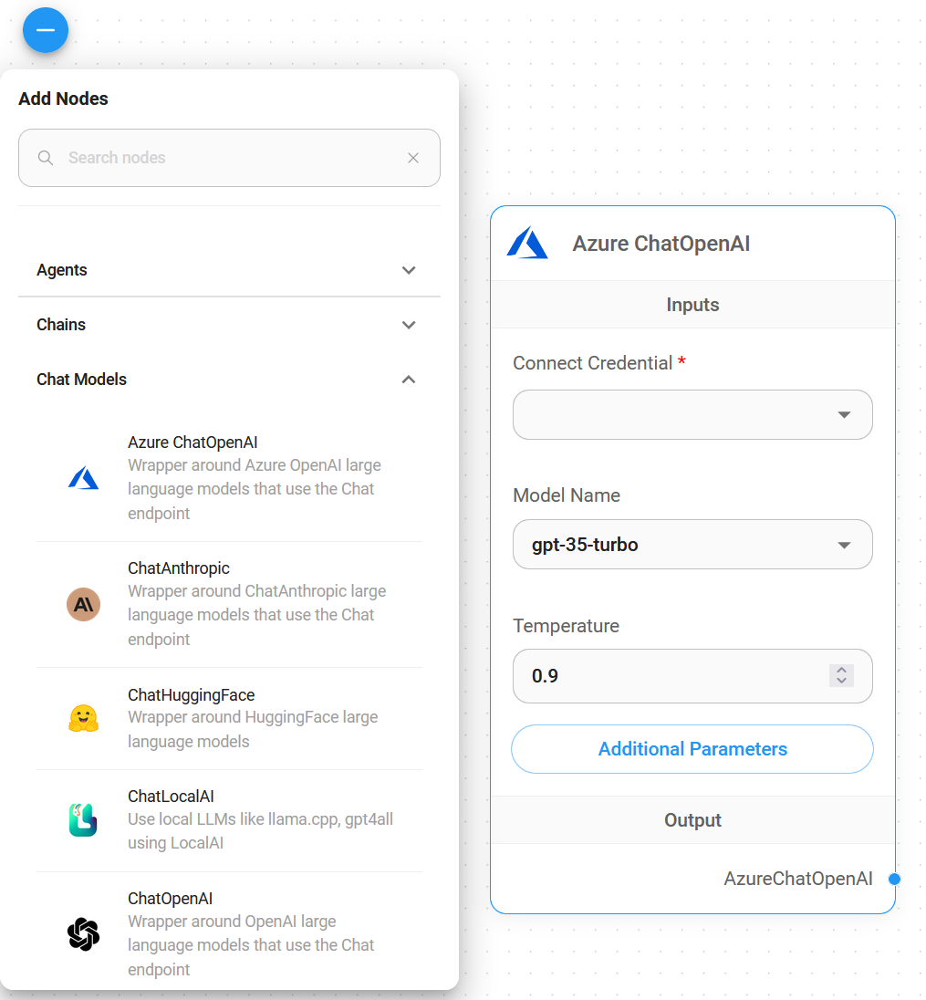
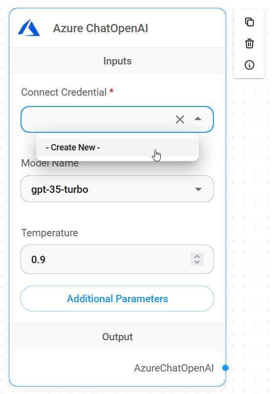
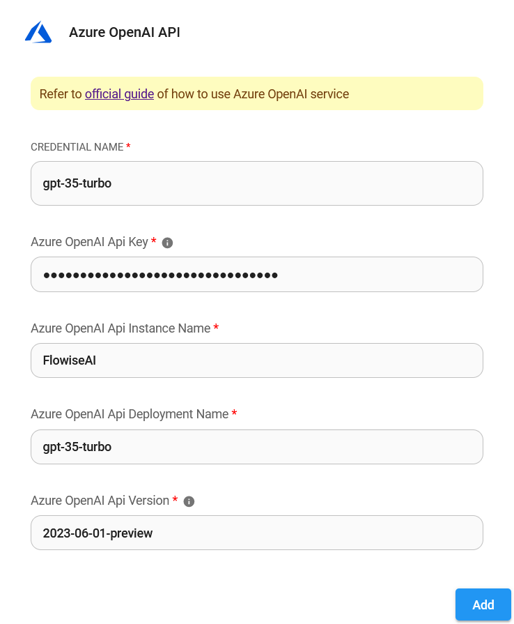

# Azure ChatOpenAI

## 先决条件

1. 登录 [Azure 门户](https://portal.azure.com/) 或 [注册](https://azure.microsoft.com/en-us/free/) Azure 帐户。
2. [创建](https://portal.azure.com/#create/Microsoft.CognitiveServicesOpenAI) Azure OpenAI 资源，并等待大约 10 个工作日的审批。
3. 您的 API 密钥可在 **Azure OpenAI** > 点击 **name_azure_openai** > 点击 **点击此处管理密钥** 中找到。

<figure><figcaption></figcaption></figure>

## 设置

### Azure ChatOpenAI

1. 点击 **转到 Azure OpenAI Studio**

<figure><figcaption></figcaption></figure>

2. 点击 **部署**

<figure><figcaption></figcaption></figure>

3. 点击 **创建新的部署**

<figure><figcaption></figcaption></figure>

4. 选择如下所示，然后点击 **创建**

<figure><figcaption></figcaption></figure>

5. 成功创建 **Azure ChatOpenAI**

* 部署名称：`gpt-35-turbo`
* 实例名称：`右上角` (原文“top right conner”翻译为更易理解的中文)

<figure><figcaption></figcaption></figure>

<figure><figcaption></figcaption></figure>

### Flowise

1. **聊天模型** > 拖动 **Azure ChatOpenAI** 节点

<figure><figcaption></figcaption></figure>

2. **连接凭据** > 点击 **创建新的**

<figure><figcaption></figcaption></figure>

3. 将每个详细信息（API 密钥、实例和部署名称、[API 版本](https://learn.microsoft.com/en-us/azure/ai-services/openai/reference#chat-completions)）复制并粘贴到 **Azure ChatOpenAI** 凭据中。

<figure><figcaption></figcaption></figure>

4. 完成！[🎉](https://emojipedia.org/party-popper/) 您已在 Flowise 中创建了 **Azure ChatOpenAI 节点**。

<figure><figcaption></figcaption></figure>

## 资源

* [LangChain JS Azure ChatOpenAI](https://js.langchain.com/docs/modules/model_io/models/chat/integrations/azure)
* [Azure OpenAI 服务 REST API 参考](https://learn.microsoft.com/en-us/azure/ai-services/openai/reference)
