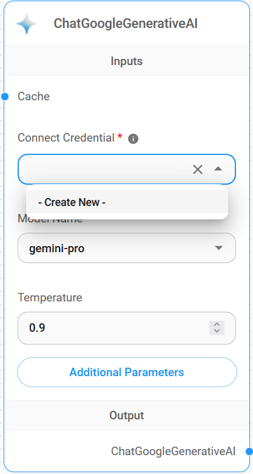
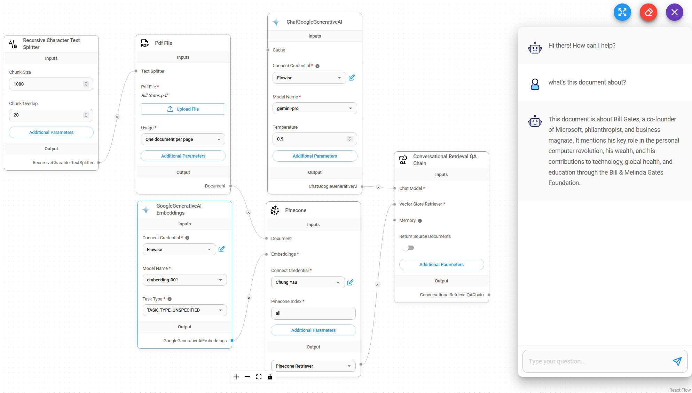
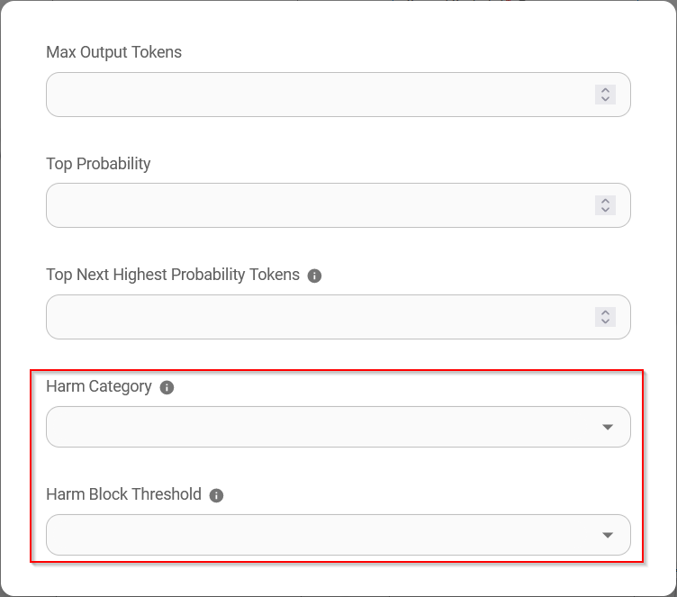
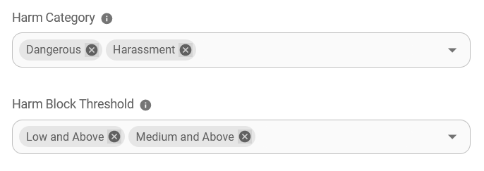

# ChatGoogleGenerativeAI

## 先决条件

1. 注册一个 [Google](https://accounts.google.com/InteractiveLogin) 账号
2. 创建一个 [API 密钥](https://aistudio.google.com/app/apikey)

## 设置

1. **聊天模型** > 拖动 **ChatGoogleGenerativeAI** 节点

<figure><figcaption></figcaption></figure>

2. **连接凭据** > 点击 **创建新的**

<figure><figcaption></figcaption></figure>

3. 填写 **Google AI** 凭据

<figure><figcaption></figcaption></figure>

4. 完成！[🎉](https://emojipedia.org/party-popper/)，您现在可以在 Flowise 中使用 **ChatGoogleGenerativeAI 节点**

<figure><figcaption></figcaption></figure>

## 安全属性配置

1. 点击 **附加参数**

<figure><figcaption></figcaption></figure>

* 配置 **安全属性** 时，**危害类别** 和 **危害阻断阈值** 中的选择数量必须相同。否则将抛出错误 `危害类别和危害阻断阈值长度不相等`

* 当 **危险** 设置为 `低及以上` 且 **骚扰** 设置为 `中及以上` 时，将导致以下 **安全属性** 组合结果为 `危险`

<figure><figcaption></figcaption></figure>

## 资源

* [LangChain JS ChatGoogleGenerativeAI](https://js.langchain.com/docs/integrations/chat/google_generativeai)
* [Google AI for Developers](https://ai.google.dev/)
* [Gemini API 文档](https://ai.google.dev/docs)
