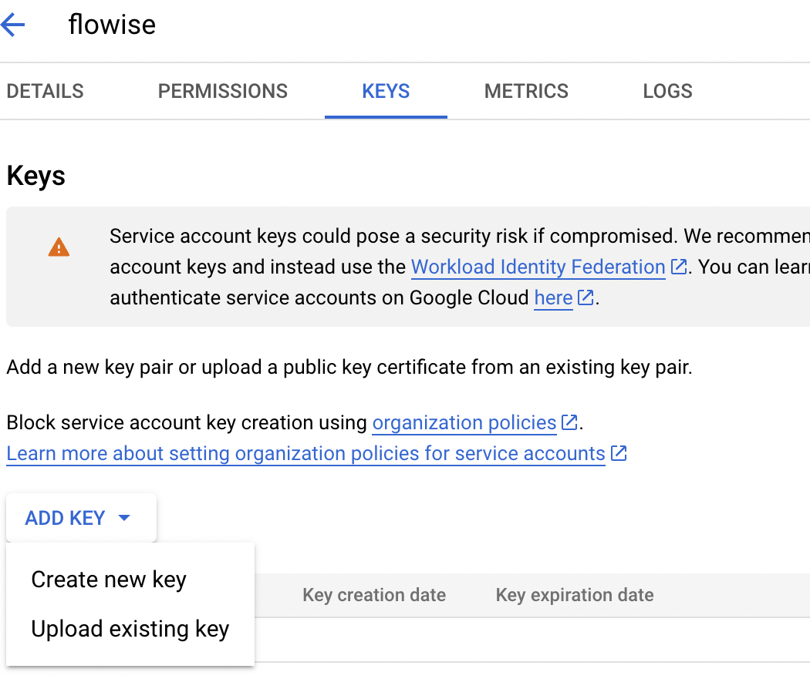
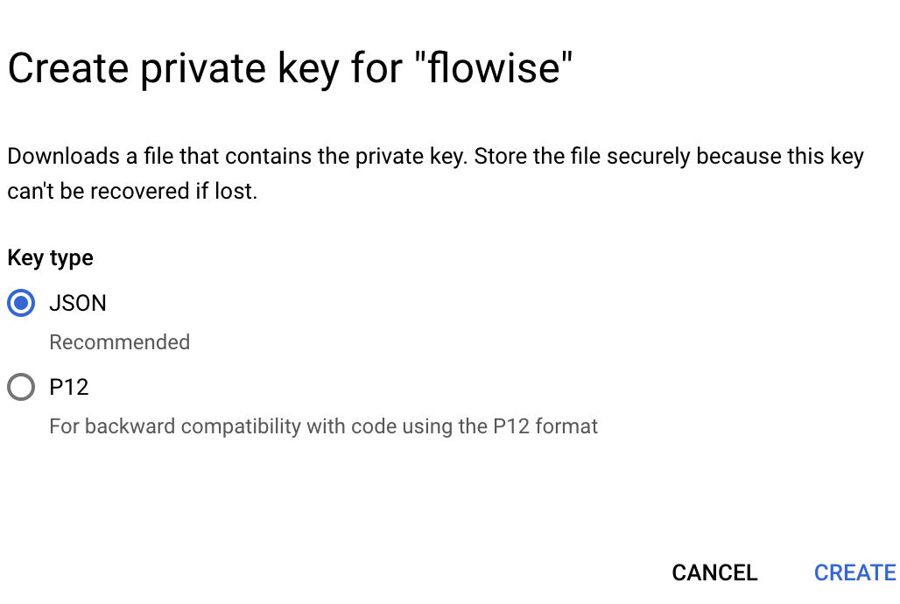

# Google Vertex AI

## 先决条件

1. [启动您的 GCP](https://cloud.google.com/docs/get-started)
2. 安装 [Google Cloud CLI](https://cloud.google.com/sdk/docs/install-sdk)

## 设置

### 启用 Vertex AI API

1. 前往 GCP 上的 Vertex AI 并点击 **“启用所有推荐的 API”**

<figure><figcaption></figcaption></figure>

## 创建凭据文件 _(可选)_

创建凭据文件有两种方法：

### 方法 1：使用 GCP CLI

1. 打开终端并运行以下命令：

```bash
gcloud auth application-default login
```

2. 登录您的 GCP 帐户。
3. 检查您的凭据文件。您可以在 `~/.config/gcloud/application_default_credentials.json` 找到您的凭据文件。

### 方法 2：使用 GCP 控制台

1. 前往 GCP 控制台并点击 **“创建凭据”**

<figure><figcaption></figcaption></figure>

2. 创建服务帐户

<figure><figcaption></figcaption></figure>

3. 填写服务帐户详细信息表单并点击 **“创建并继续”**
4. 选择合适的角色（例如 Vertex AI 用户）并点击 **“完成”**

<figure><figcaption></figcaption></figure>

5. 点击您创建的服务帐户，然后点击 **“添加密钥” -> “创建新密钥”**

<figure><figcaption></figcaption></figure>

6. 选择 JSON 并点击 **“创建”**，然后您可以下载您的凭据文件。

<figure><figcaption></figcaption></figure>

## Flowise

<figure><figcaption></figcaption></figure>

### 无需凭据文件

如果您使用的是 GCP 服务（例如 Cloud Run），或者您已在本地机器上安装了默认凭据，则无需设置此凭据。

### 使用凭据文件

1. 前往 Flowise 的凭据页面并点击 **“添加凭据”**
2. 点击 Google Vertex Auth

<figure><figcaption></figcaption></figure>

3. 注册您的凭据文件。注册凭据文件有两种方法：

<figure><figcaption></figcaption></figure>

* **选项 1：输入您的凭据文件路径**
  * 如果您的机器上有凭据文件，您可以将凭据文件的路径输入到 `Google Application Credential File Path` 中。
* **选项 2：粘贴您的凭据文件文本**
  * 或者您可以复制凭据文件中的所有文本并将其粘贴到 `Google Credential JSON Object` 中。

4. 最后，点击“添加”按钮。
5. **🎉**您现在可以在 Flowise 中使用带有凭据的 ChatGoogleVertexAI 了！

### 资源

* [LangChain JS GoogleVertexAI](https://js.langchain.com/docs/api/llms_googlevertexai/classes/GoogleVertexAI)
* [Google 服务帐户概述](https://cloud.google.com/iam/docs/service-account-overview?)
* [使用 Flowise 试用 Google Vertex AI Palm 2：无需编码即可利用直觉](https://tech.beatrust.com/entry/2023/08/22/Try_Google_Vertex_AI_Palm_2_with_Flowise%3A_Without_Coding_to_Leverage_Intuition)
