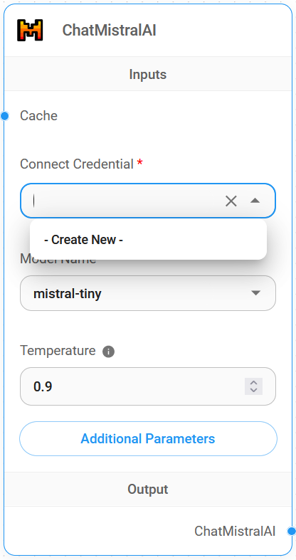
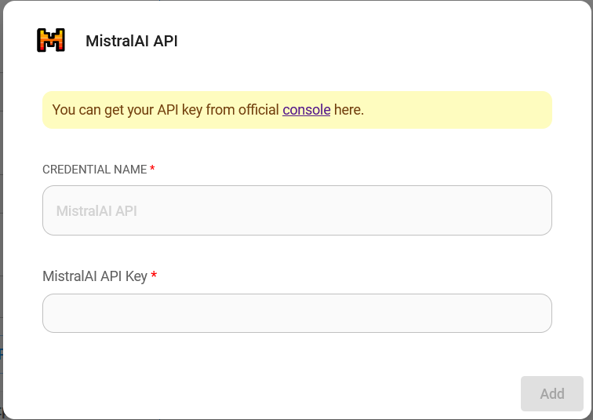

# ChatMistralAI

## 先决条件

1. 注册一个 [Mistral AI](https://mistral.ai/) 账户
2. 创建一个 [API 密钥](https://console.mistral.ai/user/api-keys/)

## 设置

1. **聊天模型** > 拖动 **ChatMistralAI** 节点

<figure><figcaption></figcaption></figure>

2. **连接凭据** > 点击 **创建新的**

<figure><figcaption></figcaption></figure>

3. 填写 **Mistral AI** 凭据

<figure><figcaption></figcaption></figure>

4. 搞定啦 [🎉](https://emojipedia.org/party-popper/)，您现在可以在 Flowise 中使用 **ChatMistralAI 节点** 了

<figure><figcaption></figcaption></figure>

## 资源

* [LangChain JS ChatMistralAI](https://js.langchain.com/docs/integrations/chat/mistral)
* [Mistral AI](https://mistral.ai/)
* [Mistral AI 文档](https://docs.mistral.ai/)
