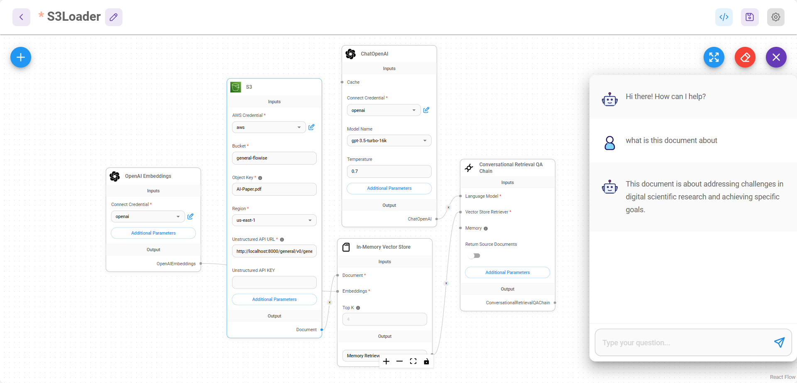

# S3 文件加载器

S3 文件加载器允许您从 S3 检索文件，并使用 [Unstructured](https://unstructured.io/) 将其预处理成结构化的文档对象，以便转换为向量嵌入。Unstructured 用于处理各种不同类型的文件。无论您在 S3 上的文件是 PDF、XML、DOCX 还是 CSV，Unstructured 都可以对其进行处理。支持的文件类型请参见 [此处](https://unstructured-io.github.io/unstructured/api.html#supported-file-types)。

## Unstructured 设置

您可以使用托管 API 或通过 Docker 本地运行。

* [托管 API](https://unstructured-io.github.io/unstructured/api.html)
* Docker：`docker run -p 8000:8000 -d --rm --name unstructured-api quay.io/unstructured-io/unstructured-api:latest --port 8000 --host 0.0.0.0`

## S3 文件加载器设置

1. 将 S3 文件加载器拖放到画布上：

<figure><figcaption></figcaption></figure>

2. AWS 凭证：为您的 AWS 账户创建一个新的凭证。您需要访问密钥和密钥 ID。请记住向关联的账户授予 S3 存储桶策略。您可以参考此处的策略指南 [此处](https://docs.aws.amazon.com/AmazonRDS/latest/AuroraUserGuide/AuroraMySQL.Integrating.Authorizing.IAM.S3CreatePolicy.html)。

<figure><figcaption></figcaption></figure>

3. 存储桶：登录您的 AWS 控制台并导航到 S3。获取您的存储桶名称：

<figure><figcaption></figcaption></figure>

4. 密钥：单击您要使用的对象，并获取密钥名称：

<figure><figcaption></figcaption></figure>

5. Unstructured API URL：根据您使用 Unstructured 的方式（通过托管 API 或 Docker），更改 Unstructured API URL 参数。如果您使用托管 API，则还需要 API 密钥。
6. 然后您可以开始与来自 S3 的文件进行交互。您无需指定文本分割器来分割文档，因为 Unstructured 会自动处理。

<figure><figcaption></figcaption></figure>
