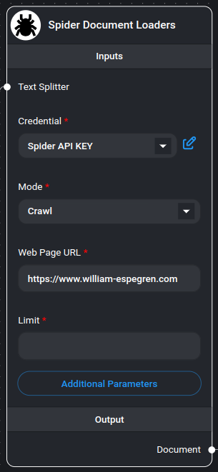
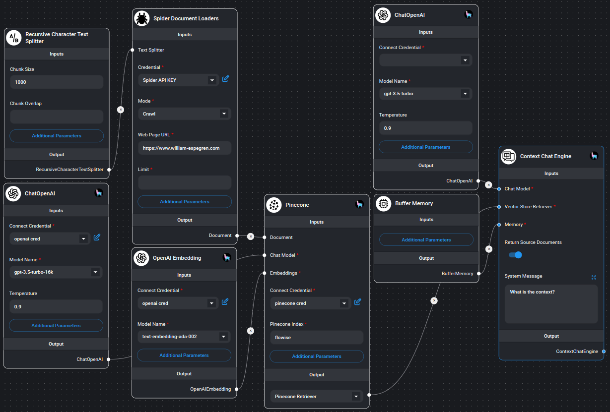

# Spider 网页抓取/爬虫工具

<figure><figcaption>
Spider 网页抓取/爬虫节点
</figcaption></figure>

[Spider](https://spider.cloud/?ref=flowise) 是最快开源的网页抓取和爬虫工具，它返回可供大型语言模型 (LLM) 使用的数据。要开始使用此节点，您需要从 [Spider.cloud](https://spider.cloud/?ref=flowise) 获取 API 密钥。

## 开始使用

1. 前往 [Spider.cloud](https://spider.cloud/?ref=flowise) 网站并注册免费帐户。
2. 然后前往 [API 密钥](https://spider.cloud/api-keys) 并创建一个新的 API 密钥。
3. 复制 API 密钥并将其粘贴到 Spider 节点的“凭据”字段中。

## 抓取和爬取

1. 在模式下拉菜单中选择“抓取”或“爬取”。
2. 在“网页 URL”字段中输入您要抓取或爬取的 URL。
3. 如果你选择了“爬取”，请在“限制”字段中输入您要爬取的最大页面数。如果未输入值或输入 0，爬虫将爬取所有页面。

## 示例

<figure><figcaption>
使用 Spider 节点的示例
</figcaption></figure>
