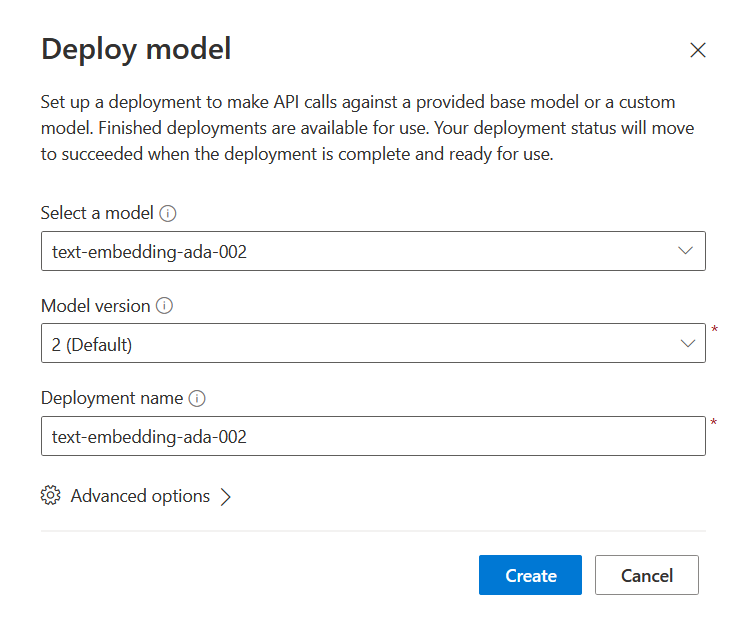
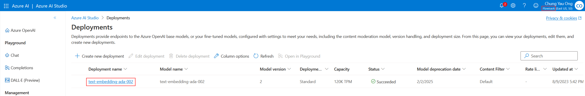
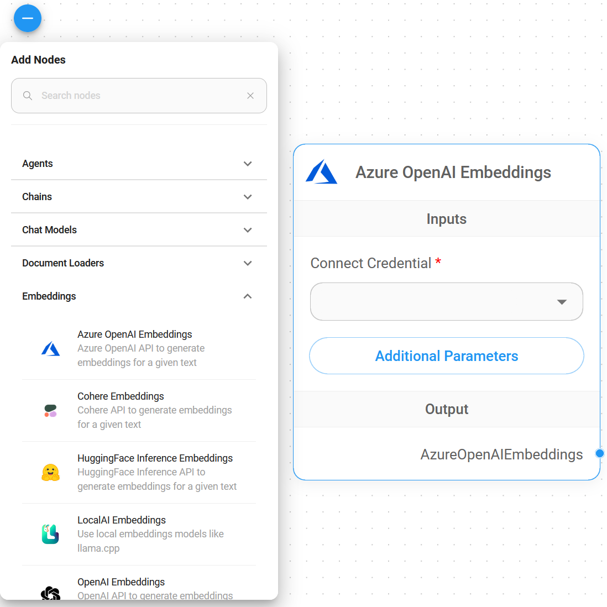
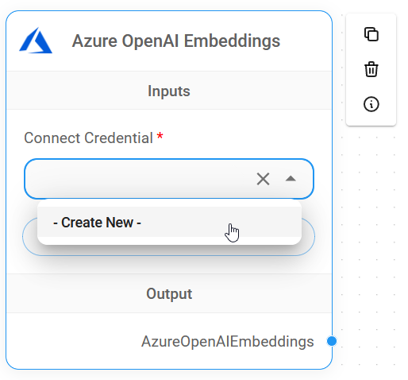
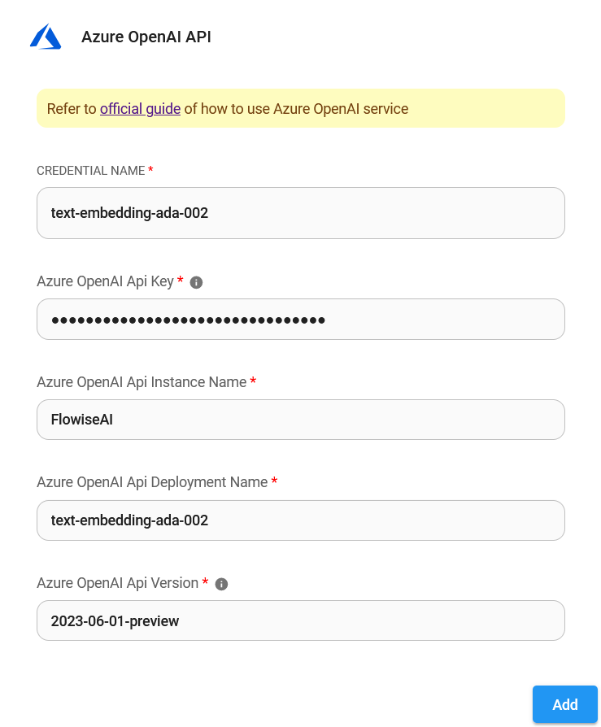
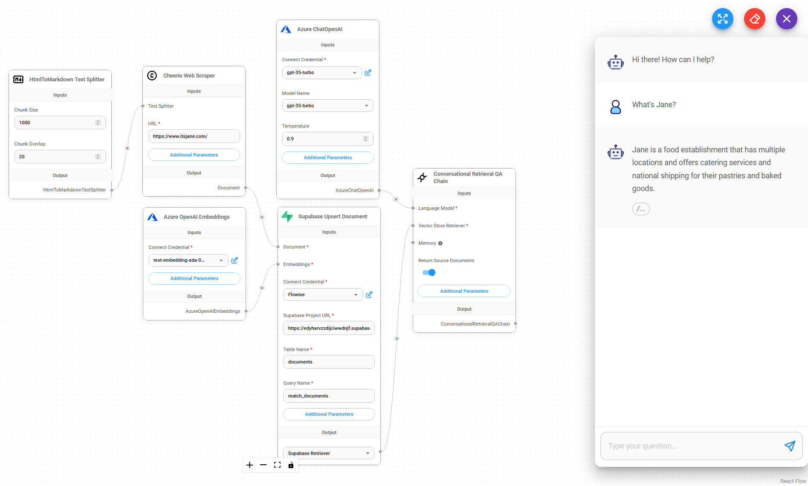

# Azure OpenAI 嵌入

## 预备条件

1. 登录 [Azure 门户](https://portal.azure.com/) 或 [注册](https://azure.microsoft.com/en-us/free/) Azure 帐户。
2. [创建](https://portal.azure.com/#create/Microsoft.CognitiveServicesOpenAI) Azure OpenAI 资源，并等待大约 10 个工作日的审批。
3. 您的 API 密钥可在 **Azure OpenAI** > 点击 **name_azure_openai** > 点击 **点击此处管理密钥** 处获取。

<figure><figcaption></figcaption></figure>

## 设置

### Azure OpenAI 嵌入

1. 点击 **转到 Azure OpenAI Studio**

<figure><figcaption></figcaption></figure>

2. 点击 **部署**

<figure><figcaption></figcaption></figure>

3. 点击 **创建新的部署**

<figure><figcaption></figcaption></figure>

4. 选择如下所示的选项，然后点击 **创建**

<figure><figcaption></figcaption></figure>

5. 成功创建 **Azure OpenAI 嵌入**

* 部署名称：`text-embedding-ada-002`
* 实例名称：`右上角`

<figure><figcaption></figcaption></figure>

### Flowise

1. 在 **嵌入** 中，拖动 **Azure OpenAI 嵌入** 节点。

<figure><figcaption></figcaption></figure>

2. 在 **连接凭据** 中，点击 **创建新的**。

<figure><figcaption></figcaption></figure>

3. 将每个详细信息（API 密钥、实例和部署名称、[API 版本](https://learn.microsoft.com/en-us/azure/ai-services/openai/reference#chat-completions)）复制并粘贴到 **Azure OpenAI 嵌入** 凭据中。

<figure><figcaption></figcaption></figure>

4. 完成！🎉 您已在 Flowise 中创建了 **Azure OpenAI 嵌入节点**。

<figure><figcaption></figcaption></figure>

## 资源

* [LangChain JS Azure OpenAI 嵌入](https://js.langchain.com/docs/modules/data_connection/text_embedding/integrations/azure_openai)
* [Azure OpenAI 服务 REST API 参考](https://learn.microsoft.com/en-us/azure/ai-services/openai/reference)
