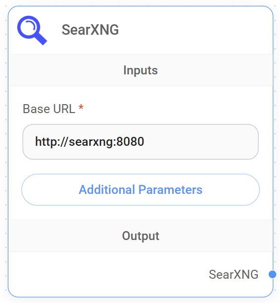

# SearXNG

<figure><figcaption><p>SearXNG 节点</p></figcaption></figure>

### 设置 SearXNG

按照 [官方文档](https://docs.searxng.org/admin/installation.html) 在本地设置 SearXNG。在本例中，我们将使用 Docker Compose 进行设置。

导航到 [searxng-docker](https://github.com/searxng/searxng-docker) 仓库并按照设置说明操作。

确保将 `server.limiter` 设置为 `false`，并且 `json` 包含在 `search.formats` 中。这些参数可以在 `searxng/settings.yml` 中定义：

```yaml
server:
  limiter: false
general:
  debug: true
search:
  formats:
    - html
    - json
```

使用 `docker-compose up -d` 启动容器。打开网页浏览器并访问 **http://localhost:8080/search**，您将看到 SearXNG 页面。

### 在 Flowise 中使用

将 SearXNG 节点拖放到画布上。将 Base URL 填写为 **http://localhost:8080**。如果需要，您还可以指定其他搜索参数。LLM 将自动确定用于搜索查询问题的内容。

<figure><figcaption></figcaption></figure>