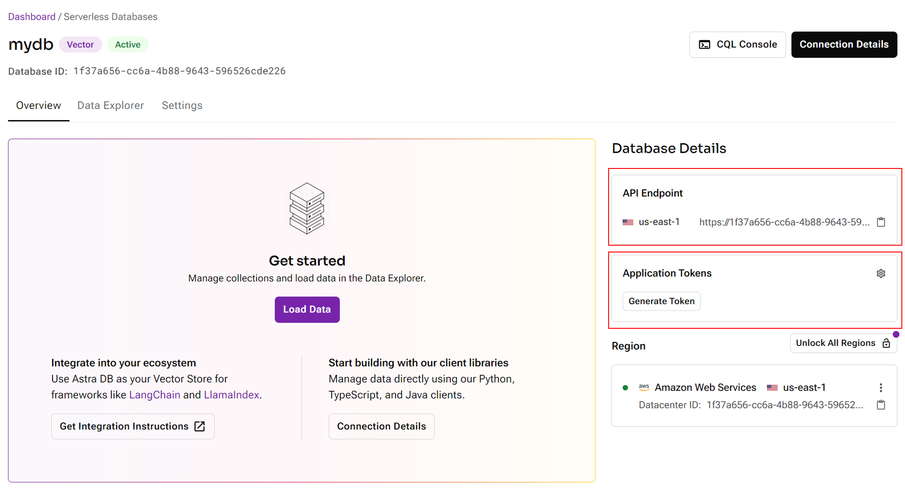

# AstraDB 设置

## 设置步骤

1. 在 [AstraDB](https://astra.datastax.com/) 注册账号。
2. 登录门户网站，创建一个数据库。

<figure><figcaption></figcaption></figure>

3. 选择 Serverless (Vector)，填写数据库名称、提供商和区域。

<figure><figcaption></figcaption></figure>

4. 数据库设置完成后，获取 API 端点并生成应用程序令牌。

<figure><figcaption></figcaption></figure>

5. 创建一个新的集合，选择所需的维度和相似度度量。

<figure><figcaption></figcaption></figure>

6. 返回 Flowise 画布，拖放 Astra 节点。点击凭据下拉菜单中的“新建”。

<figure><figcaption></figcaption></figure>

7. 指定 API 端点和应用程序令牌。

<figure><figcaption></figcaption></figure>

8. 现在可以将数据 upsert 到 AstraDB 了。

<figure><figcaption></figcaption></figure>

9. 返回 Astra 门户网站，进入您的集合，您将能够看到所有已 upsert 的数据。

<figure><figcaption></figcaption></figure>

10. 开始查询！

<figure><figcaption></figcaption></figure>
