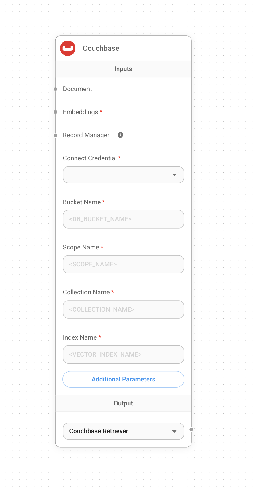
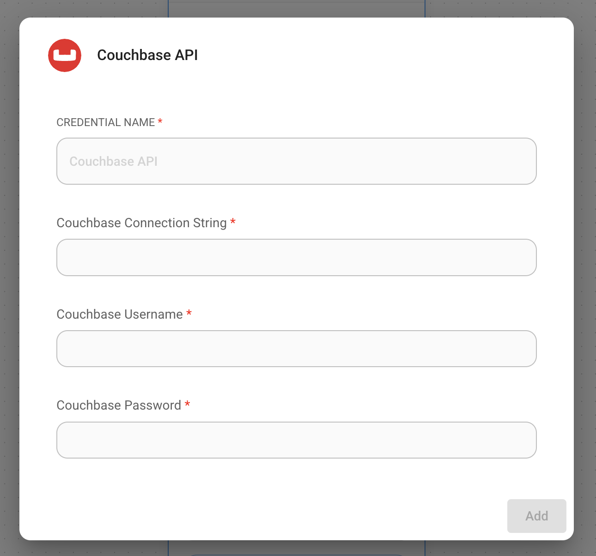
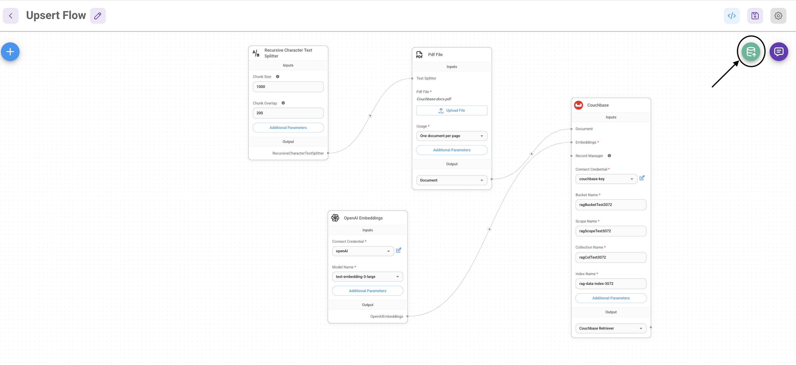
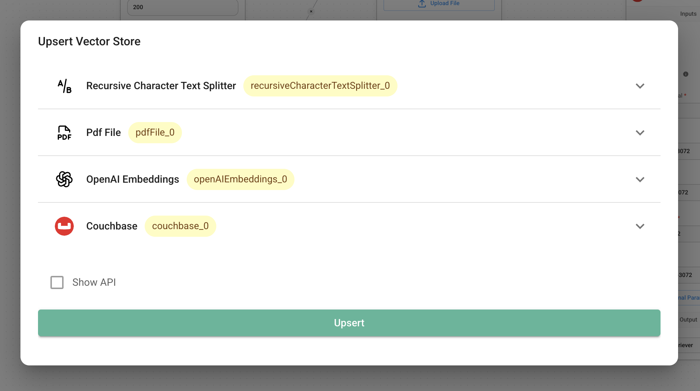

# Couchbase

## 前提条件

### 要求
1. Couchbase集群（自管理或Capella）版本 **7.6+**，并启用[搜索服务](https://docs.couchbase.com/server/current/search/search.html)。
2. Capella设置：
   要了解如何连接到您的Capella集群，请遵循[说明](https://docs.couchbase.com/cloud/get-started/connect.html?_gl=1*1yhpmel*_gcl_au*MTMzNDE3NTQxLjE3MzY5MjA5Mz4.)。

   具体来说，您需要执行以下操作：

   - 创建[数据库凭据](https://docs.couchbase.com/cloud/clusters/manage-database-users.html?_gl=1*19zk7vq*_gcl_au*MTMzNDE3NTQxLjE3MzY5MjA5Mz4.)以访问集群。
   - [允许访问](https://docs.couchbase.com/cloud/clusters/allow-ip-address.html?_gl=1*19zk7vq*_gcl_au*MTMzNDE3NTQxLjE3MzY5MjA5Mz4.)从运行应用程序的IP地址访问集群。

   自管理设置：
   - 遵循[Couchbase安装选项](https://developer.couchbase.com/tutorial-couchbase-installation-options)安装最新的Couchbase数据库服务器实例。确保添加搜索服务。

3. 在Couchbase的全文服务上创建搜索索引。

### 导入搜索索引

#### [Couchbase Capella](https://docs.couchbase.com/cloud/search/import-search-index.html?_gl=1*18d2l9w*_gcl_au*MTMzNDE3NTQxLjE3MzY5MjA5Mz4.)
按照以下步骤在Capella中导入搜索索引：
- 将索引定义复制到一个名为`index.json`的新文件中。
- 按照文档中的说明在Capella中导入该文件。
- 点击“创建索引”以完成索引创建。

#### [Couchbase Server](https://docs.couchbase.com/server/current/search/import-search-index.html?_gl=1*18d2l9w*_gcl_au*MTMzNDE3NTQxLjE3MzY5MjA5Mz4.)
按照以下步骤在Couchbase Server中操作：
- 导航到Search → Add Index → Import。
- 将提供的索引定义复制到导入屏幕中。
- 点击“创建索引”以完成索引创建。

您还可以在[Couchbase Capella](https://docs.couchbase.com/cloud/vector-search/create-vector-search-index-ui.html?_gl=1*1rglcpj*_gcl_au*MTMzNDE3NTQxLjE3MzY5MjA5Mz4.)和[Couchbase自管理服务器](https://docs.couchbase.com/server/current/vector-search/create-vector-search-index-ui.html?_gl=1*t7aeet*_gcl_au*MTMzNDE3NTQxLjE3MzY5MjA5Mz4.)上使用搜索UI创建向量索引。

### 索引定义

在这里，我们正在为文档创建索引`vector-index`。向量字段设置为`embedding`，维度为1536，文本字段设置为`text`。我们还将文档中`metadata`下的所有字段作为动态映射进行索引和存储，以应对不同的文档结构。相似性度量设置为`dot_product`。如果这些参数发生变化，请相应地调整索引。

```json
{
  "name": "vector-index",
  "type": "fulltext-index",
  "params": {
    "doc_config": {
      "docid_prefix_delim": "",
      "docid_regexp": "",
      "mode": "scope.collection.type_field",
      "type_field": "type"
    },
    "mapping": {
      "default_analyzer": "standard",
      "default_datetime_parser": "dateTimeOptional",
      "default_field": "_all",
      "default_mapping": {
        "dynamic": true,
        "enabled": false
      },
      "default_type": "_default",
      "docvalues_dynamic": false,
      "index_dynamic": true,
      "store_dynamic": false,
      "type_field": "_type",
      "types": {
        "_default._default": {
          "dynamic": true,
          "enabled": true,
          "properties": {
            "embedding": {
              "enabled": true,
              "dynamic": false,
              "fields": [
                {
                  "dims": 1536,
                  "index": true,
                  "name": "embedding",
                  "similarity": "dot_product",
                  "type": "vector",
                  "vector_index_optimized_for": "recall"
                }
              ]
            },
            "metadata": {
              "dynamic": true,
              "enabled": true
            },
            "text": {
              "enabled": true,
              "dynamic": false,
              "fields": [
                {
                  "index": true,
                  "name": "text",
                  "store": true,
                  "type": "text"
                }
              ]
            }
          }
        }
      }
    },
    "store": {
      "indexType": "scorch",
      "segmentVersion": 16
    }
  },
  "sourceType": "gocbcore",
  "sourceName": "pdf-chat",
  "sourceParams": {},
  "planParams": {
    "maxPartitionsPerPIndex": 64,
    "indexPartitions": 16,
    "numReplicas": 0
  }
}

```

## 设置

1. 在画布上添加一个新的**Couchbase**节点，并填写Bucket名称、Scope名称、Collection名称和索引名称。

<figure><figcaption></figcaption></figure>

2. 添加新凭据并填写以下参数：
   - Couchbase连接字符串
   - 集群用户名
   - 集群密码

<figure><figcaption></figcaption></figure>

3. 在画布上添加其他节点并启动upsert过程
   - **文档**可以与[**文档加载器**](../document-loaders/)类别下的任何节点连接
   - **嵌入**可以与[**嵌入**](../embeddings/)类别下的任何节点连接

<figure><figcaption></figcaption></figure>

<figure><figcaption></figcaption></figure>

5. 从Couchbase UI验证数据是否已成功upsert！

## 资源

- LangChain Couchbase向量存储集成
  - [Python](https://python.langchain.com/docs/integrations/vectorstores/couchbase/)
  - [NodeJS](https://js.langchain.com/docs/integrations/vectorstores/couchbase/)
- 参考[Couchbase文档](https://docs.couchbase.com/home/index.html)了解更多关于Couchbase的信息。