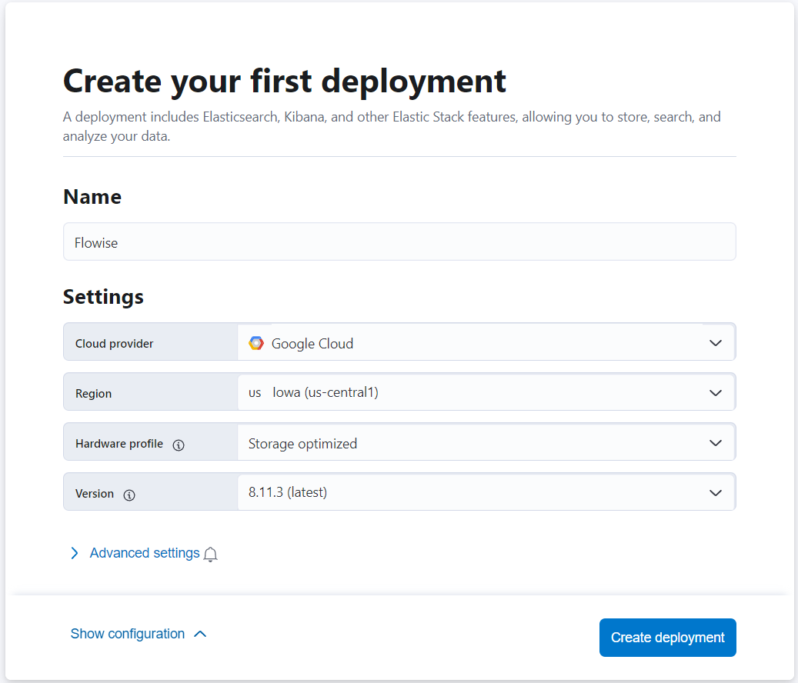
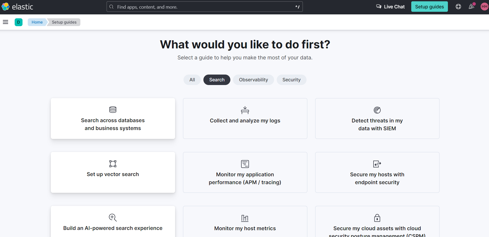
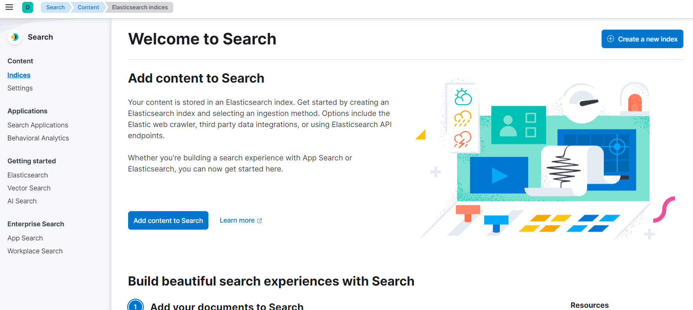
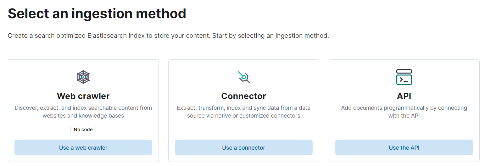
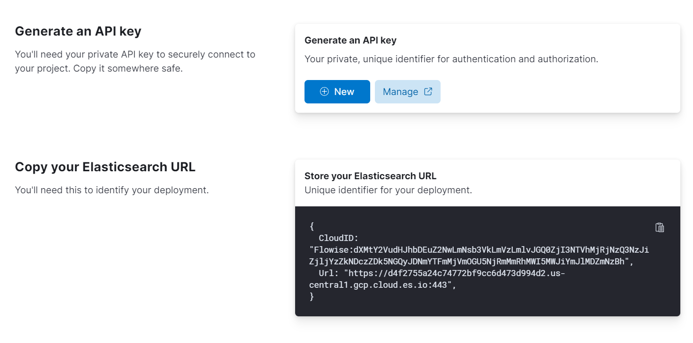

# Elastic

## 先决条件

1.  您可以使用[官方 Docker 镜像](https://www.elastic.co/guide/en/elasticsearch/reference/current/docker.html) 开始，也可以使用 Elastic 的官方云服务[Elastic Cloud](https://www.elastic.co/cloud/)。本指南将使用云版本。
2.  在 Elastic Cloud 上[注册](https://cloud.elastic.co/registration)一个帐户或使用现有帐户[登录](https://cloud.elastic.co/login)。

<figure><figcaption></figcaption></figure>

3. 点击**创建部署**。然后，命名您的部署，并选择提供商。

<figure><figcaption></figcaption></figure>

4. 部署完成后，您应该能够看到如下所示的设置指南。点击**设置向量搜索**选项。

<figure><figcaption></figcaption></figure>

5. 您现在应该看到**向量搜索**的**入门**页面。

<figure><figcaption></figcaption></figure>

6. 在左侧栏中，点击**索引**。然后，**创建新索引**。

<figure><figcaption></figcaption></figure>

7. 选择**API**摄取方法。

<figure><figcaption></figcaption></figure>

8. 命名您的搜索索引名称，然后**创建索引**。

<figure><figcaption></figcaption></figure>

9. 索引创建后，生成一个新的 API 密钥，记下生成的 API 密钥和 URL。

<figure><figcaption></figcaption></figure>

## Flowise 设置

1. 在画布上添加一个新的**Elasticsearch**节点，并填写**索引名称**。

<figure><figcaption></figcaption></figure>

2. 通过**Elasticsearch API**添加新的凭据。

<figure><figcaption></figcaption></figure>

3. 从 Elasticsearch 获取 URL 和 API 密钥，填写这些字段。

<figure><figcaption></figcaption></figure>

4. 凭据创建成功后，您可以开始上载数据。

<figure><figcaption></figcaption></figure>

<figure><figcaption></figcaption></figure>

5. 数据成功上载后，您可以从 Elastic 仪表板验证它：

<figure><figcaption></figcaption></figure>

6. 完成！您现在可以开始在聊天中提问了。

<figure><figcaption></figcaption></figure>

## 资源

* [LangChain JS Elastic](https://js.langchain.com/docs/integrations/vectorstores/elasticsearch)
* [向量搜索 (kNN) 实现指南 - API 版本](https://www.elastic.co/search-labs/blog/articles/vector-search-implementation-guide-api-edition)
