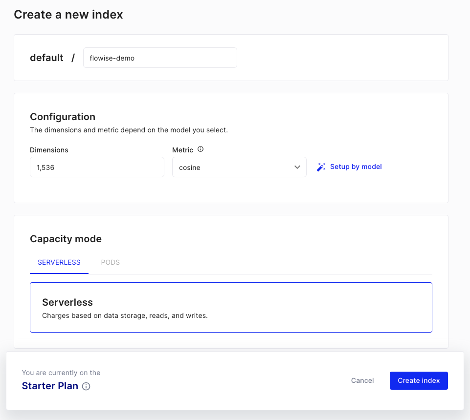
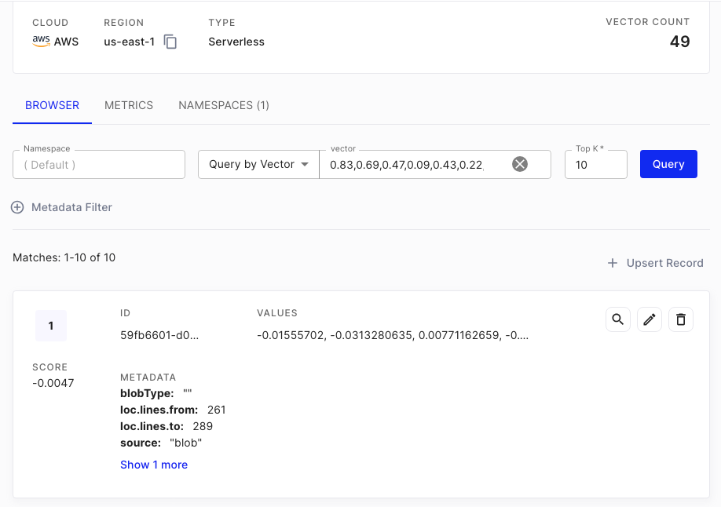

描述：

使用领先的全托管向量数据库 Pinecone 上传嵌入式数据并在查询时执行相似性搜索。

# Pinecone

## 先决条件

1. 注册 [Pinecone](https://app.pinecone.io/) 帐户
2. 点击 **创建索引**

<figure><figcaption></figcaption></figure>

3. 填写所需字段：
   - **索引名称**，要创建的索引的名称。（例如，“flowise-test”）
   - **维度**，要插入索引中的向量的尺寸。（例如，1536）

<figure><figcaption></figcaption></figure>

4. 点击 **创建索引**

## 设置

1. 获取/创建您的 **API 密钥**

<figure><figcaption></figcaption></figure>

2. 在画布上添加一个新的 **Pinecone** 节点并填写参数：
    - Pinecone 索引
    - Pinecone 命名空间（可选）

<figure><figcaption></figcaption></figure>

3. 创建新的 Pinecone 凭据 -> 填写 **API 密钥**

<figure><figcaption></figcaption></figure>

4. 向画布添加其他节点并启动上传过程
   - **文档** 可以连接到 [**文档加载器**](../document-loaders/) 类别下的任何节点
   - **嵌入** 可以连接到 [**嵌入**](../embeddings/) 类别下的任何节点

<figure><figcaption></figcaption></figure>

<figure><figcaption></figcaption></figure>

5. 从 [Pinecone 仪表板](https://app.pinecone.io) 验证数据是否已成功上传：

<figure><figcaption></figcaption></figure>

6.

## 资源

- LangChain Pinecone 向量存储集成
  - [Python](https://python.langchain.com/v0.2/docs/integrations/providers/pinecone/)
  - [NodeJS](https://js.langchain.com/v0.2/docs/integrations/vectorstores/pinecone)
- [Pinecone LangChain 集成](https://docs.pinecone.io/integrations/langchain)
- [Pinecone Flowise 集成](https://docs.pinecone.io/integrations/flowise)
- [Pinecone 官方客户端](https://docs.pinecone.io/reference/pinecone-clients)
