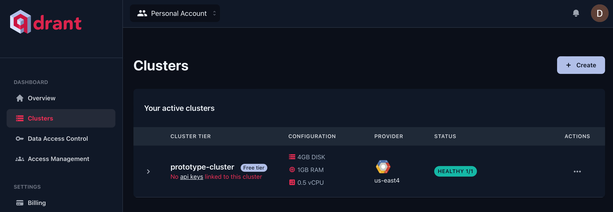
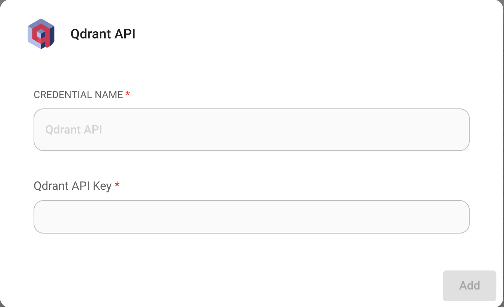
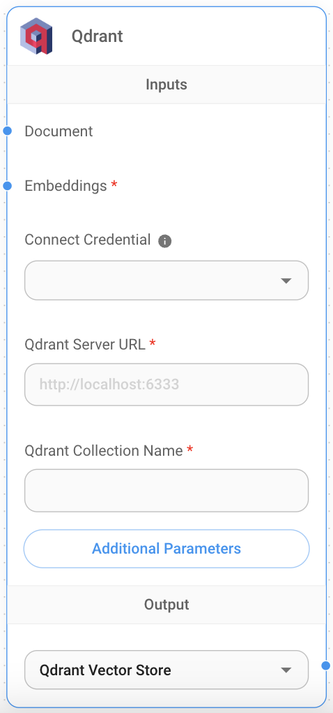

# Qdrant

## 先决条件

本地运行的 Qdrant 实例 [链接](https://qdrant.tech/documentation/quick-start/) 或 Qdrant 云实例。

获取 Qdrant 云实例的方法：

1. 前往 [云控制台](https://cloud.qdrant.io/overview) 的集群部分。
2. 选择**集群**，然后点击**+ 创建**。

<figure><figcaption></figcaption></figure>

3. 选择您的集群配置和区域。
4. 点击**创建**以配置您的集群。

## 设置

1. 从 [云控制台](https://cloud.qdrant.io/overview) 的**数据访问控制**部分获取/创建您的**API 密钥**。
2. 在画布上添加一个新的**Qdrant** 节点。
3. 使用 API 密钥创建一个新的 Qdrant 凭据。

<figure><figcaption></figcaption></figure>

4. 将所需信息输入**Qdrant** 节点：
   * Qdrant 服务器 URL
   * 集合名称

<figure><figcaption></figcaption></figure>

5. **文档**输入可以连接到 [**文档加载器**](../document-loaders/) 类别下的任何节点。
6. **嵌入**输入可以连接到 [**嵌入**](../embeddings/) 类别下的任何节点。

## 过滤

假设您已上载不同的文档，每个文档在元数据键 `{source}` 下指定一个唯一值。

<div align="left">

<figure><figcaption></figcaption></figure>

<figure><figcaption></figcaption></figure>

</div>

然后，您想根据它进行过滤。Qdrant 在过滤方面支持以下 [语法](https://qdrant.tech/documentation/concepts/filtering/#nested-key)：

**UI**

<figure><figcaption></figcaption></figure>

**API**

```json
"overrideConfig": {
    "qdrantFilter": {
        "should": [
            {
                "key": "metadata.source",
                "match": {
                    "value": "apple"
                }
            }
        ]
    }
}
```

## 资源

* [Qdrant 文档](https://qdrant.tech/documentation/)
* [LangChain JS Qdrant](https://js.langchain.com/docs/integrations/vectorstores/qdrant)
* [Qdrant 过滤器](https://qdrant.tech/documentation/concepts/filtering/#nested-key)
