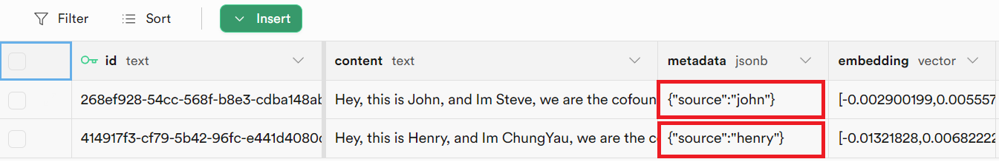

# Supabase

## 先决条件

1. 注册一个 [Supabase](https://supabase.com/) 账号
2. 点击 **新建项目**

<figure><figcaption></figcaption></figure>

3. 输入所需字段

| 字段名称                | 描述                                       |
| ------------------------- | ------------------------------------------------- |
| **名称**                  | 要创建的项目名称（例如：Flowise） |
| **数据库密码**            | PostgreSQL 数据库密码                |

<figure><figcaption></figcaption></figure>

4. 点击 **创建新项目** 并等待项目设置完成
5. 点击 **SQL 编辑器**

<figure><figcaption></figcaption></figure>

6. 点击 **新建查询**

<figure><figcaption></figcaption></figure>

7. 复制并粘贴以下 SQL 查询，然后通过 `Ctrl + Enter` 或点击 **运行** 来运行它。请注意表名和函数名。

* **表名**: `documents`
* **函数名**: `match_documents`

```plsql
-- 启用 pgvector 扩展以使用嵌入向量
create extension vector;

-- 创建一个表来存储您的文档
create table documents (
  id bigserial primary key,
  content text, -- 对应于 Document.pageContent
  metadata jsonb, -- 对应于 Document.metadata
  embedding vector(1536) -- 1536 适用于 OpenAI 嵌入，如有需要请更改
);

-- 创建一个函数来搜索文档
create function match_documents (
  query_embedding vector(1536),
  match_count int DEFAULT null,
  filter jsonb DEFAULT '{}'
) returns table (
  id bigint,
  content text,
  metadata jsonb,
  similarity float
)
language plpgsql
as $$
#variable_conflict use_column
begin
  return query
  select
    id,
    content,
    metadata,
    1 - (documents.embedding <=> query_embedding) as similarity
  from documents
  where metadata @> filter
  order by documents.embedding <=> query_embedding
  limit match_count;
end;
$$;

```

在某些情况下，您可能正在使用 [记录管理器](../record-managers_zh.md) 来跟踪 upsert 并防止重复。由于记录管理器为每个嵌入生成一个随机 UUID，您必须将 id 列实体更改为文本类型：

```sql
-- 启用 pgvector 扩展以使用嵌入向量
create extension vector;

-- 创建一个表来存储您的文档
create table documents (
  id text primary key, -- 更改为 TEXT
  content text,
  metadata jsonb,
  embedding vector(1536)
);

-- 创建一个函数来搜索文档
create function match_documents (
  query_embedding vector(1536),
  match_count int DEFAULT null,
  filter jsonb DEFAULT '{}'
) returns table (
  id text, -- 更改为 TEXT
  content text,
  metadata jsonb,
  similarity float
)
language plpgsql
as $$
#variable_conflict use_column
begin
  return query
  select
    id,
    content,
    metadata,
    1 - (documents.embedding <=> query_embedding) as similarity
  from documents
  where metadata @> filter
  order by documents.embedding <=> query_embedding
  limit match_count;
end;
$$;

```

<figure><figcaption></figcaption></figure>

## 设置

1. 点击 **项目设置**

<figure><figcaption></figcaption></figure>

2. 获取您的 **项目 URL 和 API 密钥**

<figure><figcaption></figcaption></figure>

3. 将每个详细信息（_API 密钥、URL、表名、查询名_）复制并粘贴到 **Supabase** 节点中

<figure><figcaption></figcaption></figure>

4. **文档** 可以连接到 [**文档加载器**](../document-loaders/) 类别下的任何节点
5. **嵌入** 可以连接到 [**嵌入**](../embeddings/) 类别下的任何节点

## 过滤

假设您已上传不同的文档，每个文档在 metadata 密钥 `{source}` 下都指定了一个唯一值

<figure><figcaption></figcaption></figure>

您可以使用元数据过滤来查询特定的元数据：

**UI**

<figure><figcaption></figcaption></figure>

**API**

```json
"overrideConfig": {
    "supabaseMetadataFilter": {
        "source": "henry"
    }
}
```

## 资源

* [LangChain JS Supabase](https://js.langchain.com/docs/modules/indexes/vector_stores/integrations/supabase)
* [Supabase 博客文章](https://supabase.com/blog/openai-embeddings-postgres-vector)
* [元数据过滤](https://js.langchain.com/docs/integrations/vectorstores/supabase#metadata-filtering)
