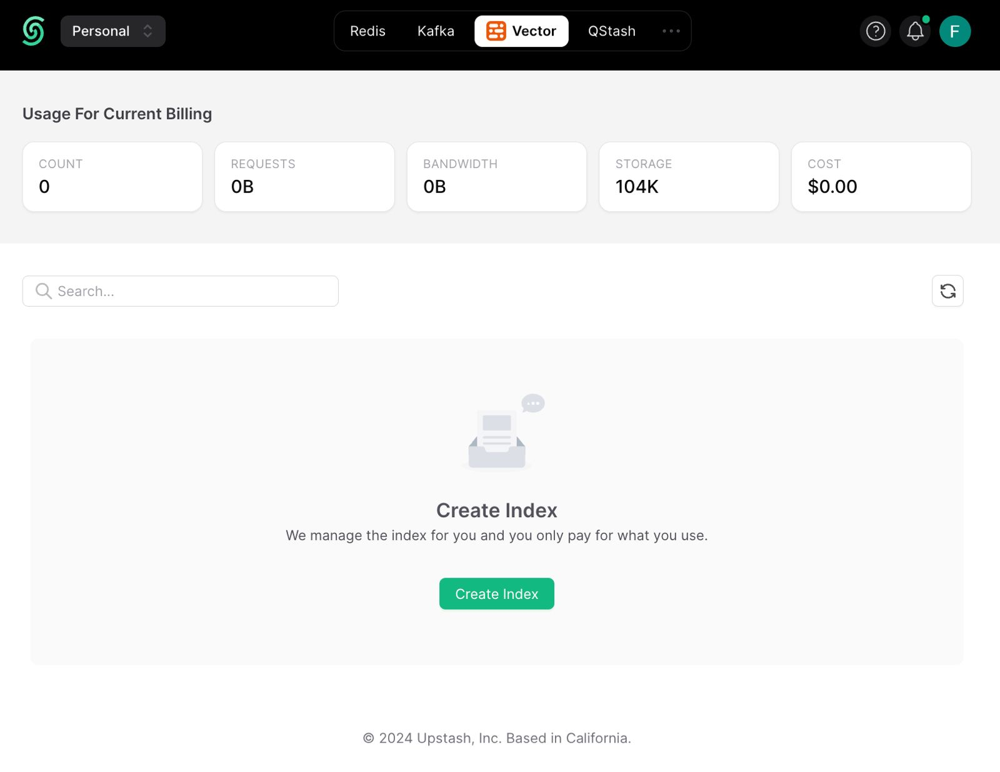
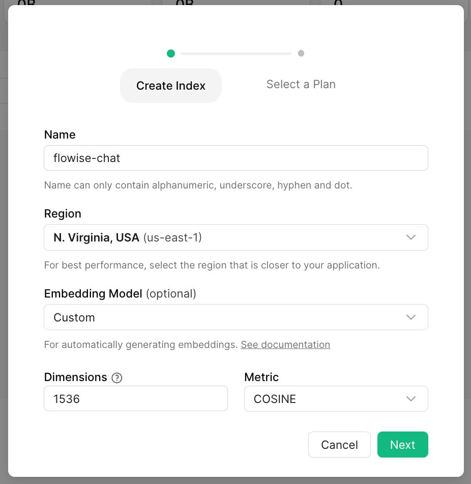
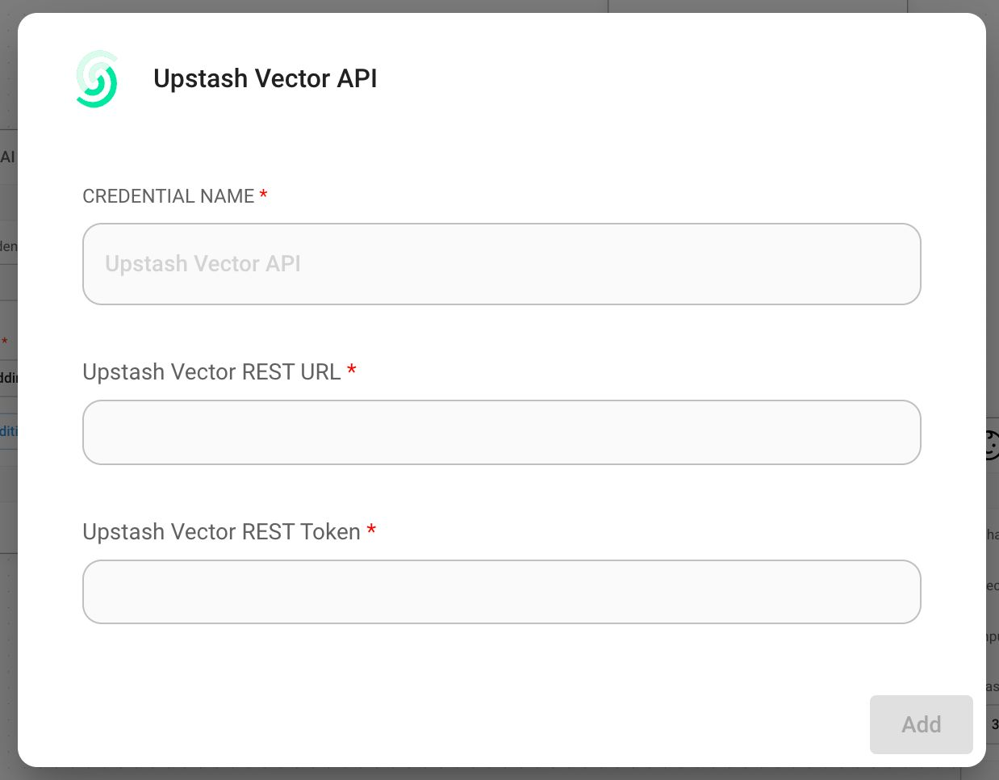
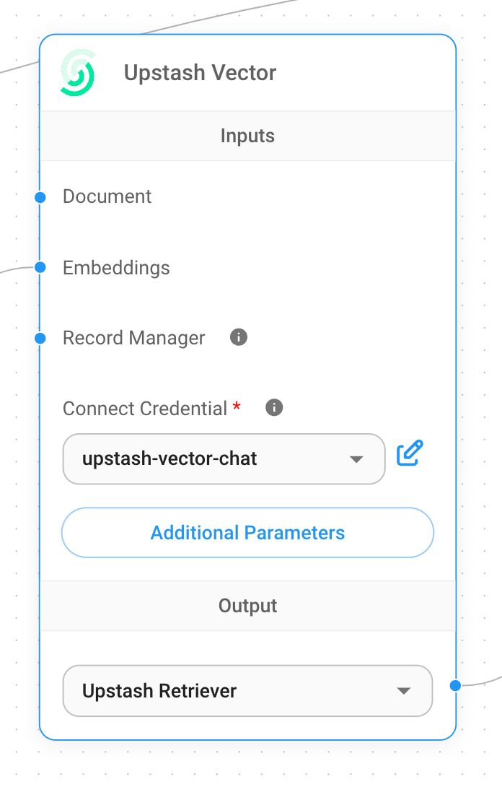
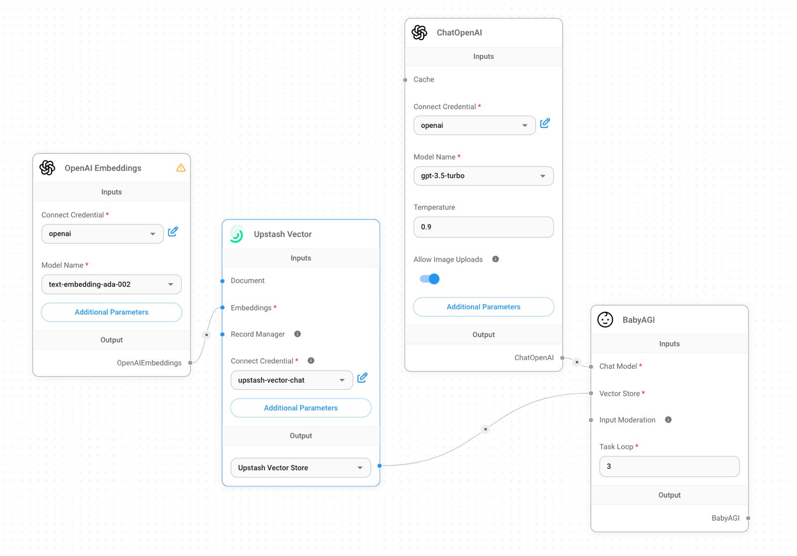
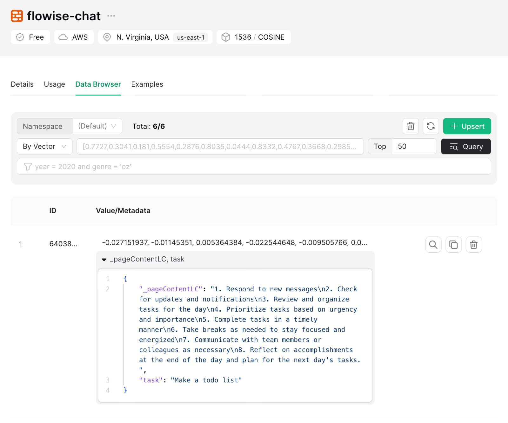

# Upstash

## 先决条件

1. 注册或登录 [Upstash 控制台](https://console.upstash.com)
2. 导航到向量页面并点击**创建索引**
   <figure><figcaption></figcaption></figure>
3. 进行必要的配置并创建索引。

   1. **索引名称**，要创建的索引的名称。（例如：“flowise-upstash-demo”）
   2. **维度**，要插入索引中的向量的尺寸。（例如：1536）
   3. **嵌入模型**，要在 [Upstash 嵌入](https://upstash.com/docs/vector/features/embeddingmodels) 中使用的模型。这是可选的。如果启用它，则无需提供嵌入模型。

   <figure><figcaption></figcaption></figure>

## 设置

1. 获取您的索引凭据

<figure><figcaption></figcaption></figure>

2. 创建新的 Upstash 向量凭据并填写：
   1. 从控制台的 UPSTASH_VECTOR_REST_URL 获取 Upstash 向量 REST URL
   2. 从控制台的 UPSTASH_VECTOR_REST_TOKEN 获取 Upstash 向量 REST 令牌

<figure><figcaption></figcaption></figure>

3. 向画布添加新的 **Upstash 向量** 节点

<figure><figcaption></figcaption></figure>

4. 向画布添加其他节点并启动 upsert 过程
   - **文档** 可以连接到 [**文档加载器**](../document-loaders/) 类别下的任何节点
   - **嵌入** 可以连接到 [**嵌入**](../embeddings/) 类别下的任何节点

<figure><figcaption></figcaption></figure>

5. 从 [Upstash 仪表板](https://console.upstash.com) 验证数据是否已成功更新：

<figure><figcaption></figcaption></figure>
