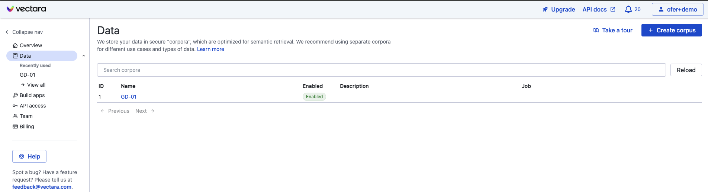
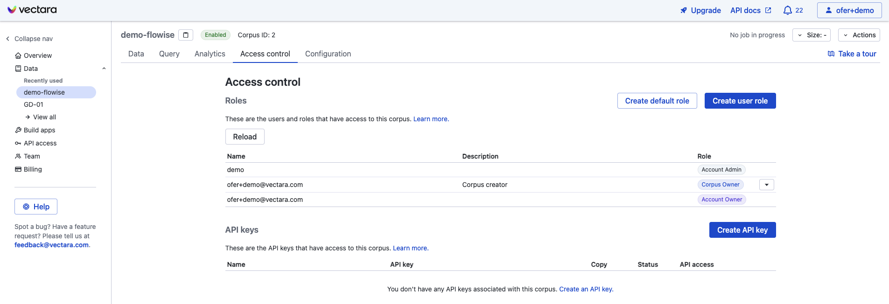
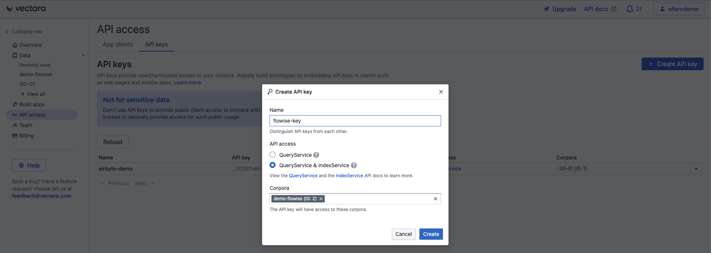
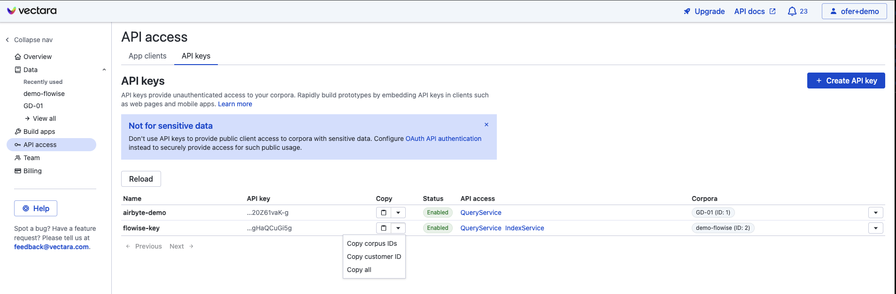
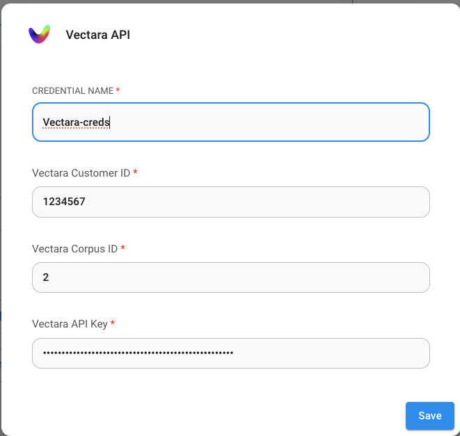
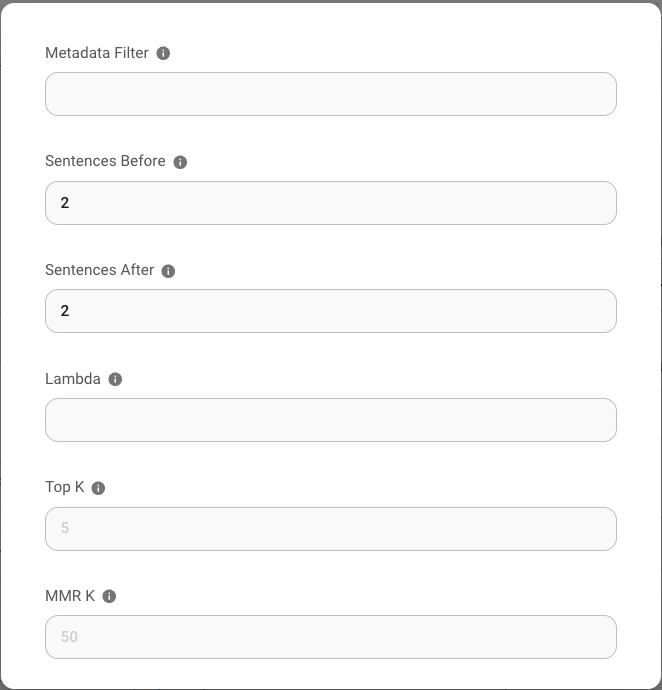

# Vectara

## 快速入门教程



## 预备条件

1. 注册 [Vectara](https://vectara.com/integrations/flowise) 账户
2. 点击 **创建语料库 (Create Corpus)**

<figure><figcaption></figcaption></figure>

为要创建的语料库命名，然后点击 **创建语料库 (Create Corpus)**，等待语料库设置完成。

## 设置

1. 在语料库视图中点击 **“访问控制 (Access Control)”** 选项卡

<figure><figcaption></figcaption></figure>

2. 点击 **“创建 API 密钥 (Create API Key)”** 按钮，为 API 密钥命名，并选择 **QueryService & IndexService** 选项

<figure><figcaption></figcaption></figure>

3. 点击 **创建 (Create)** 创建 API 密钥
4. 通过点击新 API 密钥下方的“复制 (copy)”下拉箭头，获取您的 **语料库 ID (Corpus ID)、API 密钥 (API Key) 和客户 ID (Customer ID)**：

<figure><figcaption></figcaption></figure>

5. 返回 Flowise 画布，创建您的聊天流程。点击凭据下拉菜单中的 **创建新 (Create New)** 并输入您的 Vectara 凭据。

<figure><figcaption></figcaption></figure>

6. 尽情享受！

## Vectara 查询参数

要更精细地控制 Vectara 查询参数，请点击“**附加参数 (Additional Parameters)”**，然后您可以更新以下参数的默认值：

* 元数据过滤器：Vectara 支持元数据过滤。要使用 [过滤](https://docs.vectara.com/docs/common-use-cases/filtering-by-metadata/filter-overview)，请确保您要过滤的元数据字段已在您的 Vectara 语料库中定义。
* “之前的句子 (Sentences before)”和“之后的句子 (Sentences after)”：这些参数控制从 Vectara 检索引擎返回的匹配文本之前/之后有多少个句子作为结果。
* Lambda：定义 Vectara 中 [混合搜索](https://docs.vectara.com/docs/learn/hybrid-search) 的行为。
* Top-K：从 Vectara 返回的查询结果数量。
* MMR-K：用于 [MMR](https://docs.vectara.com/docs/api-reference/search-apis/reranking#maximal-marginal-relevance-mmr-reranker)（最大边际相关性）的结果数量。

<figure><figcaption></figcaption></figure>

## 资源

* [LangChain JS Vectara 博客文章](https://blog.langchain.dev/langchain-vectara-better-together/)
* [使用 Vectara 的 Langchain 集成的 5 个理由博客文章](https://vectara.com/5-reasons-to-use-vectaras-langchain-integration/)
* [Vectara 中的最大边际相关性](https://vectara.com/blog/get-diverse-results-and-comprehensive-summaries-with-vectaras-mmr-reranker/)
* [Vectara Boomerang 嵌入模型博客文章](https://vectara.com/introducing-boomerang-vectaras-new-and-improved-retrieval-model/)
* [使用 Vectara 的 HHEM 检测幻觉](https://vectara.com/blog/cut-the-bull-detecting-hallucinations-in-large-language-models/)
