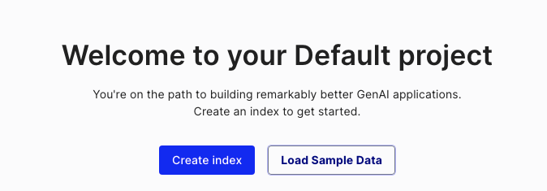
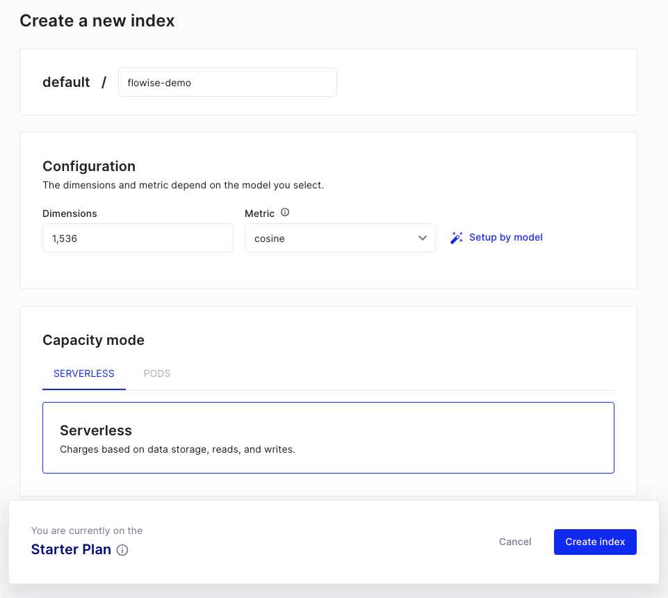
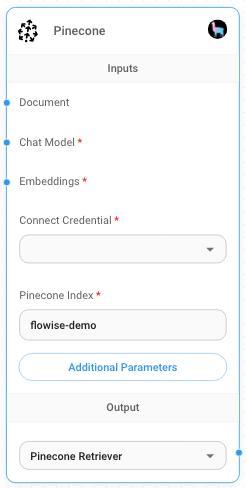
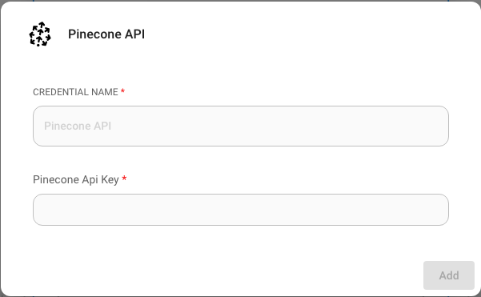
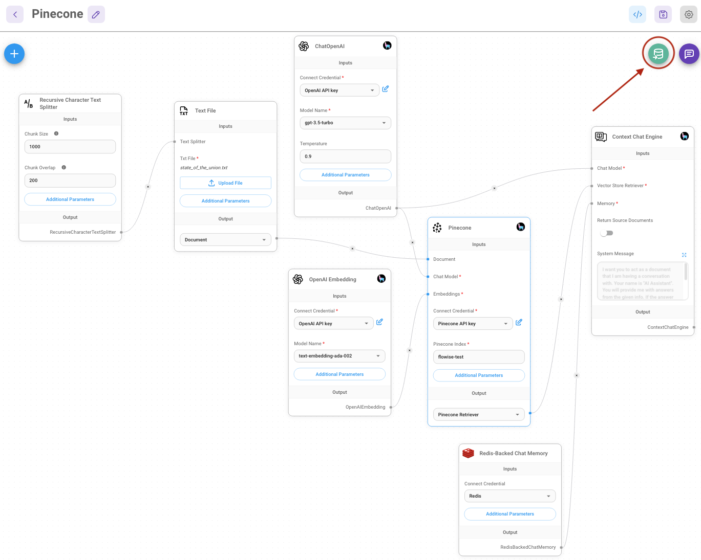
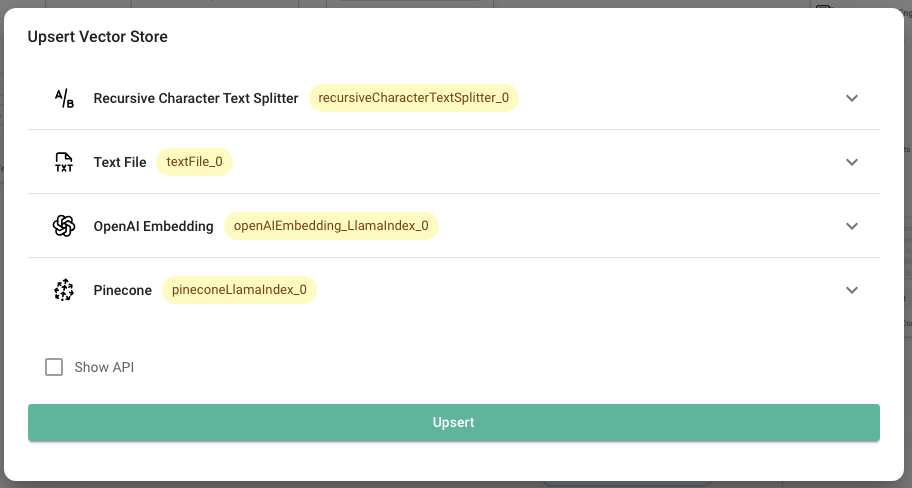
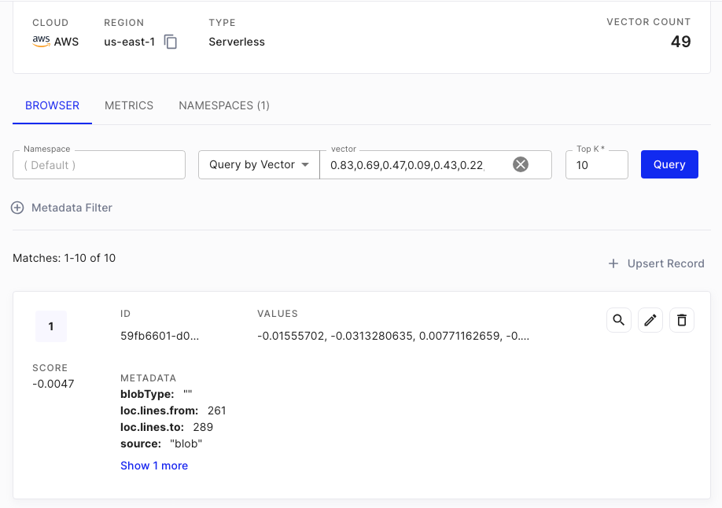

# Pinecone

## 先决条件

1. 注册一个 [Pinecone](https://app.pinecone.io/) 账户
2. 点击 **Create index**

<figure><figcaption></figcaption></figure>

3. 填写必填字段：
   - **Index Name**，要创建的索引名称。（例如 "flowise-test"）
   - **Dimensions**，要插入索引的向量大小。（例如 1536）

<figure><figcaption></figcaption></figure>

4. 点击 **Create Index**

## 设置

1. 获取/创建你的 **API Key**

<figure><figcaption></figcaption></figure>

2. 在画布上添加一个新的 **Pinecone** 节点并填写参数：
    - Pinecone Index
    - Pinecone namespace（可选）

<figure><figcaption>
Pinecone 节点
</figcaption></figure>

3. 创建新的 Pinecone 凭证 -> 填写 **API Key**

<figure><figcaption></figcaption></figure>

4. 在画布上添加其他节点并开始 upsert 过程
   - **Document** 可以与 [**Document Loader**](../../langchain/document-loaders/) 类别下的任何节点连接
     
     LlamaIndex 的文档加载器和文本分割器尚不可用，但使用 LangChain 下可用的加载器仍然可以正常使用 LlamaIndex 进行查询。
     
   - **Embeddings** 可以与 [**Embeddings**](../embeddings/) 类别下的任何节点连接

<figure><figcaption></figcaption></figure>

<figure><figcaption></figcaption></figure>

5. 在 [Pinecone 仪表板](https://app.pinecone.io) 上验证数据是否已成功 upsert：

<figure><figcaption></figcaption></figure>