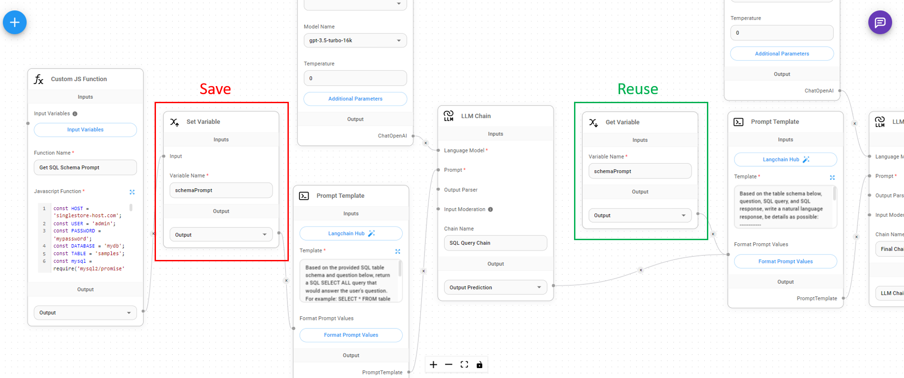

# 设置/获取变量

如果您正在运行自定义函数或大型语言模型链，您可能希望在其他节点中重用结果，而无需再次重新计算/重新运行相同的内容。您可以将输出结果保存为变量，并在流程路径中更下游的其他节点中重用它。

<figure><figcaption></figcaption></figure>

### 设置变量

我们可以从输出 `字符串、数字、布尔值、JSON、数组` 的任何节点获取输入，并为其分配一个变量名。

<figure><figcaption></figcaption></figure>

### 获取变量

您可以在稍后的阶段通过变量名获取变量值：

<figure><figcaption></figcaption></figure>
