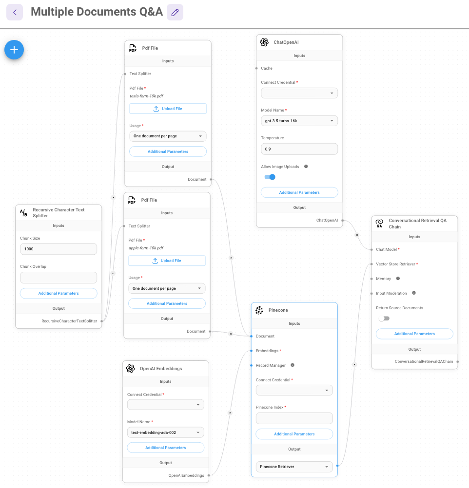
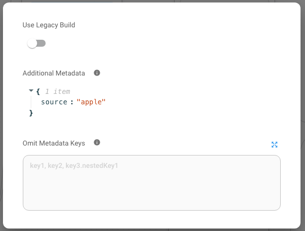
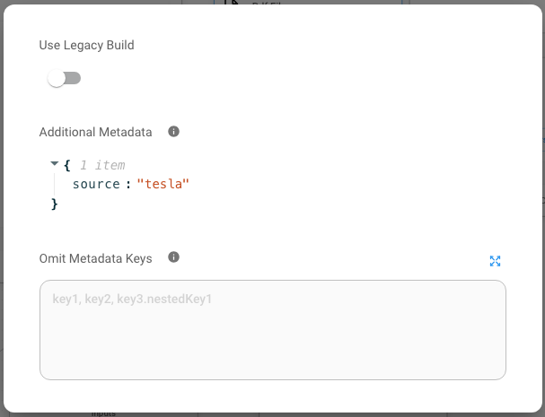
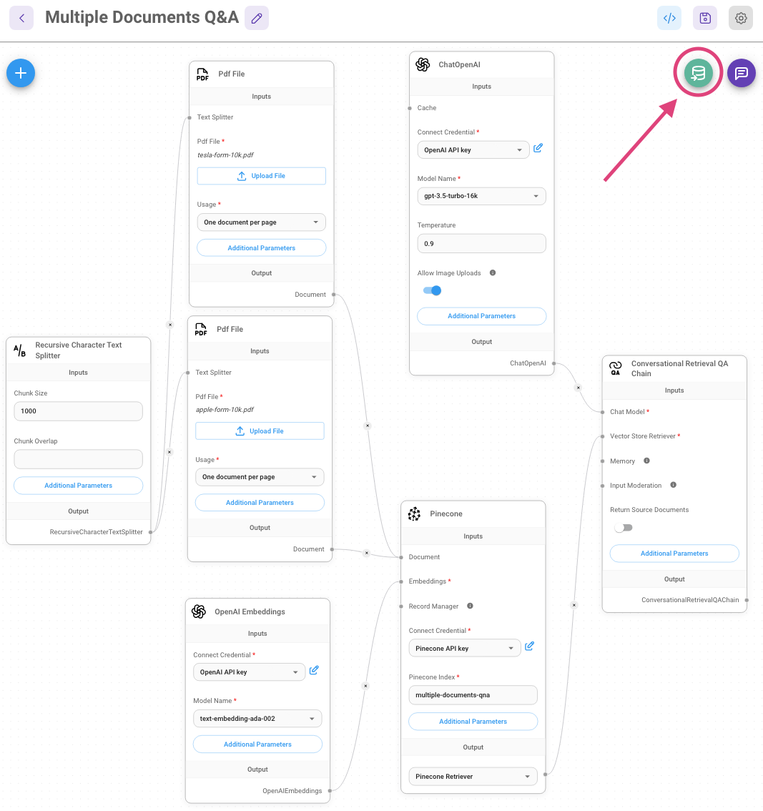
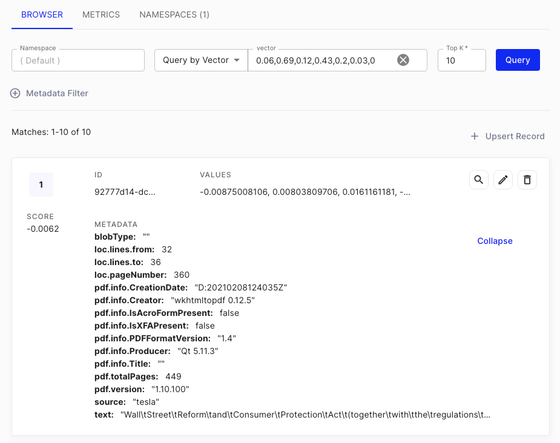

# 多文档问答

***

从之前的[网页抓取问答](web-scrape-qna_zh.md)示例中，我们只对一个网站进行了 upsert 和查询操作。如果我们有多个网站或多个文档，该怎么办呢？让我们来看一下如何实现这一点。

在这个示例中，我们将对两个 PDF 文件进行问答，分别是苹果和特斯拉的 FORM-10K 文件。

<div align="left" data-full-width="false"><figure><figcaption></figcaption></figure> <figure><figcaption></figcaption></figure></div>

## Upsert (数据插入)

1. 在市场模板中找到名为 **对话式检索 QA 链** 的示例流程。
2. 我们将使用[PDF 文件加载器](../integrations/langchain/document-loaders/pdf-file_zh.md)，并上传相应的文件：

<figure><figcaption></figcaption></figure>

3. 点击 PDF 文件加载器的 **附加参数**，并指定元数据对象。例如，上传的苹果 FORM-10K PDF 文件可以具有元数据对象 `{source: apple}`，而上传的特斯拉 FORM-10K PDF 文件可以具有 `{source: tesla}`。这样做是为了在检索时区分文档。

<div align="left"><figure><figcaption></figcaption></figure> <figure><figcaption></figcaption></figure></div>

4. 填写 Pinecone 的凭据后，点击 Upsert：

<figure><figcaption></figcaption></figure>

<figure><figcaption></figcaption></figure>

5. 在[Pinecone 控制台](https://app.pinecone.io) 上，您将能够看到已添加的新向量。

<figure><figcaption></figcaption></figure>

## 查询

1. 验证数据已上传到 Pinecone 后，我们现在就可以开始在聊天中提问了！

<figure><figcaption></figcaption></figure>

2. 但是，检索到的用于返回答案的上下文是苹果和特斯拉文档的混合。您可以从“源文档”中看到：

<div align="left"><figure><figcaption></figcaption></figure> <figure><figcaption></figcaption></figure></div>

3. 我们可以通过从 Pinecone 节点指定元数据过滤器来解决这个问题。例如，如果我们只想检索来自苹果 FORM-10K 的上下文，我们可以回顾我们在[#upsert](multiple-documents-qna.md#upsert "mention")步骤中指定的元数据，然后在下面的元数据过滤器中使用相同的元数据：

<figure><figcaption></figcaption></figure>

4. 让我们再次提出相同的问题，现在我们应该看到所有检索到的上下文都来自苹果 FORM-10K：

<figure><figcaption></figcaption></figure>


每个向量数据库提供商都有不同的过滤语法格式，建议阅读相应的向量数据库文档。


5. 但是，问题在于这种元数据过滤有点 _**“硬编码”**_。理想情况下，我们应该让 LLM 根据问题决定检索哪个文档。

## 工具代理

我们可以通过使用[工具代理](../integrations/langchain/agents/tool-agent_zh.md)来解决 _**“硬编码”**_ 元数据过滤问题。

通过向代理提供工具，我们可以让代理根据问题决定使用哪个工具。

1. 创建一个[检索器工具](../integrations/langchain/tools/retriever-tool_zh.md)，名称和描述如下：

<table><thead><tr><th width="178">名称</th><th>描述</th></tr></thead><tbody><tr><td>search_apple</td><td>使用此函数回答有关苹果公司 (APPL) 的用户问题。它包含一份 SEC 10K 表格文件，描述了 2022 年期间苹果公司 (APPL) 的财务状况。</td></tr></tbody></table>

2. 使用元数据过滤器 `{source: apple}` 连接到 Pinecone 节点

<figure><figcaption></figcaption></figure>

3. 对特斯拉重复相同的操作：

<table><thead><tr><th width="175">名称</th><th width="322">描述</th><th>Pinecone 元数据过滤器</th></tr></thead><tbody><tr><td>search_tsla</td><td>使用此函数回答有关特斯拉公司 (TSLA) 的用户问题。它包含一份 SEC 10K 表格文件，描述了 2022 年期间特斯拉公司 (TSLA) 的财务状况。</td><td><code>{source: tesla}</code></td></tr></tbody></table>


指定清晰简洁的描述非常重要。这允许 LLM 更好地决定何时使用哪个工具。


您的流程应如下所示：

<figure><figcaption></figcaption></figure>

4. 现在，我们需要为工具代理创建一个通用指令。点击节点的 **附加参数**，并指定 **系统消息**。例如：

```
您是一位经验丰富的财务分析师，总是使用您可用的工具以最相关的资料回答问题。
这些工具包含有关用户已表达兴趣的公司信息。
以下是一些您必须遵循的指导原则：
* 对于财务问题，您必须使用工具查找答案，然后编写回复。
* 即使看起来您的工具无法回答问题，您仍然必须使用它们来查找最相关的资料和见解。不使用它们看起来就像您没有尽职尽责。
* 您可以假设用户的财务问题与他们选择讨论的文档相关。
* 对于任何与财务分析无关的用户消息，请礼貌地拒绝回复，并建议用户提出相关问题。
* 如果您的工具无法找到答案，您应该说您没有找到答案，但仍然要转达工具找到的任何有用信息。
* 不要提出澄清问题，只需返回答案。

您可用的工具可以访问用户已选择与您讨论的以下 SEC 文件：
- 苹果公司 (APPL) FORM 10K 2022
- 特斯拉公司 (TSLA) FORM 10K 2022

当前日期：2024-01-28
```

5. 保存聊天流程，然后开始提问！

<figure><figcaption></figcaption></figure>

<div align="left"><figure><figcaption></figcaption></figure> <figure><figcaption></figcaption></figure></div>

6. 跟进特斯拉：

<figure><figcaption></figcaption></figure>

7. 现在，我们可以通过使用工具 + 代理，无需“硬编码”元数据过滤，即可询问我们之前已上传到向量数据库的任何文档的问题。

## 元数据检索器

使用工具代理方法，用户必须创建多个检索器工具来从不同的来源检索文档。如果存在大量具有不同元数据的文档来源，这可能会成为问题。仅使用上述苹果和特斯拉的示例，我们可能会扩展到迪士尼、亚马逊等其他公司。为每家公司创建一个检索器工具将是一项繁琐的任务。

元数据检索器派上用场。其理念是让 LLM 从用户问题中提取元数据，然后在搜索向量数据库时将其用作过滤器。

例如，如果用户正在询问与苹果相关的问题，则元数据过滤器 `{source: apple}` 将自动应用于向量数据库搜索。

<div align="left"><figure><figcaption></figcaption></figure> <figure><figcaption></figcaption></figure></div>

在这种情况下，我们可以使用单个检索器工具，并将 **元数据检索器** 置于向量数据库和检索器工具之间。

<figure><figcaption></figcaption></figure>


## XML 代理

对于某些 LLM，不支持函数调用功能。在这种情况下，我们可以使用 XML 代理以更结构化的格式/语法提示 LLM，目标是使用提供的工具。

它具有以下底层提示：

```xml
您是一位乐于助人的助手。帮助用户回答任何问题。

您可以使用以下工具：

{tools}

为了使用工具，您可以使用 <tool></tool> 和 <tool_input></tool_input> 标签。然后您将以 <observation></observation> 的形式获得回复。
例如，如果您有一个名为“search”的工具可以运行谷歌搜索，为了搜索旧金山的 weather，您将回复：

<tool>search</tool><tool_input>weather in SF</tool_input>
<observation>64 degrees</observation>

完成后，在 <final_answer></final_answer> 之间回复最终答案。例如：

<final_answer>旧金山的 weather 是 64 度</final_answer>

开始！

之前的对话：
{chat_history}

问题：{input}
{agent_scratchpad}
```

<figure><figcaption></figcaption></figure>

## 结论

我们已经介绍了如何使用对话式检索 QA 链及其在查询多个文档时的局限性。并且我们能够通过使用 OpenAI 函数代理/XML 代理 + 工具来克服这个问题。您可以在下面找到模板：




