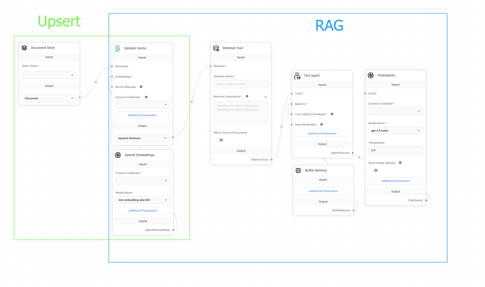
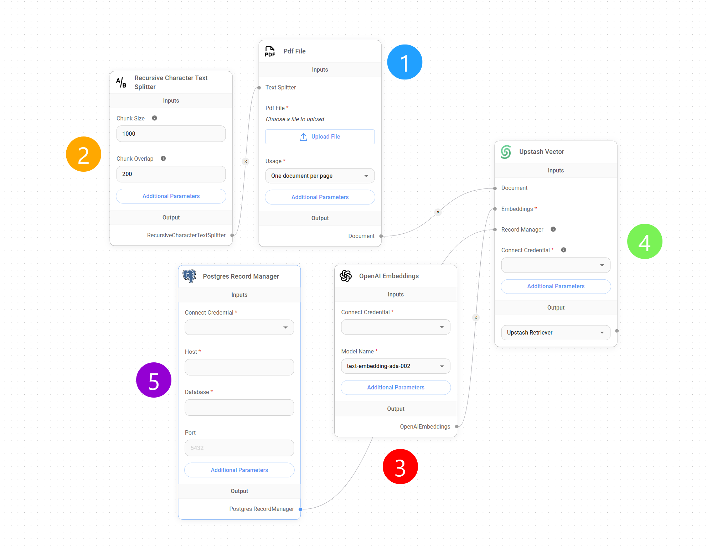
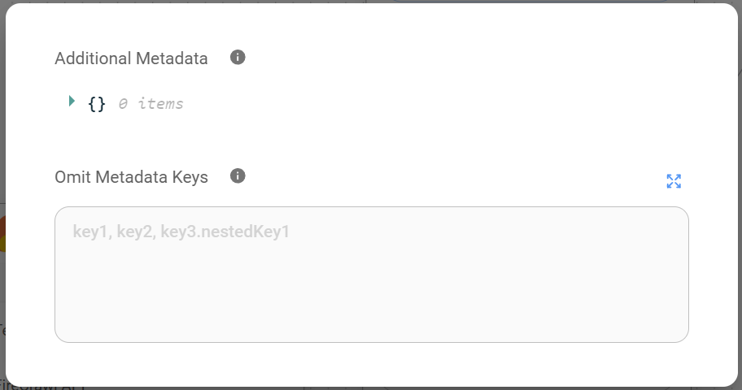
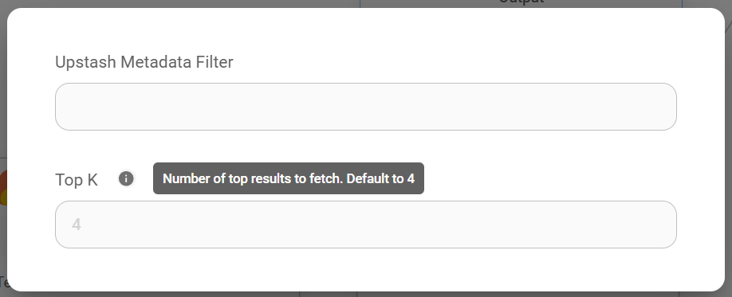
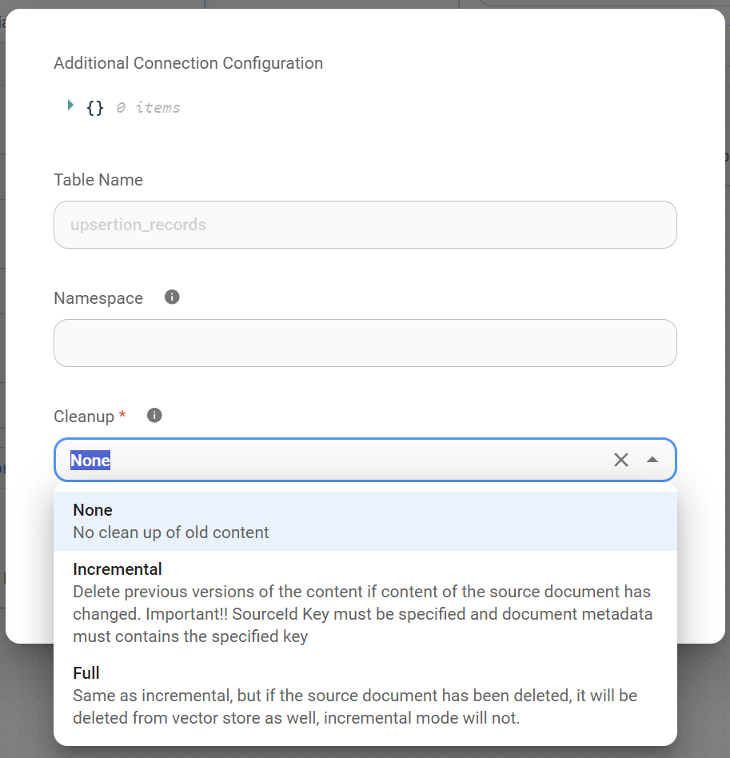
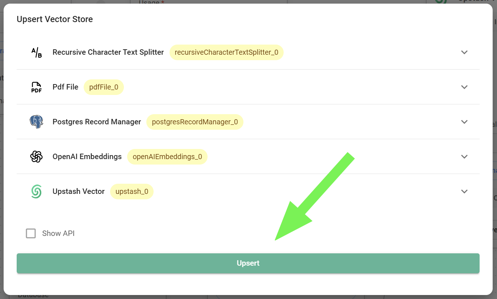

# 向 Flowise 的向量数据库插入数据

***

使用 Flowise 向 [向量数据库](../integrations/langchain/vector-stores/) 插入数据主要有两种方法：通过 [API 调用](../using-flowise/api.md#id-2.-vector-upsert-api) 或使用我们为此目的准备的一组专用节点。

本指南虽然**强烈建议**您在向向量数据库插入数据之前使用 [文档存储](../using-flowise/document-stores_zh.md) 准备数据，但我们将使用为此目的所需的特定节点完成整个过程，概述步骤、这种方法的优势以及高效数据处理的优化策略。

## 理解插入过程

首先需要理解的是，向 [向量数据库](../integrations/langchain/vector-stores/) 插入数据是构建 [检索增强生成 (RAG)](multiple-documents-qna_zh.md) 系统的基础。但是，一旦此过程完成，RAG 就可以独立执行。

换句话说，在 Flowise 中，您可以无需完整的 RAG 设置即可插入数据，并且您可以运行 RAG 而无需使用插入过程中使用的特定节点，这意味着虽然填充良好的向量数据库对于 RAG 的运行至关重要，但实际的检索和生成过程不需要持续插入。

<figure><figcaption>
插入与 RAG
</figcaption></figure>

## 设置

假设我们有一个长篇 PDF 格式的数据集，需要将其插入到我们的 [Upstash 向量数据库](../integrations/langchain/vector-stores/upstash-vector_zh.md) 中，以便我们可以指示 LLM 从该文档中检索特定信息。

为此，并为了说明本教程，我们需要创建一个包含 5 个不同节点的**插入流程**：

<figure><figcaption>
插入流程
</figcaption></figure>

## 1. 文档加载器

第一步是使用 [文档加载器节点](../integrations/langchain/document-loaders/) 将我们的 PDF 数据**上传到 Flowise 实例**。文档加载器是专门处理各种文档格式（包括**PDF**、**TXT**、**CSV**、Notion 页面等）摄取的专用节点。

重要的是，每个文档加载器都带有两个重要的**附加参数**，允许我们随意添加和省略数据集中的元数据。

<figure><figcaption>
附加参数
</figcaption></figure>


**提示**: 添加/省略元数据参数虽然是可选的，但对于在向量数据库中插入数据集后定位数据集或从中删除不必要的元数据非常有用。


## 2. 文本分割器

上传 PDF 或数据集后，我们需要将其**分割成更小的片段、文档或块**。这是至关重要的预处理步骤，主要有两个原因：

* **检索速度和相关性**: 将大型文档作为单个实体存储在向量数据库中并对其进行查询可能会导致检索时间变慢，并且可能导致结果的相关性降低。将文档分割成较小的块可以实现更具针对性的检索。通过针对更小、更集中的信息单元进行查询，我们可以缩短响应时间并提高检索结果的精度。
* **成本效益**: 由于我们只检索相关的块而不是整个文档，因此 LLM 处理的标记数量大大减少。这种有针对性的检索方法直接转化为降低 LLM 的使用成本，因为计费通常基于标记消耗。通过最大限度地减少发送到 LLM 的无关信息量，我们还可以优化成本。

### 节点

在 Flowise 中，此分割过程是使用 [文本分割器节点](../integrations/langchain/text-splitters/) 完成的。这些节点提供了一系列文本分割策略，包括：

* **字符文本分割**: 将文本分割成固定数量字符的块。此方法简单明了，但可能会将单词或短语分割成不同的块，从而可能破坏上下文。
* **标记文本分割**: 基于单词边界或所选嵌入模型的标记方案对文本进行分割。这种方法通常会导致语义上更连贯的块，因为它保留了单词边界并考虑了文本的底层语言结构。
* **递归字符文本分割**: 此策略旨在将文本分割成在保持语义连贯性的同时保持在指定大小限制内的块。它特别适用于具有嵌套部分或标题的分层文档。它不会盲目地在字符限制处分割，而是递归地分析文本以查找逻辑断点，例如句子结尾或部分断点。这种方法确保每个块都代表一个有意义的信息单元，即使它略微超过目标大小。
* **Markdown 文本分割器**: 此分割器专为 Markdown 格式的文档而设计，它根据 Markdown 标题和结构元素对文本进行逻辑分割，创建与文档中逻辑部分相对应的块。
* **代码文本分割器**: 此分割器专为分割代码文件而设计，它考虑代码结构、函数定义和其他特定于编程语言的元素，以创建适合代码搜索和文档编制等任务的有意义的块。
* **HTML 到 Markdown 文本分割器**: 此专用分割器首先将 HTML 内容转换为 Markdown，然后应用 Markdown 文本分割器，从而允许对网页和其他 HTML 文档进行结构化分割。

文本分割器节点提供对文本分割的精细控制，允许自定义参数，例如：

* **块大小**: 每个块的所需最大大小，通常以字符或标记定义。
* **块重叠**: 连续块之间重叠的字符或标记数，有助于保持块之间的上下文流程。


**提示**: 块大小和块重叠值不是累加的。选择 `chunk_size=1200` 和 `chunk_overlap=400` 不会导致总块大小为 1600。重叠值决定了从前一个块中包含在当前块中的标记数量以保持上下文。它不会增加总块大小。


### 理解块重叠

在基于向量的检索和 LLM 查询的上下文中，块重叠在**保持上下文连续性**和**提高响应准确性**方面起着**重要作用**，尤其是在处理有限的检索深度或**top K**时，后者是确定从 [向量数据库](../integrations/langchain/vector-stores/) 中检索到的与查询最相似的块的最大数量的参数。

在查询处理过程中，LLM 对向量数据库执行相似性搜索，以检索与给定查询语义上最相关的块。如果检索深度（由 top K 参数表示）设置为较小的值（默认为 4），则 LLM 最初仅使用来自这 4 个块的信息来生成其响应。

这种情况给我们带来了一个问题，因为仅依赖于数量有限且没有重叠的块可能会导致答案不完整或不准确，尤其是在处理需要跨多个块的信息的查询时。

块重叠通过确保文本上下文的一部分在连续块之间共享来解决此问题，**从而增加了给定查询的所有相关信息都包含在检索到的块中的可能性**。

换句话说，这种重叠充当块之间的桥梁，使 LLM 即使仅限于一小部分检索到的块（top K），也能访问更广泛的上下文窗口。如果查询与扩展到单个块之外的概念或信息片段相关，则重叠区域会增加捕获所有必要上下文的可能性。

因此，通过在文本分割阶段引入块重叠，我们增强了 LLM 的能力：

1. **保持上下文连续性**: 重叠的块在连续段之间提供了更平滑的信息转换，使模型能够对文本保持更连贯的理解。
2. **提高检索准确性**: 通过增加在目标 top K 检索到的块中捕获所有相关信息的概率，重叠有助于获得更准确和上下文更合适的响应。

### 准确性与成本

因此，为了进一步优化检索准确性和成本之间的权衡，可以使用两种主要策略：

1. **增加/减少块重叠**: 在文本分割过程中调整重叠百分比允许对块之间共享上下文的数量进行细粒度控制。较高的重叠百分比通常会导致上下文保留得到改善，但也可能会增加成本，因为您需要使用更多块来包含整个文档。相反，较低的重叠百分比可以降低成本，但可能会丢失块之间的关键上下文信息，从而可能导致 LLM 的答案不太准确或不完整。
2. **增加/减少 top K**: 提高默认 top K 值 (4) 会扩展为响应生成而考虑的块的数量。虽然这可以提高准确性，但也会增加成本。


**提示**: 最佳**重叠**和**top K**值的选取取决于文档复杂性、嵌入模型特性以及所需准确性和成本之间的平衡等因素。对这些值进行实验对于找到特定需求的理想配置非常重要。


## 3. 嵌入

现在，我们已经上传了数据集并配置了数据在插入到 [向量数据库](../integrations/langchain/vector-stores/) 之前将如何分割。此时，[嵌入节点](../integrations/langchain/embeddings/) 开始发挥作用，**将所有这些块转换成 LLM 可以轻松理解的“语言”**。

在此上下文中，嵌入是将文本转换为捕获其含义的数值表示的过程。这种数值表示也称为嵌入向量，是一个多维数字数组，其中每个维度代表文本含义的特定方面。

这些向量允许 LLM 通过测量它们在此多维空间中的距离或相似性来比较和搜索向量存储中相似的文本片段。

### 理解嵌入/向量数据库维度

向量数据库索引中的维度数量由我们插入数据时使用的嵌入模型决定，反之亦然。每个维度代表数据中的特定特征或概念。例如，一个**维度**可能**代表特定主题、情感或文本的其他方面**。

我们用来嵌入数据的维度越多，捕获文本细微含义的潜力就越大。但是，这种增加是以每个查询的计算需求更高为代价的。

一般来说，较多的维度需要更多资源来存储、处理和比较生成的嵌入向量。因此，像使用 768 个维度的 Google `embedding-001` 这样的嵌入模型在理论上比像具有 3072 个维度的 OpenAI `text-embedding-3-large` 这样的其他模型更便宜。

需要注意的是，**维度与含义捕获之间的关系并非严格线性**；存在一个收益递减点，在该点添加更多维度会带来微不足道的益处，但却增加了不必要的成本。


**提示**: 为了确保嵌入模型和向量数据库索引之间的兼容性，维度对齐至关重要。**模型和索引都必须使用相同的维度数量来进行向量表示**。维度不匹配会导致插入错误，因为向量数据库设计为处理由所选嵌入模型确定的特定大小的向量。


## 4. 向量数据库

[向量数据库节点](../integrations/langchain/vector-stores/) 是我们插入流程的**最终节点**。它充当 Flowise 实例和向量数据库之间的桥梁，使我们能够将生成的嵌入以及任何相关的元数据发送到我们的目标向量数据库索引以进行持久存储和后续检索。

在这个节点中，我们可以设置诸如“**top K**”之类的参数，正如我们前面所说，它决定了响应查询时从向量数据库检索到的最相似块的最大数量。

<figure><figcaption></figcaption></figure>


**提示**: 较低的 top K 值将产生较少但可能更相关的结果，而较高的值将返回更广泛的结果范围，可能捕获更多信息。


## 5. 记录管理器

[记录管理器节点](../integrations/langchain/record-managers_zh.md) 是可选的，但对于我们的插入流程来说非常有用。它允许我们维护已插入到向量数据库的所有块的记录，使我们能够有效地根据需要添加或删除块。

有关更深入的指南，请参阅 [本指南](../integrations/langchain/record-managers_zh.md)。

<figure><figcaption></figcaption></figure>

## 6. 完整概述

最后，让我们检查每个阶段，从初始文档加载到最终向量表示，重点介绍关键组件及其在插入过程中的作用。

<figure><figcaption></figcaption></figure>

1. **文档摄取**:
   * 我们首先使用适合您数据格式的**文档加载器节点**将原始数据馈送到 Flowise。
2. **战略分割**:
   * 接下来，**文本分割器节点**将我们的文档分割成更小、更易于管理的块。这对于高效检索和成本控制至关重要。
   * 通过选择合适的文本分割器节点，并通过微调块大小和块重叠来平衡上下文保留和效率，我们可以灵活地进行此分割。
3. **有意义的嵌入**:
   * 现在，就在我们的数据要记录到向量数据库之前，**嵌入节点**介入。它将每个文本块及其含义转换为 LLM 可以理解的数值表示。
4. **向量数据库索引**:
   * 最后，**向量数据库节点**充当 Flowise 和我们的数据库之间的桥梁。它将我们的嵌入以及任何相关的元数据发送到指定的向量数据库索引。
   * 在此节点中，我们可以通过设置**top K**参数来控制检索行为，这会影响在回答查询时考虑的块数量。
5. **数据准备**:
   * 插入后，我们的数据现在以向量的形式表示在向量数据库中，准备进行相似性搜索和检索。
6. **记录保存（可选）**:
   * 为了增强数据控制和管理，**记录管理器**节点会跟踪所有已插入的块。这有助于在您的数据或需求发生变化时轻松更新或删除。

本质上，插入过程将我们的原始数据转换为 LLM 可用的格式，并针对快速且经济高效的检索进行了优化。
