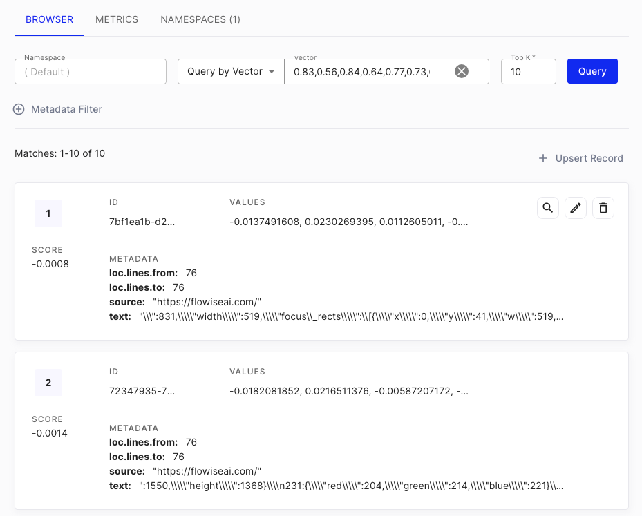

# 网页抓取问答

***

假设你有一个网站（可能是商店、电商网站或博客），你想抓取该网站的所有相关链接，并让大型语言模型 (LLM) 回答关于你网站的任何问题。本教程将逐步讲解如何实现这一目标。

你可以在市场模板中找到名为 **网页问答** 的示例流程。

## 设置

我们将使用 **Cheerio 网页抓取器** 节点从给定 URL 抓取链接，并使用 **HtmlToMarkdown 文本分割器** 将抓取的内容分割成较小的片段。

<figure><figcaption></figcaption></figure>

如果你没有指定任何内容，默认情况下只会抓取给定 URL 页面的内容。如果你想抓取其余的相关链接，请点击 Cheerio 网页抓取器的 **附加参数**。

## 1. 抓取多个页面

1. 在 **获取相关链接方法** 中选择 `网页爬取` 或 `抓取 XML 站点地图`。
2. 在 **获取相关链接限制** 中输入 `0` 以检索从提供的 URL 获取的所有可用链接。

<figure><figcaption></figcaption></figure>

### 管理链接（可选）

1. 输入要抓取的所需 URL。
2. 点击 **获取链接** 以根据 **附加参数** 中 **获取相关链接方法** 和 **获取相关链接限制** 的输入检索链接。
3. 在 **已抓取链接** 部分，点击 **红色垃圾桶图标** 删除不需要的链接。
4. 最后，点击 **保存**。

<figure><figcaption></figcaption></figure>

## 2. 更新

1. 在右上角，你会看到一个绿色按钮：

<figure><figcaption></figcaption></figure>

2. 将显示一个对话框，允许用户将数据更新到 Pinecone：

<figure><figcaption></figcaption></figure>

**注意：** 在后台，将执行以下操作：

* 使用 Cheerio 网页抓取器抓取所有 HTML 数据
* 将所有抓取的数据从 HTML 转换为 Markdown，然后将其分割
* 将对分割后的数据进行循环，并使用 OpenAI 嵌入将其转换为向量嵌入
* 向量嵌入将被更新到 Pinecone

3. 你可以在 [Pinecone 控制台](https://app.pinecone.io) 上看到已添加的新向量。

<figure><figcaption></figcaption></figure>

## 3. 查询

查询相对简单。在验证数据已更新到向量数据库后，你就可以开始在聊天中提问：

<figure><figcaption></figcaption></figure>

在会话检索 QA 链的附加参数中，你可以指定两个提示：

* **改写提示：** 用于根据过去的对话历史记录改写问题
* **回复提示：** 使用改写后的问题，从向量数据库检索上下文，并返回最终回复

<figure><figcaption></figcaption></figure>


建议指定详细的回复提示消息。例如，你可以指定 AI 的名称、回答的语言以及找不到答案时的回复（以防止出现幻觉）。


你还可以启用“返回源文档”选项以返回 AI 回复来源的文档片段列表。

<figure><figcaption></figcaption></figure>

## 其他网页抓取工具

除了 Cheerio 网页抓取器之外，还有其他节点也可以执行网页抓取：

* **Puppeteer：** Puppeteer 是一个 Node.js 库，它提供了一个高级 API 用于控制无头 Chrome 或 Chromium。你可以使用 Puppeteer 自动化网页交互，包括从需要 JavaScript 才能呈现的动态网页中提取数据。
* **Playwright：** Playwright 是一个 Node.js 库，它提供了一个高级 API 用于控制多个浏览器引擎，包括 Chromium、Firefox 和 WebKit。你可以使用 Playwright 自动化网页交互，包括从需要 JavaScript 才能呈现的动态网页中提取数据。
* **Apify：** [Apify](https://apify.com/) 是一个用于网页抓取和数据提取的云平台，它提供了一个 [生态系统](https://apify.com/store)，其中包含超过一千个针对各种网页抓取、爬取和数据提取用例的预制应用程序，称为 _Actors_。

<figure><figcaption></figcaption></figure>


相同的逻辑可以应用于任何文档用例，而不仅仅限于网页抓取！


如果你有任何关于如何提高性能的建议，我们欢迎你的 [贡献](../contributing/)！
