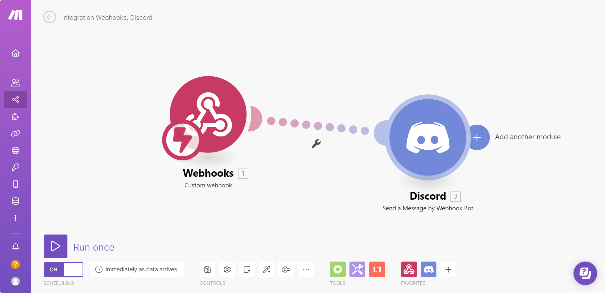
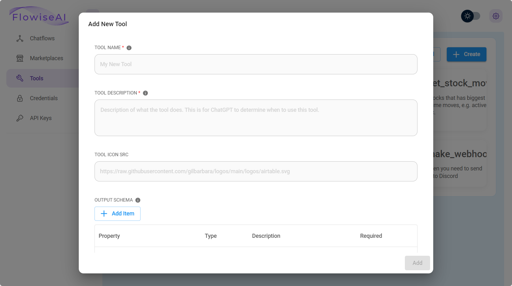
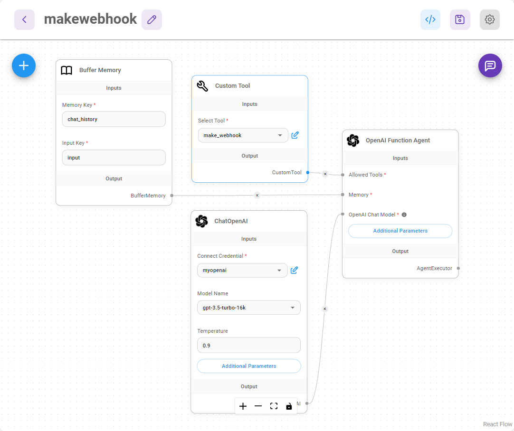

# 调用Webhook

***

本教程将创建一个自定义工具，用于调用Webhook端点并将必要的参数传递到Webhook正文中。我们将使用[Make.com](https://www.make.com/en)创建Webhook工作流程。

## Make

访问Make.com，注册帐户后，创建一个包含Webhook模块和Discord模块的工作流程，如下所示：

<figure><figcaption></figcaption></figure>

在Webhook模块中，您可以看到一个Webhook URL：

<figure><figcaption></figcaption></figure>

在Discord模块中，我们将Webhook的`message`正文作为要发送到Discord频道的消息：

<figure><figcaption></figcaption></figure>

要进行测试，您可以点击左下角的“立即运行”，并发送一个带有JSON正文的POST请求：

代码块0json
```json
{
    "message": "Hello Discord!"
}
```
代码块1

<figure><figcaption></figcaption></figure>

您将看到一条发送到该频道的Discord消息：

<figure><figcaption></figcaption></figure>

完美！我们已成功配置了一个能够传递消息并将其发送到Discord频道的工作流程 [🎉 ](https://emojiterra.com/party-popper/)[🎉](https://emojiterra.com/party-popper/)

## Flowise

在Flowise中，我们将创建一个自定义工具，用于调用带有消息正文的Webhook POST请求。

在仪表板中，点击**工具**，然后点击**创建**

<figure><figcaption></figcaption></figure>

然后，我们可以填写以下字段（您可以根据需要更改这些字段）：

* **工具名称**: make\_webhook （必须为snake\_case格式）
* **工具描述**: 当您需要向Discord发送消息时很有用
* **工具图标源**: [https://github.com/FlowiseAI/Flowise/assets/26460777/517fdab2-8a6e-4781-b3c8-fb92cc78aa0b](https://github.com/FlowiseAI/Flowise/assets/26460777/517fdab2-8a6e-4781-b3c8-fb92cc78aa0b)
* **输入模式**:

<figure><figcaption></figcaption></figure>

* **JavaScript函数**:

```javascript
const fetch = require('node-fetch');
const webhookUrl = 'https://hook.eu1.make.com/abcdef';
const body = {
	"message": $message
};
const options = {
    method: 'POST',
    headers: {
        'Content-Type': 'application/json'
    },
    body: JSON.stringify(body)
};
try {
    const response = await fetch(webhookUrl, options);
    const text = await response.text();
    return text;
} catch (error) {
    console.error(error);
    return '';
}
```

点击**添加**保存自定义工具，您现在应该可以看到它：

<figure><figcaption></figcaption></figure>

现在，创建一个包含以下节点的新画布：

* **缓冲区内存**
* **ChatOpenAI**
* **自定义工具** （选择我们刚刚创建的make\_webhook工具）
* **OpenAI 函数代理**

连接它们后，它应该如下所示：

<figure><figcaption></figcaption></figure>

保存聊天流程，然后开始测试！

例如，我们可以问诸如“如何煮鸡蛋”之类的问题

<figure><figcaption></figcaption></figure>

然后要求代理将所有这些发送到Discord：

<figure><figcaption></figcaption></figure>

转到Discord频道，您将看到该消息：

<figure><figcaption></figcaption></figure>

就是这样！OpenAI 函数代理将能够自动确定要传递什么作为消息并将其发送到Discord。这只是一个如何使用动态正文触发Webhook工作流程的快速示例。同样的想法可以应用于具有Webhook和Gmail、GoogleSheets等的工作流程。

您可以阅读更多关于如何将聊天信息（如`sessionId`、`flowid`和`variables`）传递给自定义工具的信息 - [#additional](../integrations/langchain/tools/custom-tool.md#additional "mention")

## 教程

* 观看有关使用Flowise自定义工具与Webhook的逐步指导视频。



* 观看如何使用Webhook将Flowise连接到Google Sheets



* 观看如何使用Webhook将Flowise连接到Microsoft Excel


