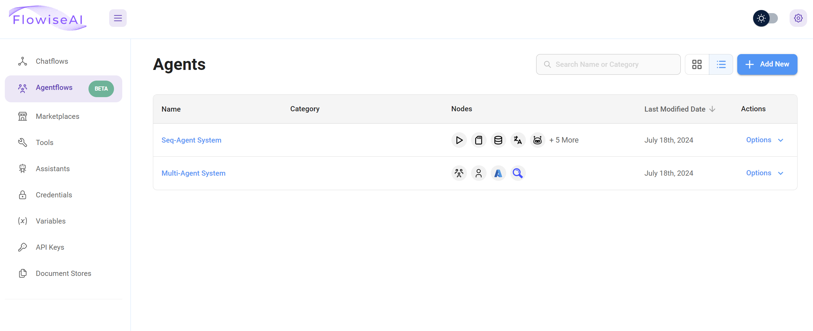

# 代理流程 (Agentflows)

## Flowise 中的自主代理系统介绍

Flowise 的代理流程 (Agentflows) 部分提供了一个平台，用于构建能够与外部工具和数据源交互的基于代理的系统。

目前，Flowise 提供两种设计这些系统的方法：[**多代理 (Multi-Agents)**](#user-content-fn-1)[^1] 和 [**顺序代理 (Sequential Agents)**](#user-content-fn-2)[^2]。这些方法提供了不同级别的控制和复杂性，允许您选择最适合您需求的方法。

<figure><figcaption>
Flowise 应用
</figcaption></figure>


本文档将探讨顺序代理和多代理这两种方法，解释其功能以及如何使用它们来构建不同类型的会话工作流程。


[^1]: **多代理 (Multi-Agents)** 基于顺序代理架构构建，通过预配置核心元素并提供更高级别的抽象来简化构建和管理代理团队的过程。

[^2]: **顺序代理 (Sequential Agents)** 为开发人员提供了对底层工作流程结构的直接访问，从而能够对会话流程的每个步骤进行精细控制，并为构建高度定制的会话应用程序提供最大的灵活性。
