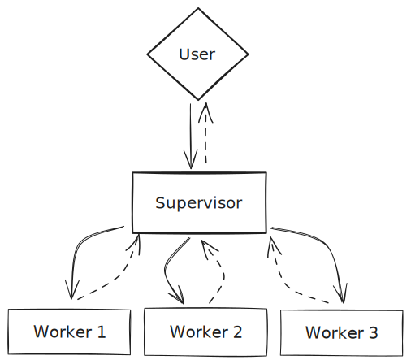
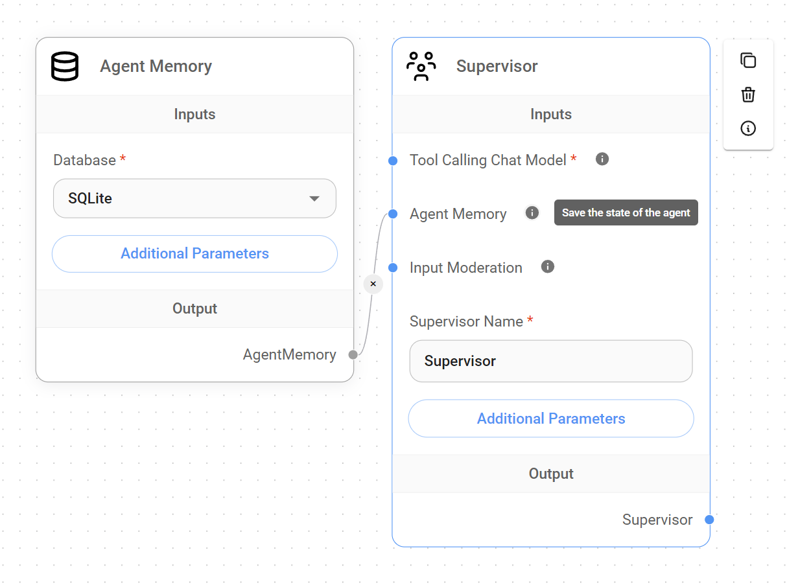
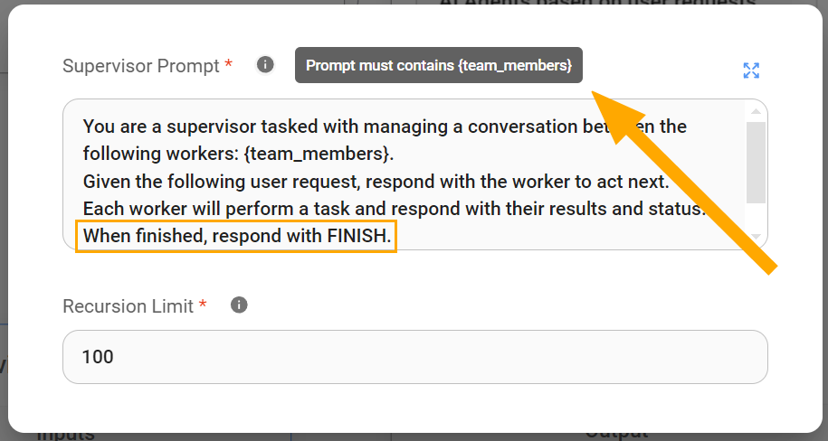
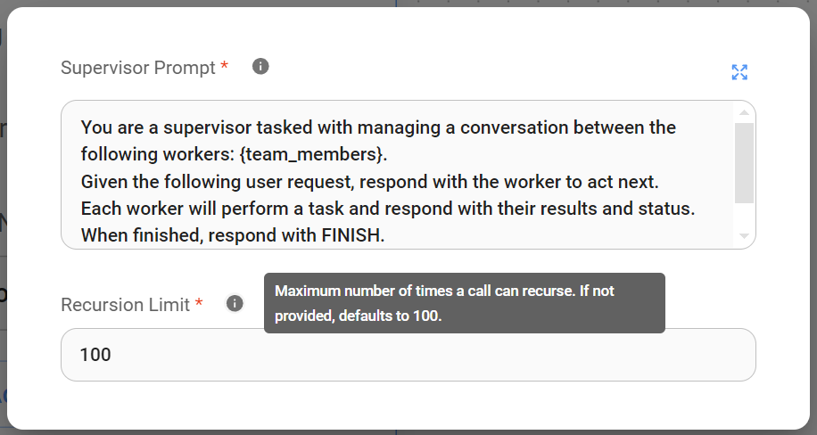
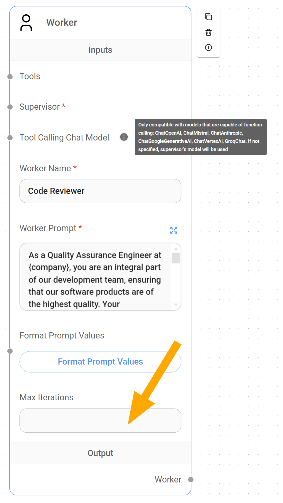
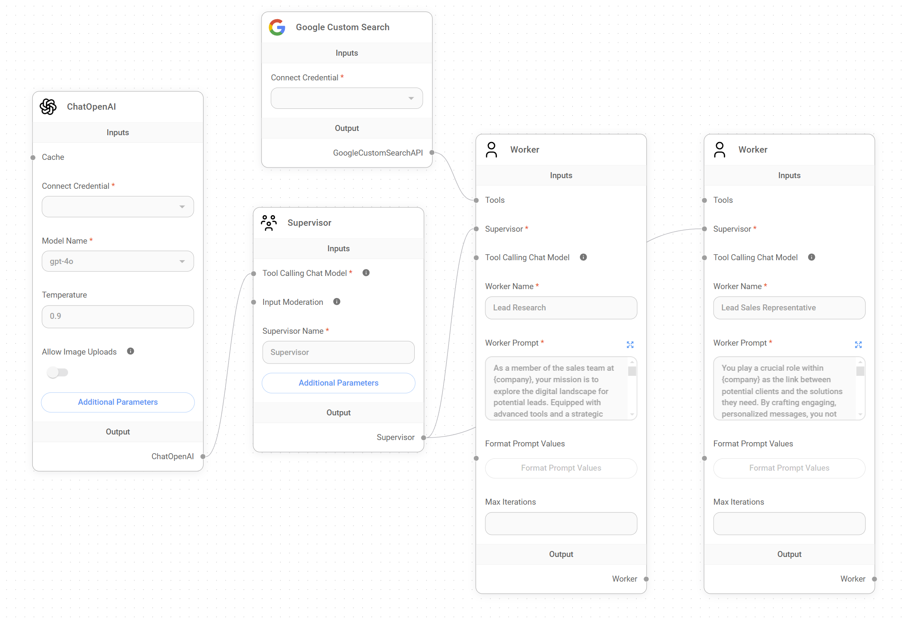

# 多智能体系统

本指南旨在介绍 Flowise 中的多智能体 AI 系统架构，详细说明其组件、操作约束和工作流程。

## 概念

类似于一个领域专家团队协作完成一个复杂项目，多智能体系统利用了人工智能中的专业化原则。

该多智能体系统采用分层、顺序的工作流程，最大限度地提高效率和专业化程度。

### 1. 系统架构

我们可以将多智能体 AI 架构定义为一个可扩展的 AI 系统，它能够通过将复杂项目分解成可管理的子任务来处理这些项目。

在 Flowise 中，多智能体系统包含两个主要节点或智能体类型和一个用户，它们在一个分层图中交互以处理请求并交付目标结果：

1. **用户:** 用户充当**系统的起点**，提供初始输入或请求。虽然多智能体系统可以设计成处理各种各样的请求，但重要的是这些用户请求必须与系统的预期用途相符。任何超出此范围的请求都可能导致不准确的结果、意外循环甚至系统错误。因此，用户交互虽然灵活，但应始终与系统的核心功能保持一致，以获得最佳性能。
2. **监督 AI:** 监督者充当**系统的协调者**，监督整个工作流程。它分析用户请求，将其分解成一系列子任务，将这些子任务分配给专门的工作智能体，汇总结果，并最终将处理后的输出呈现给用户。
3. **工作 AI 团队:** 该团队由专门的 AI 智能体或工作者组成，每个工作者都通过提示消息获得指令，负责处理工作流程中的特定任务。这些工作者独立运行，接收来自监督者的指令和数据，**执行其专门的功能**，根据需要使用工具，并将结果返回给监督者。

<figure><figcaption></figcaption></figure>

### 2. 操作约束

为了保持秩序和简单性，该多智能体系统在两个重要的约束条件下运行：

* **一次只执行一项任务:** 监督者被有意设计为一次只关注一项任务。它等待活动工作者完成其任务并返回结果，然后才分析下一步并委托后续任务。这确保了在继续之前每个步骤都成功完成，防止过度复杂化。
* **每个流程只有一个监督者:** 虽然理论上可以实现一组嵌套的多智能体系统以形成更复杂的层次结构以用于高度复杂的工作流程，但这与 LangChain 定义的“[分层智能体团队](https://github.com/langchain-ai/langgraph/blob/main/examples/multi_agent/hierarchical_agent_teams.ipynb)”（具有顶级监督者和管理工作者团队的中级监督者）不同，Flowise 的多智能体系统目前只运行一个监督者。


在**规划应用程序的工作流程**时，这两个约束条件非常重要。如果您尝试设计一个需要监督者同时并行委托多个任务的工作流程，则系统将无法处理它，并且您会遇到错误。


## 监督者

监督者作为管理整体工作流程并负责将任务委托给相应工作者的智能体，需要一组组件才能正常运行：

* **能够进行函数调用的聊天模型**，用于管理任务分解、委托和结果聚合的复杂性。
* **智能体内存（可选）:** 虽然监督者可以在没有智能体内存的情况下运行，但此节点可以显著增强需要访问过去监督者状态的工作流程。这种**状态保存**可以允许监督者从特定点恢复作业或利用过去的数据来改进决策。

<figure><figcaption></figcaption></figure>

### 监督者提示

默认情况下，监督者提示的措辞指示监督者分析用户请求，将其分解成一系列子任务，并将这些子任务分配给专门的工作智能体。

虽然可以自定义监督者提示以适应特定应用程序的需求，但它始终需要以下两个关键元素：

* **{team_members} 变量:** 此变量对于监督者理解可用劳动力至关重要，因为它为监督者提供了工作者名称列表。这允许监督者根据其专业知识勤勉地将任务委托给最合适的工作者。
* **“FINISH”关键字:** 此关键字用作监督者提示中的信号。它指示监督者何时应认为任务已完成并将最终输出呈现给用户。如果没有明确的“FINISH”指令，监督者可能会继续不必要地委托任务，或者无法向用户交付连贯且最终的结果。它表示所有必要的子任务都已执行，并且用户的请求已得到满足。

<figure><figcaption></figcaption></figure>


重要的是要理解监督者与工作者的作用非常不同。与可以定制高度特定指令的工作者不同，**监督者在使用一般指令时运行效率最高，这允许它根据需要规划和委托任务。**如果您不熟悉多智能体系统，我们建议您坚持使用默认的监督者提示。


### 理解监督者节点中的递归限制：

此参数限制了应用程序中嵌套函数调用的最大深度。在我们当前的上下文中，**它限制了监督者在单个工作流程执行中可以触发自身的次数。**这对于防止无界递归和确保有效使用资源非常重要。

<figure><figcaption></figcaption></figure>

### 监督者如何工作

在收到用户查询后，监督者通过分析请求并辨别用户的预期结果来启动工作流程。

然后，利用监督者提示中的 `{team_members}` 变量（仅提供可用工作者 AI 名称的列表），监督者推断每个工作者的专长，并战略性地为工作流程中的每个任务选择最合适的工作者。


由于监督者只有工作者的名称来推断其在工作流程中的功能，因此正确设置这些名称非常重要。**清晰、简洁且具有描述性的名称，准确反映工作者的角色或专业领域，对于监督者在委托任务时做出明智的决策至关重要。**这确保了为正确的工作选择正确的工作者，最大限度地提高系统在满足用户请求方面的准确性。


***

## 工作者

工作者作为被指示处理系统中特定任务的专门智能体，需要两个基本组件才能正常运行：

* **监督者:** 每个工作者都必须连接到监督者，以便在需要委托任务时可以调用它。这种连接建立了多智能体系统中必不可少的层次关系，确保监督者可以有效地将工作分配给相应的专门工作者。
* **能够进行函数调用的聊天模型节点:** 默认情况下，除非直接分配一个，否则工作者将继承监督者的聊天模型节点。这种函数调用能力使工作者能够与为其专门任务设计的工具进行交互。

<figure><figcaption></figcaption></figure>


能够**为每个工作者分配不同的聊天模型**为我们的应用程序提供了显著的灵活性和优化机会。通过选择针对特定任务量身定制的[聊天模型](../../integrations/langchain/chat-models/)，我们可以利用更经济高效的解决方案来完成更简单的任务，并在真正需要时保留专门的、可能更昂贵的模型。


### 理解工作者中的最大迭代参数

[LangChain](https://python.langchain.com/v0.1/docs/modules/agents/how_to/max_iterations/) 将 `最大迭代上限` 称为防止代理系统出现混乱的重要控制机制。在我们当前的上下文中，它作为防止监督者和工作者之间过度交互（可能无限交互）的防护措施。

与限制监督者可以调用自身的次数的监督者节点的 `递归限制` 不同，工作者节点的 `最大迭代` 参数限制了监督者可以迭代或查询特定工作者的次数。

通过限制最大迭代次数，我们可以确保成本得到控制，即使在出现意外系统行为的情况下也是如此。

***

## 示例：一个实际的用例

现在我们已经建立了对 Flowise 中多智能体系统如何工作的基本理解，让我们探索一个实际的应用程序。

想象一下一个**潜在客户拓展多智能体系统**（在市场上可用），该系统旨在自动化识别、资格认定和吸引潜在客户的过程。此系统将利用监督者来协调以下两个工作者：

* **潜在客户研究者:** 此工作者使用 Google 搜索工具，将负责根据用户定义的标准收集潜在客户。
* **潜在客户销售生成器:** 此工作者将利用潜在客户研究者收集的信息为销售团队创建个性化的电子邮件草稿。

<figure><figcaption></figcaption></figure>

**背景:** Solterra Renewables 公司的一名员工希望收集有关 Evergreen Energy Group（一家位于英国的信誉良好的可再生能源公司）的可用信息，并将首席执行官 Amelia Croft 作为潜在客户。

**用户请求:** Solterra Renewables 的员工向多智能体系统提供以下查询：“_我需要有关 Evergreen Energy Group 和 Amelia Croft 的信息，作为我们业务的潜在新客户。_"

1. **监督者:**
   * 监督者收到用户请求并将“潜在客户研究”任务委托给 `潜在客户研究者工作者`。
2. **潜在客户研究者工作者:**
   * 潜在客户研究者工作者使用 Google 搜索工具收集有关 Evergreen Energy Group 的信息，重点关注：
     * 公司背景、行业、规模和位置。
     * 最新消息和发展动态。
     * 主要高管，包括确认 Amelia Croft 的首席执行官职位。
   * 潜在客户研究者将收集到的信息发送回 `监督者`。
3. **监督者:**
   * 监督者从潜在客户研究者工作者处接收研究数据，并确认 Amelia Croft 是一个相关的潜在客户。
   * 监督者将“生成销售电子邮件”任务委托给 `潜在客户销售生成器工作者`，提供：
     * 有关 Evergreen Energy Group 的研究信息。
     * Amelia Croft 的电子邮件。
     * 有关 Solterra Renewables 的背景信息。
4. **潜在客户销售生成器工作者:**
   * 潜在客户销售生成器工作者根据以下内容制作个性化的电子邮件草稿：
     * 她作为首席执行官的角色以及 Solterra Renewables 的服务与她的公司相关的程度。
     * 有关 Evergreen Energy Group 目前关注点或项目的研究所得信息。
   * 潜在客户销售生成器工作者将完成的电子邮件草稿发送回 `监督者`。
5. **监督者:**
   * 监督者收到生成的电子邮件草稿并发出“FINISH”指令。
   * 监督者将电子邮件草稿输出回用户，即 `Solterra Renewables 的员工`。
6. **用户接收输出:** Solterra Renewables 的员工收到一份个性化的电子邮件草稿，准备进行审核并发送给 Amelia Croft。

## 视频教程

在这里，您将找到来自[Leon 的 YouTube 频道](https://www.youtube.com/@leonvanzyl) 的视频教程列表，这些教程展示了如何使用无代码在 Flowise 中构建多智能体应用程序。






