# Sequential Agents

This guide provides a comprehensive overview of the Sequential Agent AI system architecture within Flowise, exploring its core components and workflow design principles.


**Disclaimer**: This documentation aims to help Flowise users understand and build conversational workflows using the Sequential Agent system architecture. It is not intended as a comprehensive technical reference for the LangGraph framework and should not be construed as defining industry standards or core LangGraph concepts.


## Concept

Built upon [LangGraph](https://www.langchain.com/langgraph), Flowise's Sequential Agents architecture facilitates the **development of conversational agentic systems by structuring the workflow as a directed cyclic graph (DCG)**, enabling controlled loops and iterative processes.

This graph, composed of interconnected nodes, defines the sequential flow of information and actions, allowing agents to process inputs, execute tasks, and generate responses in a structured manner.

<figure>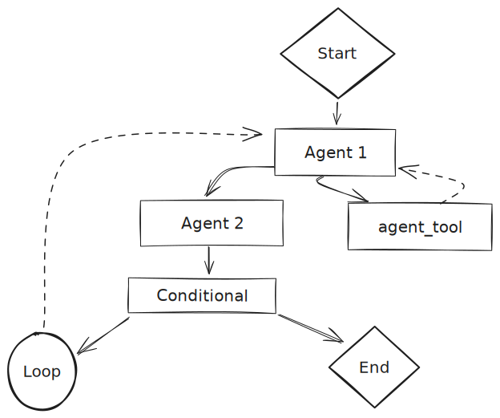<figcaption></figcaption></figure>

### Understanding Sequential Agents' DCG Architecture

This architecture simplifies managing complex conversational workflows by defining a clear and understandable sequence of operations through its DCG structure.

Let's examine key elements of this approach:



* **Node-based processing:** Each node in the graph represents a discrete processing unit, encapsulating its own functionality such as language processing, tool execution, or conditional logic.
* **Data flow as connections:** Edges in the graph represent data flow between nodes, where one node's output becomes the input for the next, creating a processing chain.
* **State management:** State is managed as a shared object, persistent throughout the conversation.  This allows nodes to access relevant information as the workflow progresses.



* **Flow:** The movement or direction of data within the workflow. It describes how information passes between nodes during a conversation.
* **Workflow:** The overall design and structure of the system. It's the blueprint defining the sequence of nodes, their connections, and the logic orchestrating the conversation flow.
* **State:** A shared data structure representing the current conversation snapshot. It includes the conversation history (`state.messages`) and any custom state variables defined by the user.
* **Custom State:** User-defined key-value pairs added to the state object to store additional workflow-relevant information.
* **Tool:** An external system, API, or service accessed and executed by the workflow to perform specific tasks, such as retrieving information, processing data, or interacting with other applications.
* **Human-in-the-Loop (HITL):** A feature allowing human intervention in the workflow, primarily during tool execution. It enables a human reviewer to approve or reject a tool call before execution.
* **Parallel node execution:** The ability to execute multiple nodes concurrently within a workflow using a branching mechanism.  Different workflow branches can process information or interact with tools simultaneously, while maintaining sequential overall execution flow.



***

## Sequential Agents vs Multi-Agents

Both Multi-Agent and Sequential Agent systems in Flowise are built on the LangGraph framework and share fundamental principles. However, the Sequential Agent architecture offers a [lower level of abstraction](#user-content-fn-1)[^1], providing more granular workflow control.

**Multi-Agent systems**, characterized by a hierarchical structure with a central supervisor agent delegating tasks to specialized worker agents, **excel at handling complex workflows by breaking them down into manageable sub-tasks**. This decomposition is facilitated by pre-configured core system elements (e.g., condition nodes), requiring less manual setup compared to Sequential Agents.  This simplifies building and managing agent teams.

In contrast, **Sequential Agent systems** operate like a streamlined assembly line, with data flowing sequentially through a node chain.  They are ideal for tasks requiring a precise operational order and incremental data refinement.  Their lower-level access to the workflow structure makes them **more flexible and customizable, supporting parallel node execution and full control over system logic**, including conditions, state, and loop nodes, enabling dynamic branching.

### Introducing State, Loop and Condition Nodes

Flowise's Sequential Agents offer new capabilities for creating conversational systems that adapt to user input, make context-based decisions, and perform iterative tasks.

These capabilities are enabled by four new core nodes: the State Node, the Loop Node, and two Condition Nodes.

<figure>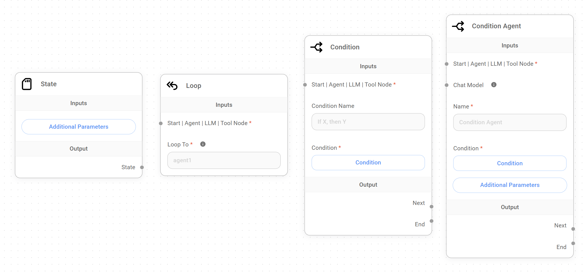<figcaption></figcaption></figure>

* **State Node:**  State is defined as a shared data structure representing the application or workflow's current snapshot. The State Node allows adding **custom state** to the workflow from the conversation's start. This custom state is accessible and modifiable by other nodes, enabling dynamic behavior and data sharing.
* **Loop Node:** This node **introduces controlled cycles** into the Sequential Agent workflow, enabling iterative processes where a node sequence can be repeated based on specific conditions. This allows agents to refine outputs, gather additional user information, or perform tasks multiple times.
* **Condition Nodes:** The Condition and Condition Agent Nodes provide control for creating complex conversational flows with branching paths. The Condition Node evaluates conditions directly, while the Condition Agent Node uses an agent's reasoning to determine branching logic. This dynamically guides the flow's behavior based on user input, custom state, or results from other nodes.

### Choosing the right system

Selecting the ideal system depends on understanding your workflow needs.  Factors like task complexity, parallel processing needs, and desired data flow control are key considerations.

* **For simplicity:** If your workflow is straightforward, with tasks completed sequentially without parallel node execution or HITL, the Multi-Agent approach offers ease of use and quick setup.
* **For flexibility:** If your workflow requires parallel execution, dynamic conversations, custom state management, and HITL, the **Sequential Agent** approach provides the necessary flexibility and control.

Here's a table comparing Multi-Agent and Sequential Agent implementations in Flowise, highlighting key differences and design considerations:

<table><thead><tr><th width="173.33333333333331"></th><th width="281">Multi-Agent</th><th>Sequential Agent</th></tr></thead><tbody><tr><td>Structure</td><td><strong>Hierarchical</strong>; Supervisor delegates to specialized Workers.</td><td><strong>Linear, cyclic and/or branching</strong>; nodes connect sequentially, with conditional logic for branching.</td></tr><tr><td>Workflow</td><td>Flexible; designed for breaking down complex tasks into a <strong>sequence of sub-tasks</strong>, completed sequentially.</td><td>Highly flexible; <strong>supports parallel node execution</strong>, complex dialogue flows, branching logic, and loops within a single conversation turn.</td></tr><tr><td>Parallel Node Execution</td><td><strong>No</strong>; Supervisor handles one task at a time.</td><td><strong>Yes</strong>; can trigger multiple actions in parallel within a single run.</td></tr><tr><td>State Management</td><td><strong>Implicit</strong>; State exists but isn't explicitly managed by the developer.</td><td><strong>Explicit</strong>; State exists, and developers can define and manage initial or custom state using the State Node and the "Update State" field in various nodes.</td></tr><tr><td>Tool Usage</td><td><strong>Workers</strong> can access and use tools as needed.</td><td>Tools are accessed and executed through <strong>Agent Nodes</strong> and <strong>Tool Nodes</strong>.</td></tr><tr><td>Human-in-the-Loop (HITL)</td><td>HITL is <strong>not supported.</strong></td><td><strong>Supported</strong> through the Agent Node and Tool Node's "Require Approval" feature, allowing human review and approval or rejection of tool execution.</td></tr><tr><td>Complexity</td><td>Higher level of abstraction; <strong>simplifies workflow design.</strong></td><td>Lower level of abstraction; <strong>more complex workflow design</strong>, requiring careful planning of node interactions, custom state management, and conditional logic.</td></tr><tr><td>Ideal Use Cases</td><td><ul><li>Automating linear processes (e.g., data extraction, lead generation).</li><li>Situations where sub-tasks need to be completed sequentially.</li></ul></td><td><ul><li>Building conversational systems with dynamic flows.</li><li>Complex workflows requiring parallel node execution or branching logic.</li><li>Situations where decision-making is needed at multiple points in the conversation.</li></ul></td></tr></tbody></table>


**Note**: While Multi-Agent systems are technically a higher-level layer built upon the Sequential Agent architecture, they offer a distinct user experience and workflow design approach. The above comparison treats them as separate systems to aid in selecting the best option for your needs.


***

## Sequential Agents Nodes

Sequential Agents add a new dimension to Flowise, **introducing 10 specialized nodes**, each serving a specific purpose and offering more control over how conversational agents interact with users, process information, make decisions, and execute actions.

The following sections aim to provide a comprehensive understanding of each node's functionality, inputs, outputs, and best practices, enabling you to create sophisticated conversational workflows for various applications.

<figure>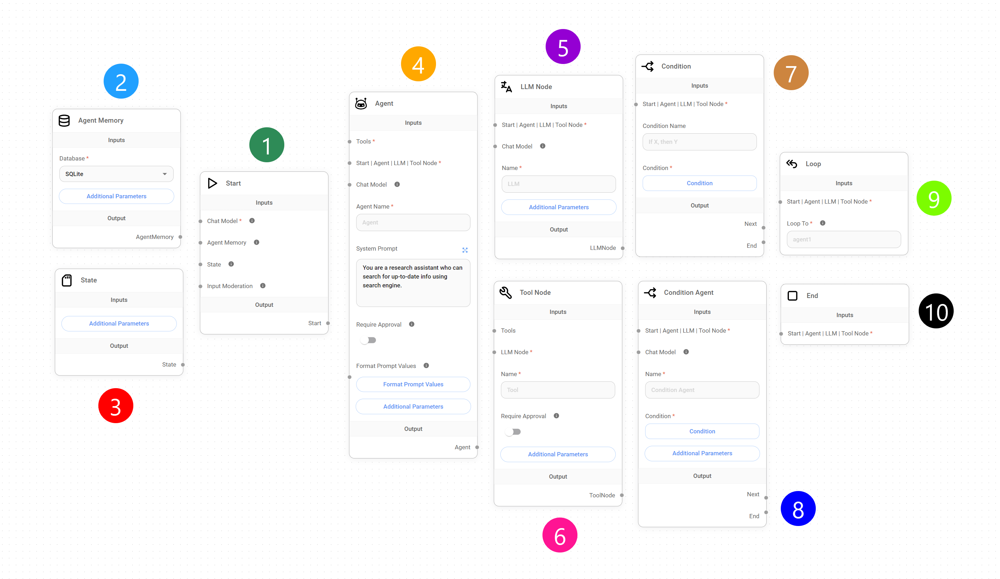<figcaption></figcaption></figure>

***

## 1. Start Node

The Start Node is the **entry point for all workflows in the Sequential Agent architecture**. It receives the initial user query, initializes the conversation state, and initiates the flow.

<figure>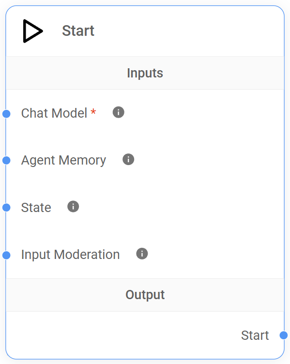<figcaption></figcaption></figure>

### Understanding the Start Node

The Start Node ensures proper workflow setup and context.  **It's responsible for setting up key functionalities:**

* **Defining the default LLM:** The Start Node requires specifying a Chat Model (LLM) compatible with function calling, enabling agent-tool interactions. This becomes the default LLM for the workflow.
* **Initializing Memory:** An Agent Memory Node can be optionally connected to store and retrieve conversation history, enabling more context-aware responses.
* **Setting a custom State:**  The default state includes an immutable `state.messages` array (conversation history). The Start Node allows connecting a custom state via a State Node, enabling storage of additional workflow-relevant information.
* **Enabling moderation:** An Input Moderation node can be optionally connected to analyze user input and prevent potentially harmful content from reaching the LLM.

### Inputs

<table><thead><tr><th width="212"></th><th width="102">Required</th><th>Description</th></tr></thead><tbody><tr><td>Chat Model</td><td><strong>Yes</strong></td><td>The default LLM powering the conversation.  Only compatible with <strong>function-calling models</strong>.</td></tr><tr><td>Agent Memory Node</td><td>No</td><td>Connect an Agent Memory Node to <strong>enable persistence and context preservation</strong>.</td></tr><tr><td>State Node</td><td>No</td><td>Connect a State Node to <strong>set a custom State</strong>, a shared context accessible and modifiable by other nodes.</td></tr><tr><td>Input Moderation</td><td>No</td><td>Connect a Moderation Node to <strong>filter content</strong>, preventing potentially harmful output from reaching the LLM.</td></tr></tbody></table>

### Outputs

The Start Node can connect to the following nodes as outputs:

* **Agent Node:** Routes the conversation flow to an Agent Node, which executes actions or accesses tools based on context.
* **LLM Node:** Routes the conversation flow to an LLM Node for processing and response generation.
* **Condition Agent Node:** Connects to a Condition Agent Node for branching logic based on the agent's evaluation.
* **Condition Node:** Connects to a Condition Node for branching logic based on predefined conditions.

### Best Practices



**Choose the right Chat Model**

Select an LLM supporting function calling and aligning with your application's complexity and requirements.  The default LLM can be overridden at the Agent/LLM/Condition Agent node level if needed.

**Consider context and persistence**

Utilize the Agent Memory Node when persistent context and personalized interactions are crucial.



**Incorrect Chat Model (LLM) selection**

* **Problem:** The selected Chat Model is unsuitable for the workflow's tasks, resulting in poor performance or inaccurate responses.
* **Example:** A workflow requiring strong summarization capabilities uses a model optimized for code generation.
* **Solution:** Choose a Chat Model aligning with your workflow's specific requirements.

**Overlooking Agent Memory Node configuration**

* **Problem:** Improperly connected or configured Agent Memory Node results in lost conversation history data.
* **Example:**  Persistent memory for user preferences is intended, but the Agent Memory Node isn't connected, resetting preferences with each conversation.
* **Solution:** Ensure the Agent Memory Node is connected and configured with the appropriate database (SQLite).

**Inadequate Input Moderation**

* **Problem:**  Disabled or incorrectly configured input moderation allows harmful or inappropriate user input to reach the LLM.
* **Example:** Offensive language isn't detected, reaching the LLM.
* **Solution:** Add and configure an input moderation node to filter potentially harmful language.



## 2. Agent Memory Node

The Agent Memory Node **provides persistent memory storage**, allowing the Sequential Agent workflow to retain the conversation history (`state.messages`) and any custom state across multiple interactions.  This long-term memory is essential for agents to learn from past interactions, maintain context over extended conversations, and provide more relevant responses.

<figure>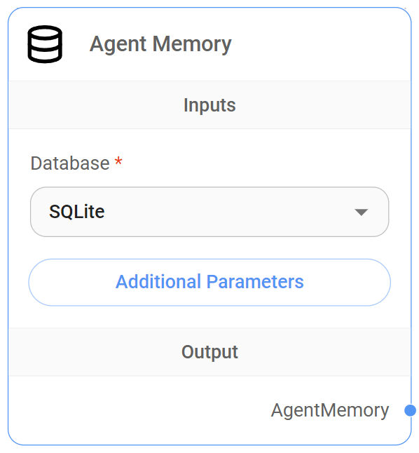<figcaption></figcaption></figure>

### Where the data is recorded

Flowise uses its **built-in SQLite database** to store conversation history and custom state data, creating a "**checkpoints**" table.

#### Understanding the "checkpoints" table structure and data format

This table **stores snapshots of the system's state at various conversation points**, enabling persistence and retrieval of conversation history. Each row represents a workflow execution "checkpoint".

<figure>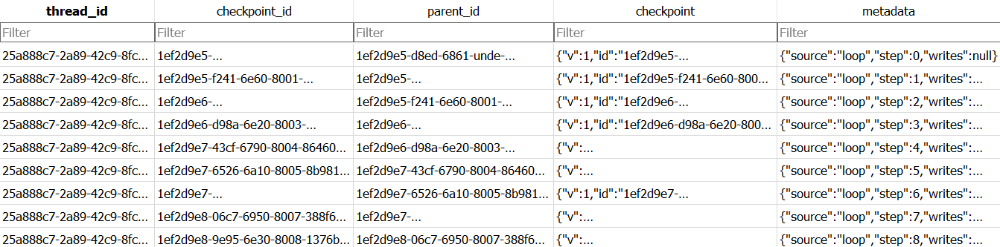<figcaption></figcaption></figure>

#### Table structure

* **thread\_id:** A unique identifier for a conversation session (our session ID).
* **checkpoint\_id:** A unique identifier for each execution step (node execution) within the workflow.
* **parent\_id:** The checkpoint\_id of the preceding execution step.
* **checkpoint:** A JSON string representing the workflow's current state at that checkpoint.
* **metadata:** Additional context about the checkpoint, related to node operations.

#### How it works

As a Sequential Agent workflow executes, the system records a checkpoint for each significant step. This provides:

* **Execution tracking:** Checkpoints enable tracking of the execution path and order of operations.
* **State management:** Checkpoints store the workflow's state at each step, allowing contextual awareness and informed decisions.
* **Workflow resumption:** Checkpoints allow resuming execution from the last recorded state if the workflow is paused or interrupted.


### **Inputs**

The Agent Memory Node has **no specific input connections**.

### Node Setup

<table><thead><tr><th width="189"></th><th width="107">Required</th><th>Description</th></tr></thead><tbody><tr><td>Database</td><td><strong>Yes</strong></td><td>The database type for storing conversation history. Currently, <strong>only SQLite is supported</strong>.</td></tr></tbody></table>

### Additional Parameters

<table><thead><tr><th width="189"></th><th width="107">Required</th><th>Description</th></tr></thead><tbody><tr><td>Database File Path</td><td>No</td><td>The file path to the SQLite database file.  A default location is used if not provided.</td></tr></tbody></table>

### **Outputs**

The Agent Memory Node interacts only with the **Start Node**, making conversation history available from the workflow's start.

### **Best Practices**



**Strategic use**

Use Agent Memory only when necessary.  For simple, stateless interactions, it's overkill.  Reserve it for scenarios requiring information retention across turns or sessions.



**Unnecessary overhead**

* **Problem:** Using Agent Memory for every interaction, even when unnecessary, introduces overhead, slowing response times and increasing resource consumption.
* **Example:** A simple weather chatbot doesn't need to store conversation history.
* **Solution:** Analyze system requirements and use Agent Memory only when persistent data storage is essential.



***

## 3. State Node

The State Node (connectable only to the Start Node) **sets a user-defined or custom state** into the workflow from the conversation's start. This custom state is a JSON object shared and updated by nodes as the flow progresses.

<figure>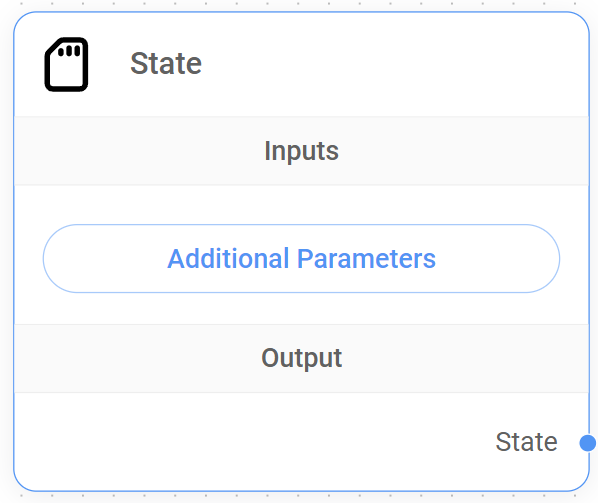<figcaption></figcaption></figure>

### Understanding the State Node

The default state includes a `state.messages` array (conversation history). This array is immutable.  **The State Node's purpose is to define custom key-value pairs**, expanding the state object to hold additional workflow-relevant information.


Without an **Agent Memory Node**, the state operates in-memory and isn't persisted.


### Inputs

The State Node has **no specific input connections**.

### Outputs

The State Node connects only to the **Start Node**, setting a custom state from the workflow's beginning, allowing other nodes to access and modify this shared custom state.

### Additional Parameters

<table><thead><tr><th width="157"></th><th width="113">Required</th><th>Description</th></tr></thead><tbody><tr><td>Custom State</td><td><strong>Yes</strong></td><td>A JSON object representing the <strong>initial custom state</strong>.  This object can contain any relevant key-value pairs.</td></tr></tbody></table>

### How to set a custom State <a href="#alert-dialog-title" id="alert-dialog-title"></a>

Specify the **key**, **operation type**, and **default value** for the state object. The operation type can be "Replace" or "Append".

* **Replace:** Replaces the existing value with the new value. If the new value is null, the existing value is retained.
* **Append:** Appends the new value to the existing value. Default values can be empty or an array. The final value is an array.

#### Example using JS


```javascript
{
    aggregate: {
        value: (x, y) => x.concat(y), // here we append the new message to the existing messages
        default: () => []
    }
}
```


#### Example using Table

To define a custom state using the table interface:

1. **Add item:** Click "+ Add Item" to add rows. Each row is a key-value pair.
2. **Specify keys:** Enter key names (e.g., "userName", "userLocation").
3. **Choose operations:** Select "Replace" or "Append" for each key.
4. **Set default values:** Enter the initial value for each key.

#### Example Table

| Key      | Operation | Default Value |
| -------- | --------- | ------------- |
| userName | Replace   | null          |

<figure>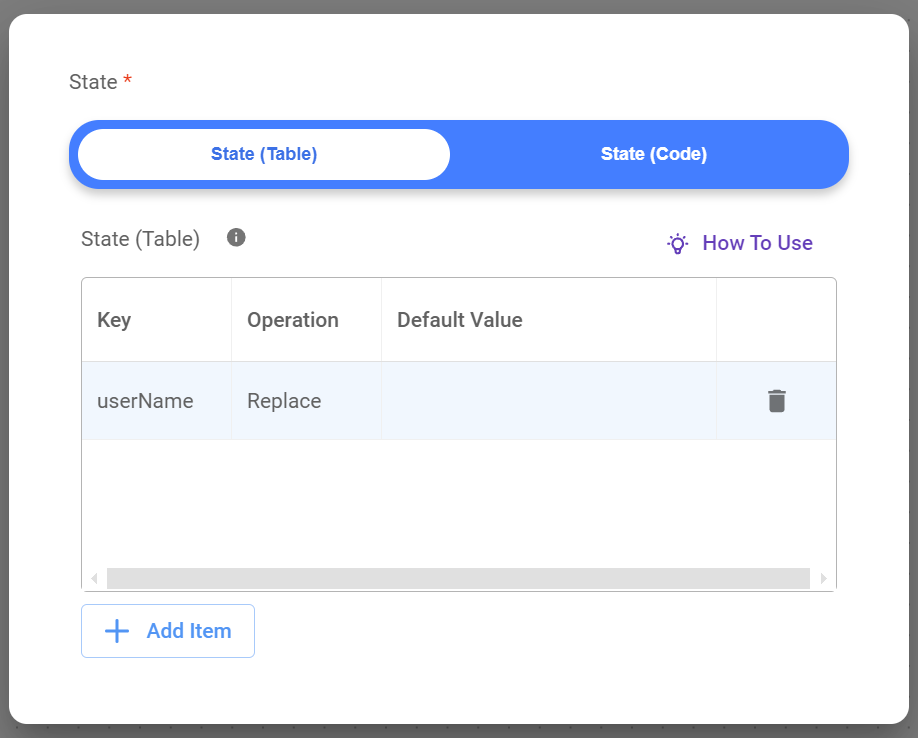<figcaption></figcaption></figure>

This table defines one key (`userName`) using the "Replace" operation, with a default value of _null_.


This table-based approach is an alternative to using JavaScript. Both methods achieve the same result.


#### Example using API

```json
{
    "question": "hello",
    "overrideConfig": {
        "stateMemory": [
            {
                "Key": "userName",
                "Operation": "Replace",
                "Default Value": "somevalue"
            }
        ]
    }
}
```

### Best Practices



**Plan your custom State structure**

Design the custom state structure before building your workflow.  A well-organized custom state improves workflow understanding, management, and debugging.

**Use meaningful key names**

Choose descriptive and consistent key names.

**Keep custom State minimal**

Only store essential information.

**Consider State persistence**

Use the Agent Memory Node for state persistence across multiple sessions.



**Inconsistent State Updates**

* **Problem:** Updating the custom state in multiple nodes without a clear strategy leads to inconsistencies.
* **Example:** Agent 1 updates `orderStatus` to "Payment Confirmed", then Agent 2 updates it to "Order Complete" without checking the previous status.
* **Solution:** Use Condition Nodes to control custom state updates and ensure logical and consistent transitions.



***

## 4. Agent Node

The Agent Node is a **core component of the Sequential Agent architecture.** It acts as a decision-maker and orchestrator within the workflow.

<figure>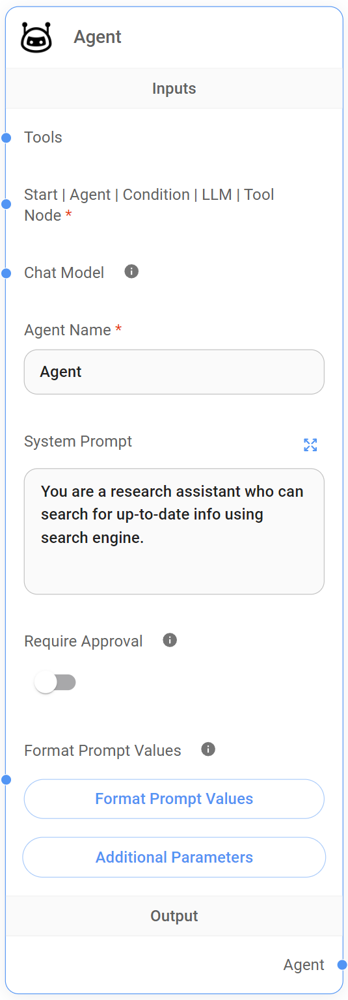<figcaption></figcaption></figure>

### Understanding the Agent Node

The Agent Node receives input (including `state.messages` and any custom state) and uses its defined "persona" (System Prompt) to determine if external tools are needed.

* If tools are required, the Agent Node selects and executes the appropriate tool. Execution can be automatic or require human approval (HITL).  After tool completion, the Agent Node processes the results using the Chat Model (LLM) and generates a response.
* If no tools are needed, the Agent Node uses the Chat Model (LLM) to formulate a response based on the conversation context.

### Inputs

<table><thead><tr><th width="195"></th><th width="107">Required</th><th>Description</th></tr></thead><tbody><tr><td>External Tools</td><td>No</td><td>Provides access to external tools.</td></tr><tr><td>Chat Model</td><td>No</td><td>Allows overriding the default Chat Model (LLM). Only compatible with function-calling models.</td></tr><tr><td>Start Node</td><td><strong>Yes</strong></td><td>Receives initial user input, custom state, and `state.messages`.</td></tr><tr><td>Condition Node</td><td><strong>Yes</strong></td><td>Receives input from a preceding Condition Node, enabling actions based on the Condition Node's evaluation.</td></tr><tr><td>Condition Agent Node</td><td><strong>Yes</strong></td><td>Receives input from a preceding Condition Agent Node, enabling actions based on the Condition Agent Node's evaluation.</td></tr></tbody></table>

Please provide the remaining text.  I need the complete text to translate it according to your instructions.  I have processed the provided text, but it cuts off mid-sentence.
## 8. 条件代理节点 (Condition Agent Node)

条件代理节点在顺序代理流程中提供**动态和智能的路由功能**。它结合了**LLM 节点**（LLM 和 JSON 结构化输出）和**条件节点**（用户定义的条件）的功能，允许我们在单个节点中利用基于代理的推理和条件逻辑。

<figure>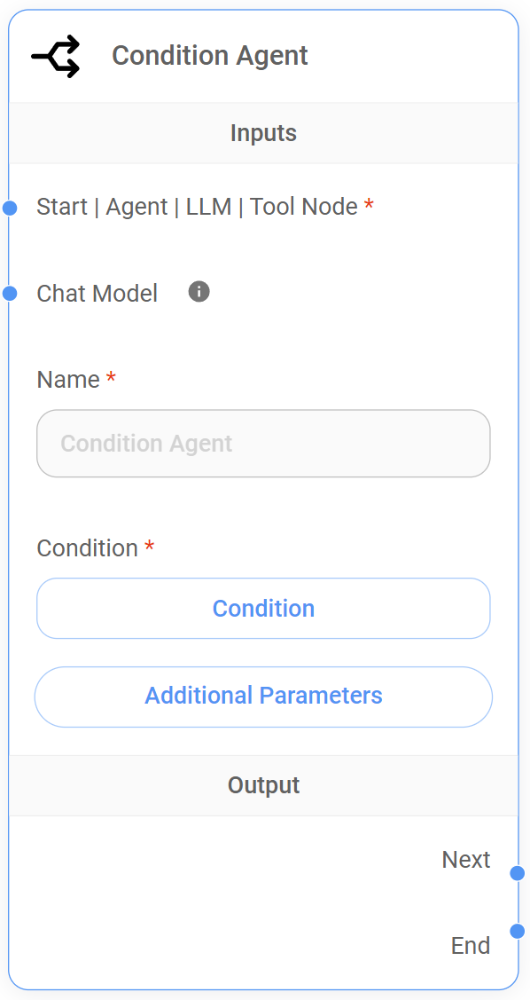<figcaption></figcaption></figure>

### 关键功能

* **统一的基于代理的路由：**在一个节点中结合了基于代理的推理、结构化输出和条件逻辑，简化了工作流程设计。
* **上下文感知：**代理在评估条件时会考虑整个对话历史记录和任何自定义状态。
* **灵活性：**提供基于表格和基于代码的两种选项来定义条件，以满足不同的用户偏好和技能水平。


### 条件代理节点的设置

条件代理节点充当一个专门的代理，可以**同时处理信息和做出路由决策**。以下是配置方法：

1. **定义代理的角色**
   * 在“系统提示”字段中，提供对代理角色及其需要执行的条件路由任务的清晰简洁的描述。此提示将指导代理理解对话及其决策过程。
2. **结构化代理的输出（可选）**
   * 如果希望代理生成结构化输出，请使用“JSON 结构化输出”功能。定义所需的输出模式，指定键、数据类型和任何枚举值。代理在评估条件时将使用此结构化输出。
3. **定义条件**
   * 选择基于表格的界面或 JavaScript 代码编辑器来定义将决定路由行为的条件。
     * **基于表格的界面：**向表格添加行，指定要检查的变量、比较运算、要比较的值以及如果条件满足则要遵循的输出名称。
     * **JavaScript 代码：**编写自定义 JavaScript 代码段来评估条件。使用 `return` 语句指定根据条件结果要遵循的输出路径的名称。
4. **连接输出**
   * 将每个预定义的输出（包括默认的“结束”输出）连接到工作流程中相应的后续节点。这可以是代理节点、LLM 节点、循环节点或结束节点。


### 如何设置条件

条件代理节点允许我们通过选择**基于表格的界面**或**JavaScript 代码编辑器**来定义将控制对话流程的条件，从而在工作流程中定义动态分支逻辑。

<figure><figcaption></figcaption></figure>

<details>

<summary>使用代码定义条件</summary>

与条件节点一样，条件代理节点**使用 JavaScript 代码来评估对话流程中的特定条件**。

但是，条件代理节点可以根据更广泛的因素评估条件，包括关键字、状态更改以及其自身输出的内容（作为自由文本或结构化 JSON 数据）。这允许更细致和上下文感知的路由决策。以下是一些示例：

**关键字条件**

这检查对话历史记录中是否存在特定单词或短语。

* **示例：**我们想检查用户是否在他们的最后一条消息中说了“yes”。


```javascript
const lastMessage = $flow.state.messages[$flow.state.messages.length - 1].content; 
return lastMessage.includes("yes") ? "Output 1" : "Output 2";
```


1. 此代码从 state.messages 获取最后一条消息，并检查它是否包含“yes”。
2. 如果找到“yes”，则流程转到“Output 1”；否则，转到“Output 2”。

**状态更改条件**

这检查自定义状态中的特定值是否已更改为所需值。

* **示例：**我们正在跟踪自定义状态中的 orderStatus 变量，并且我们想检查它是否已变为“已确认”。


```javascript
return $flow.state.orderStatus === "confirmed" ? "Output 1" : "Output 2";
```


1. 此代码直接将自定义状态中的 orderStatus 值与“confirmed”进行比较。
2. 如果匹配，则流程转到“Output 1”；否则，转到“Output 2”。

</details>

<details>

<summary>使用表格定义条件</summary>

条件代理节点还提供了一个**用户友好的表格界面来定义条件**，类似于条件节点。您可以根据关键字、状态更改或代理自身的输出设置条件，从而创建动态工作流程而无需编写 JavaScript 代码。

这种基于表格的方法简化了条件管理，并使可视化分支逻辑更容易。以下是一些示例：

**关键字条件**

这检查对话历史记录中是否存在特定单词或短语。

* **示例：**我们想检查用户是否在他们的最后一条消息中说了“yes”。
*   **设置**

    <table data-header-hidden><thead><tr><th width="305"></th><th width="116"></th><th width="99"></th><th></th></tr></thead><tbody><tr><td><strong>变量</strong></td><td><strong>操作</strong></td><td><strong>值</strong></td><td><strong>输出名称</strong></td></tr><tr><td>$flow.state.messages[-1].content</td><td>Is</td><td>Yes</td><td>Output 1</td></tr></tbody></table>

    1. 此表格条目检查`state.messages`中最后一条消息（\[-1]）的内容（.content）是否等于“Yes”。
    2. 如果条件满足，则流程转到“Output 1”。否则，工作流程将定向到默认的“结束”输出。

**状态更改条件**

这检查自定义状态中的特定值是否已更改为所需值。

* **示例：**我们正在跟踪自定义状态中的 orderStatus 变量，并且我们想检查它是否已变为“已确认”。
*   **设置**

    <table data-header-hidden><thead><tr><th width="266"></th><th width="113"></th><th></th><th></th></tr></thead><tbody><tr><td><strong>变量</strong></td><td><strong>操作</strong></td><td><strong>值</strong></td><td><strong>输出名称</strong></td></tr><tr><td>$flow.state.orderStatus</td><td>Is</td><td>Confirmed</td><td>Output 1</td></tr></tbody></table>

    1. 此表格条目检查自定义状态中 orderStatus 的值是否等于“confirmed”。
    2. 如果条件满足，则流程转到“Output 1”。否则，工作流程将定向到默认的“结束”输出。

</details>

### 使用表格界面定义条件

这种可视化方法允许您轻松设置规则，根据用户输入、对话的当前状态或其他节点采取的操作结果等因素来确定对话流程的路径。

<details>

<summary>基于表格：条件代理节点</summary>

*   **更新于 2024年9月8日**

    <table><thead><tr><th width="125"></th><th width="186">描述</th><th>选项/语法</th></tr></thead><tbody><tr><td><strong>变量</strong></td><td>在条件中评估的变量或数据元素。这可以包括来自代理输出的数据。</td><td>- <code>$flow.output.content</code>（代理输出 - 字符串）<br>- <code>$flow.output.<x3C;replace-with-key></code>（代理的 JSON 键输出 - 字符串/数字）<br>- <code>$flow.state.messages.length</code>（总消息数）<br>- <code>$flow.state.messages[0].con</code>（第一条消息内容）<br>- <code>$flow.state.messages[-1].con</code>（最后一条消息内容）<br>- <code>$vars.<x3C;variable-name></code>（全局变量）</td></tr><tr><td><strong>操作</strong></td><td>对变量执行的比较或逻辑运算。</td><td>- 包含<br>- 不包含<br>- 以…开头<br>- 以…结尾<br>- 等于<br>- 不等于<br>- 为空<br>- 不为空<br>- 大于<br>- 小于<br>- 等于<br>- 不等于<br>- 大于或等于<br>- 小于或等于</td></tr><tr><td><strong>值</strong></td><td>将变量与其进行比较的值。</td><td>- 取决于变量的数据类型和所选操作。<br>- 示例：“yes”，10，“Hello”</td></tr><tr><td><strong>输出名称</strong></td><td>如果条件计算结果为<code>true</code>，则要遵循的输出路径的名称。</td><td>- 用户定义的名称（例如，“Agent1”、“结束”、“循环”）</td></tr></tbody></table>

</details>

### 输入

<table><thead><tr><th width="167"></th><th width="118">必需</th><th>描述</th></tr></thead><tbody><tr><td>起始节点</td><td>是</td><td>接收来自起始节点的状态。这允许条件代理节点根据对话的**初始上下文**评估条件，包括任何自定义状态。</td></tr><tr><td>代理节点</td><td>是</td><td>接收代理节点的输出。这使条件代理节点能够根据代理的操作和对话历史记录（包括任何自定义状态）做出决策。</td></tr><tr><td>LLM 节点</td><td>是</td><td>接收 LLM 节点的输出。这允许条件代理节点根据 LLM 的响应和对话历史记录（包括任何自定义状态）评估条件。</td></tr><tr><td>工具节点</td><td>是</td><td>接收工具节点的输出。这使条件代理节点能够根据工具执行的结果和对话历史记录（包括任何自定义状态）做出决策。</td></tr></tbody></table>


**条件代理节点需要至少一个来自以下节点的连接：**起始节点、代理节点、LLM 节点或工具节点。


### 节点设置

<table><thead><tr><th width="178">参数</th><th width="110">必需</th><th>描述</th></tr></thead><tbody><tr><td>名称</td><td>否</td><td>为条件代理节点添加描述性名称，以增强工作流程的可读性和易用性。</td></tr><tr><td>条件</td><td><strong>是</strong></td><td>这是我们**定义将被评估以确定输出路径的逻辑**的地方。</td></tr></tbody></table>

### 输出

条件代理节点与条件节点一样，**根据定义的条件动态确定其输出路径**，使用基于表格的界面或 JavaScript。这提供了根据条件评估灵活地指导工作流程的功能。

#### 条件评估逻辑

* **基于表格的条件：**表格中的条件按顺序从上到下进行评估。第一个计算结果为 true 的条件将触发其相应的输出。如果所有预定义条件都不满足，则工作流程将定向到默认的“结束”输出。
* **基于代码的条件：**使用 JavaScript 时，我们必须显式返回所需输出路径的名称，包括默认“结束”输出的名称。
* **单个输出路径：**一次只激活一条输出路径。即使多个条件可能为真，也只有第一个匹配的条件决定流程。

#### 连接输出

每个预定义的输出（包括默认的“结束”输出）都可以连接到以下任何节点：

* **代理节点：**继续与代理进行对话，可能会根据条件的结果采取行动。
* **LLM 节点：**使用 LLM 处理当前状态和对话历史记录，生成响应或做出进一步的决策。
* **结束节点：**终止对话流程。如果默认的“结束”输出连接到结束节点，则条件节点将输出前一个节点的最后响应并结束对话。
* **循环节点：**将流程重定向回之前的顺序节点，根据条件的结果启用迭代过程。

#### 与条件节点的关键区别

* 条件**代理节点将代理的推理**和结构化输出纳入条件评估过程。
* 它提供了一种更集成的基于代理的条件路由方法。


### 附加参数

<table><thead><tr><th width="180"></th><th width="111">必需</th><th>描述</th></tr></thead><tbody><tr><td>系统提示</td><td>否</td><td>**定义条件代理的“角色”并指导其做出路由决策的行为。**例如：“您是一位专门从事技术支持的客户服务代理。您的目标是帮助客户解决与我们产品相关的技术问题。根据用户的查询，确定具体的技术问题（例如，连接问题、软件错误、硬件故障）。”</td></tr><tr><td>人工提示</td><td>否</td><td>此提示作为人工消息附加到<code>state.messages</code>数组。它允许我们在条件代理节点处理其输入并且下一个节点接收条件代理节点的输出之后，将人工消息注入到对话流程中。</td></tr><tr><td>JSON 结构化输出</td><td>否</td><td>指示条件代理节点**以 JSON 结构模式提供输出**（键、类型、枚举值、描述）。</td></tr></tbody></table>

### 最佳实践



**创建清晰且重点突出的系统提示**

在系统提示中为代理提供明确定义的角色和清晰的指示。这将指导其推理并帮助它为条件逻辑生成相关的输出。

**构建结构化输出以实现可靠的条件**

使用 JSON 结构化输出功能来定义条件代理输出的模式。这将确保输出一致且易于解析，使其更可靠地用于条件评估。



**由于非结构化输出导致的不可靠路由**

* **问题：**条件代理节点未配置为输出结构化的 JSON 数据，导致输出格式不可预测，这使得难以定义可靠的条件。
* **示例：**要求条件代理节点确定用户情绪（正面、负面、中性），但它以自由文本字符串的形式输出其评估结果。代理语言的多变性使得难以在条件表格或代码中创建准确的条件。
* **解决方案：**使用 JSON 结构化输出功能来定义代理输出的模式。例如，指定一个具有“正面”、“负面”和“中性”枚举的“sentiment”键。这将确保代理的输出始终结构化，从而更容易创建可靠的条件。



***

## 9. 循环节点 (Loop Node)

循环节点允许我们在对话流程中创建循环，**将对话重定向回特定点**。这对于我们需要根据用户输入或特定条件重复特定操作或问题的场景非常有用。

<figure>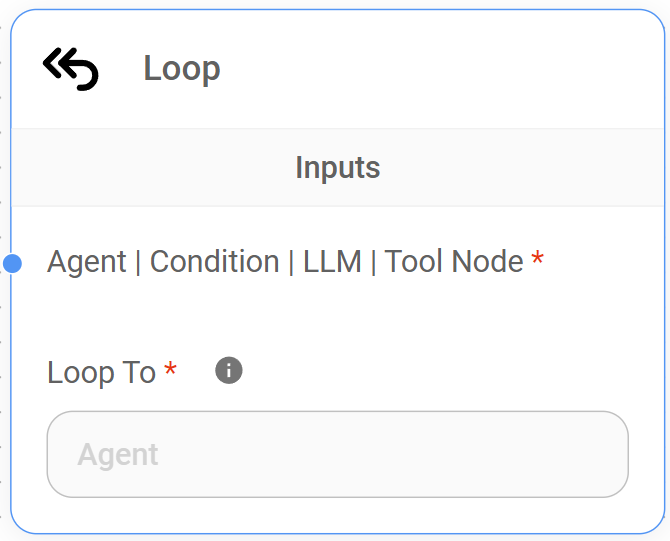<figcaption></figcaption></figure>

### 理解循环节点

循环节点充当连接器，将流程重定向回图中的特定点，允许我们在对话流程中创建循环。**它传递当前状态，其中包括循环节点之前的节点的输出到我们的目标节点。**此数据传输允许我们的目标节点处理来自循环先前迭代的信息并相应地调整其行为。

例如，假设我们正在构建一个帮助用户预订航班的聊天机器人。我们可以使用循环来根据用户反馈迭代地细化搜索条件。

#### 循环节点的使用方法

1. **LLM 节点（初始搜索）：**LLM 节点接收用户的初始航班请求（例如，“查找 7 月份从马德里到纽约的航班”）。它查询航班搜索 API 并返回可能的航班列表。
2. **代理节点（显示选项）：**代理节点向用户显示航班选项，并询问他们是否要细化搜索（例如，“您想按价格、航空公司或出发时间筛选吗？”）。
3. **条件代理节点：**条件代理节点检查用户的响应，并有两个输出：
   * **如果用户想要细化：**流程转到“细化搜索”LLM 节点。
   * **如果用户对结果满意：**流程继续进行预订过程。
4. **LLM 节点（细化搜索）：**此 LLM 节点收集用户的细化条件（例如，“只显示低于 500 美元的航班”）并使用新的搜索参数更新状态。
5. **循环节点：**循环节点将流程重定向回初始 LLM 节点（“初始搜索”）。它传递更新后的状态，其中现在包含细化的搜索条件。
6. **迭代：**初始 LLM 节点使用细化的条件执行新的搜索，并且该过程从步骤 2 重复。

**在此示例中，循环节点启用迭代搜索细化过程。**系统可以继续循环并细化搜索结果，直到用户对显示的选项满意为止。


### 输入

<table><thead><tr><th width="197"></th><th width="104">必需</th><th>描述</th></tr></thead><tbody><tr><td>代理节点</td><td><strong>是</strong></td><td>接收来自前面代理节点的输出。然后将此数据发送回“循环到”参数中指定的目标节点。</td></tr><tr><td>LLM 节点</td><td><strong>是</strong></td><td>接收来自前面 LLM 节点的输出。然后将此数据发送回“循环到”参数中指定的目标节点。</td></tr><tr><td>工具节点</td><td><strong>是</strong></td><td>接收来自前面工具节点的输出。然后将此数据发送回“循环到”参数中指定的目标节点。</td></tr><tr><td>条件节点</td><td><strong>是</strong></td><td>接收来自前面条件节点的输出。然后将此数据发送回“循环到”参数中指定的目标节点。</td></tr><tr><td>条件代理节点</td><td><strong>是</strong></td><td>接收来自前面条件代理节点的输出。然后将此数据发送回“循环到”参数中指定的目标节点。</td></tr></tbody></table>


**循环节点需要至少一个来自以下节点的连接：**代理节点、LLM 节点、工具节点、条件节点或条件代理节点。


### 节点设置

<table><thead><tr><th width="125"></th><th width="109">必需</th><th>描述</th></tr></thead><tbody><tr><td>循环到</td><td><strong>是</strong></td><td>循环节点要求我们**指定目标节点**（“循环到”），对话流程应重定向到该节点。此目标节点必须是**代理节点**或**LLM 节点**。</td></tr></tbody></table>

### 输出

**循环节点没有任何直接的输出连接**。它将流程重定向回图中的特定顺序节点。

### 最佳实践



**明确的循环目的**

为工作流程中的每个循环定义明确的目的。如果可能，请使用便利贴记录您尝试使用循环实现的目标。



**混乱的工作流程结构**

* **问题：**过多的或设计不良的循环使工作流程难以理解和维护。
* **示例：**您使用多个嵌套循环而没有明确的目的或标签，这使得难以跟踪对话的流程。
* **解决方案：**谨慎使用循环，仅在必要时使用。清楚地记录您的循环节点及其连接的节点。

**由于缺少或不正确的退出条件导致的无限循环**

* **问题：**循环永远不会终止，因为应该触发循环退出的条件不存在或定义不正确。
* **示例：**循环节点用于迭代地收集用户信息。但是，工作流程缺少条件代理节点来检查是否已收集所有必需的信息。结果，循环无限期地继续，反复向用户询问相同的信息。
* **解决方案：**始终为循环定义清晰且准确的退出条件。使用条件节点来检查状态变量、用户输入或指示循环何时应终止的其他因素。



***

## 10. 结束节点 (End Node)

结束节点标志着顺序代理工作流程中**对话的最终终止点**。它表示不需要进一步的处理、操作或交互。

<figure>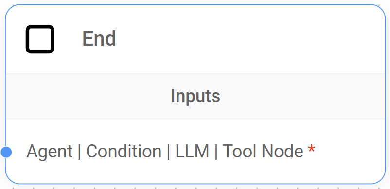<figcaption></figcaption></figure>

### 理解结束节点

结束节点在 Flowise 的顺序代理架构中充当信号，**表示对话已达到预期的结论**。到达结束节点后，系统“理解”对话目标已实现，并且在流程中不需要进一步的操作或交互。


### 输入

<table><thead><tr><th width="212"></th><th width="103">必需</th><th>描述</th></tr></thead><tbody><tr><td>代理节点</td><td><strong>是</strong></td><td>接收来自前面代理节点的最终输出，表示代理处理的结束。</td></tr><tr><td>LLM 节点</td><td><strong>是</strong></td><td>接收来自前面 LLM 节点的最终输出，表示 LLM 处理的结束。</td></tr></tbody></table>

This translation maintains the original formatting and structure as much as possible while ensuring accurate and clear technical language.  The use of bolding and other formatting elements is consistent with the source text.
This document describes Flowise's node types and their usage within sequential agent workflows.

### End Node

**Input:**

<table>
  <tr>
    <th>Node Type</th>
    <th>Accepts End Node Input?</th>
    <th>Description</th>
  </tr>
  <tr>
    <td>Agent Node</td>
    <td><strong>Yes</strong></td>
    <td>Receives the final output from a preceding Agent Node, signaling the end of the Agent Node's processing.</td>
  </tr>
  <tr>
    <td>LLM Node</td>
    <td><strong>Yes</strong></td>
    <td>Receives the final output from a preceding LLM Node, indicating the LLM Node's processing completion.</td>
  </tr>
  <tr>
    <td>Tool Node</td>
    <td><strong>Yes</strong></td>
    <td>Receives the final output from a preceding Tool Node, indicating the Tool Node's execution completion.</td>
  </tr>
  <tr>
    <td>Condition Node</td>
    <td><strong>Yes</strong></td>
    <td>Receives the final output from a preceding Condition Node, signaling the Condition Node's execution completion.</td>
  </tr>
  <tr>
    <td>Condition Agent Node</td>
    <td><strong>Yes</strong></td>
    <td>Receives the final output from a preceding Condition Agent Node, indicating the Condition Agent Node's processing completion.</td>
  </tr>
</table>


The **End Node requires at least one incoming connection** from an Agent Node, LLM Node, or Tool Node.


### Output

The **End Node has no output connections**, signifying the workflow's termination.

### Best Practices



**Provide a final response:**  If necessary, connect the End Node to a dedicated LLM or Agent Node to generate a concluding message or summary for the user, providing conversational closure.



**Premature conversation termination:**

* **Problem:** The End Node is positioned too early in the workflow, prematurely ending the conversation before all necessary steps are completed or the user's request is fully addressed.
* **Example:** A chatbot designed for user feedback collection ends the conversation after the first comment, preventing additional feedback or questions.
* **Solution:** Re-evaluate workflow logic; ensure the End Node is placed only after all essential steps are completed or the user explicitly signals conversation termination.

**Lack of user closure:**

* **Problem:** The conversation ends abruptly without a clear signal to the user or a concluding message.
* **Example:** A customer support chatbot ends immediately after resolving an issue without confirming resolution or offering further assistance.
* **Solution:** Connect the End Node to a dedicated LLM or Agent Node to generate a final response summarizing the conversation, confirming actions, and providing user closure.




***

## Condition Node vs. Condition Agent Node

Condition and Condition Agent Nodes are crucial in Flowise's Sequential Agent architecture for creating dynamic conversational experiences.  They enable adaptive workflows responding to user input, context, and complex decisions, but differ in their approach to condition evaluation and complexity.

<details>

<summary><strong>Condition Node</strong></summary>

**Purpose:** To create branching based on simple, predefined logical conditions.

**Condition Evaluation:** Uses a table-based interface or JavaScript code editor to define conditions checked against custom State and/or the complete conversation history.

**Output Behavior:**

* Supports multiple output paths, each linked to a specific condition.
* Conditions are evaluated sequentially; the first matching condition determines the output.
* If no conditions are met, the flow defaults to an "End" output.

**Best Suited For:** Straightforward routing decisions based on easily definable conditions; workflows where logic is expressed using simple comparisons, keyword checks, or custom state variable values.

</details>

<details>

<summary><strong>Condition Agent Node</strong></summary>

**Purpose:** To create dynamic routing based on an agent's analysis of the conversation and its structured output.

**Condition Evaluation:**

* If no Chat Model is connected, it uses the default system LLM (from the Start Node) to process the conversation history and any custom State.
* It generates structured output used for condition evaluation.
* Uses a table-based interface or JavaScript code editor to define conditions checked against the agent's output (structured or unstructured).

**Output Behavior:**  Same as the Condition Node: multiple output paths, sequential condition evaluation, and a default "End" output if no conditions are met.

**Best Suited For:** More complex routing decisions requiring understanding of conversation context, user intent, or nuanced factors; scenarios where simple logical conditions are insufficient.  For example: a chatbot determining if a user's question relates to a specific product category, using the Condition Agent Node to analyze the query and output a JSON object with a "category" field for routing.

</details>

### Summary

<table>
  <thead>
    <tr>
      <th></th>
      <th>Condition Node</th>
      <th>Condition Agent Node</th>
    </tr>
  </thead>
  <tbody>
    <tr>
      <td><strong>Decision Logic</strong></td>
      <td>Based on predefined logical conditions.</td>
      <td>Based on agent reasoning and structured output.</td>
    </tr>
    <tr>
      <td><strong>Agent Involvement</strong></td>
      <td>No agent involved in condition evaluation.</td>
      <td>Uses an agent to process context and generate output for conditions.</td>
    </tr>
    <tr>
      <td><strong>Structured Output</strong></td>
      <td>Not possible.</td>
      <td>Possible and encouraged for reliable condition evaluation.</td>
    </tr>
    <tr>
      <td><strong>Condition Evaluation</strong></td>
      <td>Conditions checked against the full conversation history.</td>
      <td>Conditions checked against the agent's output (structured or unstructured).</td>
    </tr>
    <tr>
      <td><strong>Complexity</strong></td>
      <td>Suitable for simple branching logic.</td>
      <td>Handles more nuanced and context-aware routing.</td>
    </tr>
    <tr>
      <td><strong>Ideal Use Cases</strong></td>
      <td><ul><li>Routing based on user's age or a keyword in the conversation.</li></ul></td>
      <td><ul><li>Routing based on user sentiment, intent, or complex contextual factors.</li></ul></td>
    </tr>
  </tbody>
</table>

### Choosing the Right Node

* **Condition Node:** Use for straightforward routing based on easily definable conditions (keywords, state comparisons, simple logical expressions).
* **Condition Agent Node:** Use when routing requires a deeper understanding of conversational nuances, leveraging an LLM to analyze the conversation and provide structured output for more sophisticated routing.


***

## Agent Node vs. LLM Node

Both **LLM and Agent Nodes are agentic entities**, leveraging LLMs or Chat Models.  However, they serve different purposes within a workflow.

<details>

<summary>Agent Node</summary>

**Focus:** Simulates a human agent's actions and decision-making in a conversational context.  Acts as a high-level workflow coordinator, integrating language understanding, tool execution, and decision-making for a more human-like experience.

**Strengths:** Effectively manages multiple tool executions and integrates their results; offers built-in Human-in-the-Loop (HITL) support for sensitive operations.

**Best Suited For:** Workflows where the agent guides the user, gathers information, makes choices, and manages conversation flow; scenarios requiring multiple external tool integrations; tasks involving sensitive data or actions where human oversight is beneficial (e.g., approving financial transactions).

</details>

<details>

<summary>LLM Node</summary>

**Focus:** Similar to the Agent Node, but provides more flexibility in tool usage and HITL via the Tool Node.

**Strengths:** Enables JSON schema definition to structure LLM output; offers flexible tool integration, allowing complex LLM and tool call sequences with fine-grained HITL control.

**Best Suited For:** Scenarios requiring structured data extraction from LLM responses; workflows needing a mix of automated and human-reviewed tool executions (e.g., an LLM Node calling a tool for product information (automated) and another for payment processing requiring HITL approval).

</details>

### Summary

<table>
  <thead>
    <tr>
      <th></th>
      <th>Agent Node</th>
      <th>LLM Node</th>
    </tr>
  </thead>
  <tbody>
    <tr>
      <td><strong>Tool Interaction</strong></td>
      <td>Directly calls and manages multiple tools; built-in HITL.</td>
      <td>Triggers tools via the Tool Node; granular HITL control at the tool level.</td>
    </tr>
    <tr>
      <td><strong>Human-in-the-Loop (HITL)</strong></td>
      <td>HITL controlled at the Agent Node level (all connected tools affected).</td>
      <td>HITL managed at the individual Tool Node level (more flexibility).</td>
    </tr>
    <tr>
      <td><strong>Structured Output</strong></td>
      <td>Relies on the LLM's natural output format.</td>
      <td>Relies on the LLM's natural output format; provides JSON schema definition for structured LLM output (if needed).</td>
    </tr>
    <tr>
      <td><strong>Ideal Use Cases</strong></td>
      <td><ul><li>Workflows with complex tool orchestration.</li><li>Simplified HITL at the Agent Level.</li></ul></td>
      <td><ul><li>Extracting structured data from LLM output.</li><li>Workflows with complex LLM and tool interactions, requiring mixed HITL levels.</li></ul></td>
    </tr>
  </tbody>
</table>

### Choosing the Right Node

* **Agent Node:** Use for conversational systems managing multiple tools sharing the same HITL setting.  Suitable for complex multi-step conversations requiring consistent agent-like behavior.
* **LLM Node:** Use for extracting structured data from LLM output using JSON schemas and for orchestrating tool execution with fine-grained HITL control at the individual tool level, allowing mixed automated and human-reviewed tool executions.
