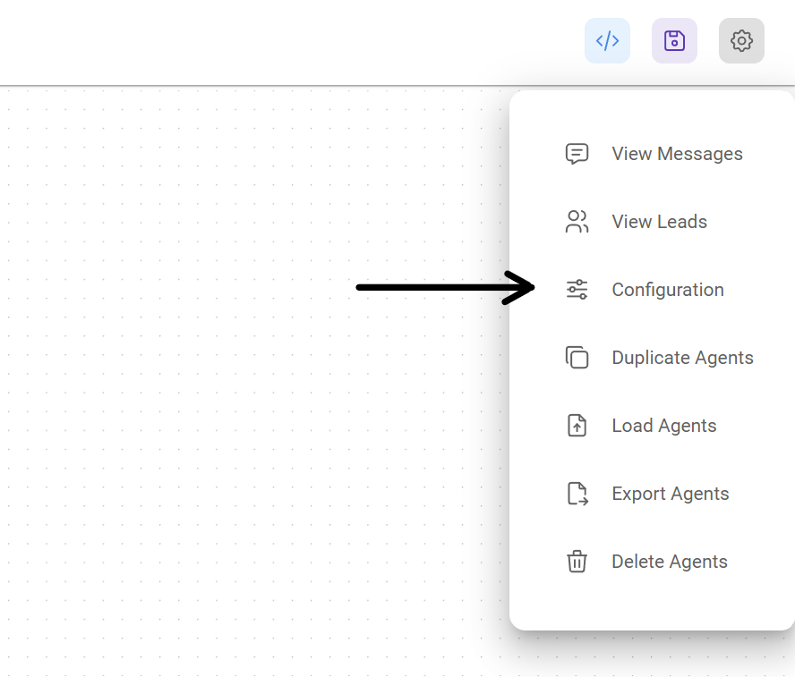
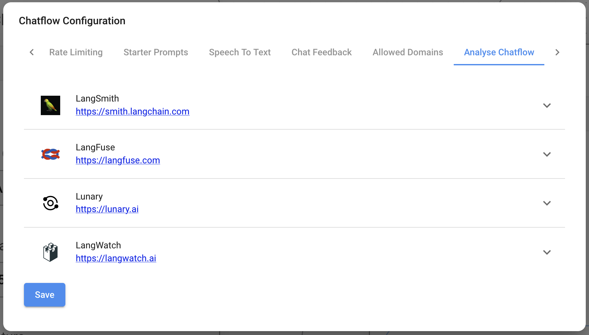

# 分析

***

Flowise 集成了多个分析提供商：

* [LunaryAI](https://lunary.ai/)
* [Langsmith](https://smith.langchain.com/)
* [Langfuse](https://langfuse.com/)
* [LangWatch](https://langwatch.ai/)

## Lunary

[Lunary](https://lunary.ai/) 是一个用于 LLM 聊天机器人的监控和分析平台。

Flowise 已与 Lunary 建立合作伙伴关系，提供完整的集成，支持用户追踪、反馈追踪、对话回放和详细的 LLM 分析。

Flowise 用户结账时可以使用代码 `FLOWISEFRIENDS` 获得团队计划 30% 的折扣。

阅读有关如何使用 Flowise 设置 Lunary 的更多信息 [此处](https://lunary.ai/docs/integrations/flowise)。

## 设置

1. 在 Chatflow 或 Agentflow 的右上角，点击 **设置** > **配置**

<figure><figcaption></figcaption></figure>

2. 然后转到“分析 Chatflow”部分

<figure><figcaption></figcaption></figure>

3. 您将看到一个提供商列表及其配置字段

<figure><figcaption></figcaption></figure>

4. 填写凭据和其他配置详细信息，然后将提供商设置为 **开启**

<figure><figcaption></figcaption></figure>

## API

一旦从 UI 中开启分析，您就可以在 [预测 API](api.md#prediction-api) 的主体中覆盖或提供其他配置：

```json
```json
{
  "question": "hi there",
  "overrideConfig": {
    "analytics": {
      "langFuse": {
        // langSmith, langFuse, lunary, langWatch
        "userId": "user1"
      }
    }
  }
}
```
