# 文档存储

***

Flowise 的文档存储提供了一种通用的数据管理方法，使您能够在一个位置上传、分割和准备数据集，并将其上载。

这种集中式方法简化了数据处理，并允许有效管理各种数据格式，从而更轻松地在 Flowise 应用程序中组织和访问您的数据。

## 设置

在本教程中，我们将设置一个 [检索增强生成 (RAG)](../use-cases/multiple-documents-qna_zh.md) 系统来检索有关 _LibertyGuard Deluxe Homeowners Policy_ 的信息，这是一个大型语言模型 (LLM) 没有广泛训练的主题。

使用 **Flowise 文档存储**，我们将准备并上载有关 LibertyGuard 及其房屋保险政策集的数据。这将使我们的 RAG 系统能够准确地回答用户关于 LibertyGuard 房屋保险产品的问题。

## 1. 添加文档存储

* 首先添加一个文档存储并命名它。在本例中，命名为“LibertyGuard Deluxe Homeowners Policy”。

<figure>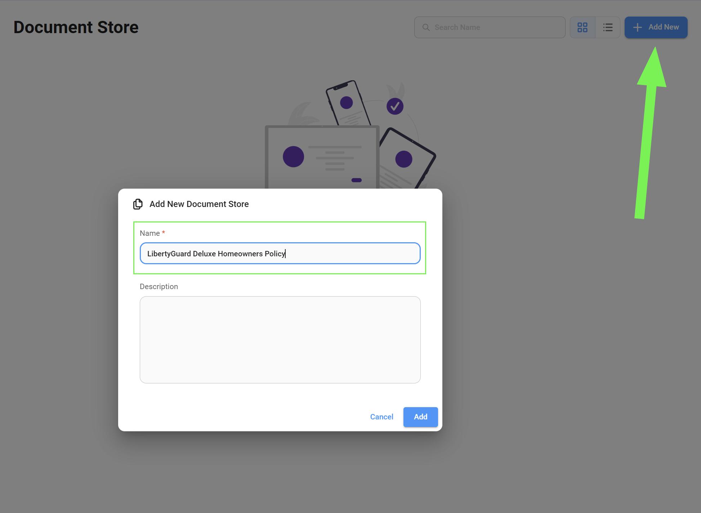<figcaption></figcaption></figure>

## 2. 选择文档加载器

* 进入您刚刚创建的文档存储，并选择要使用的 [文档加载器](../integrations/langchain/document-loaders/)。在本例中，由于我们的数据集为 PDF 格式，我们将使用 [PDF 加载器](../integrations/langchain/document-loaders/pdf-file_zh.md)。

<figure>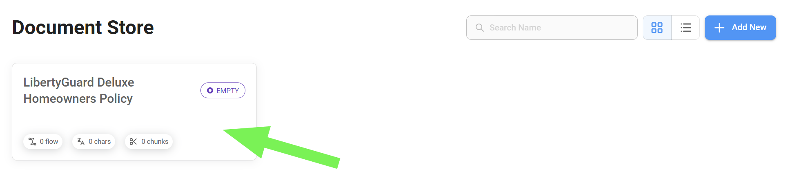<figcaption></figcaption></figure>

<figure>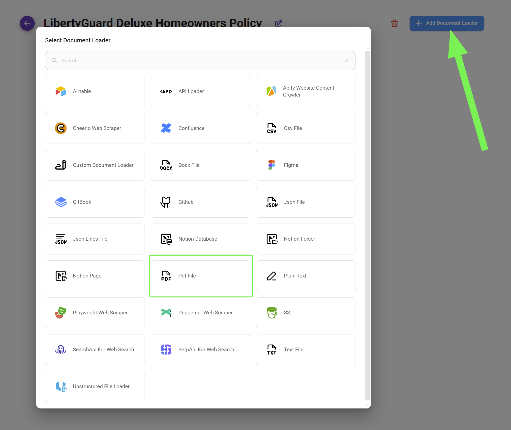<figcaption></figcaption></figure>

## 3. 准备您的数据

* 首先，我们开始上传 PDF 文件。
* 然后，我们添加一个 **唯一的元数据键**。这是可选的，但这是一个好习惯，因为它允许我们在需要时稍后定位和过滤相同的此数据集。

<figure>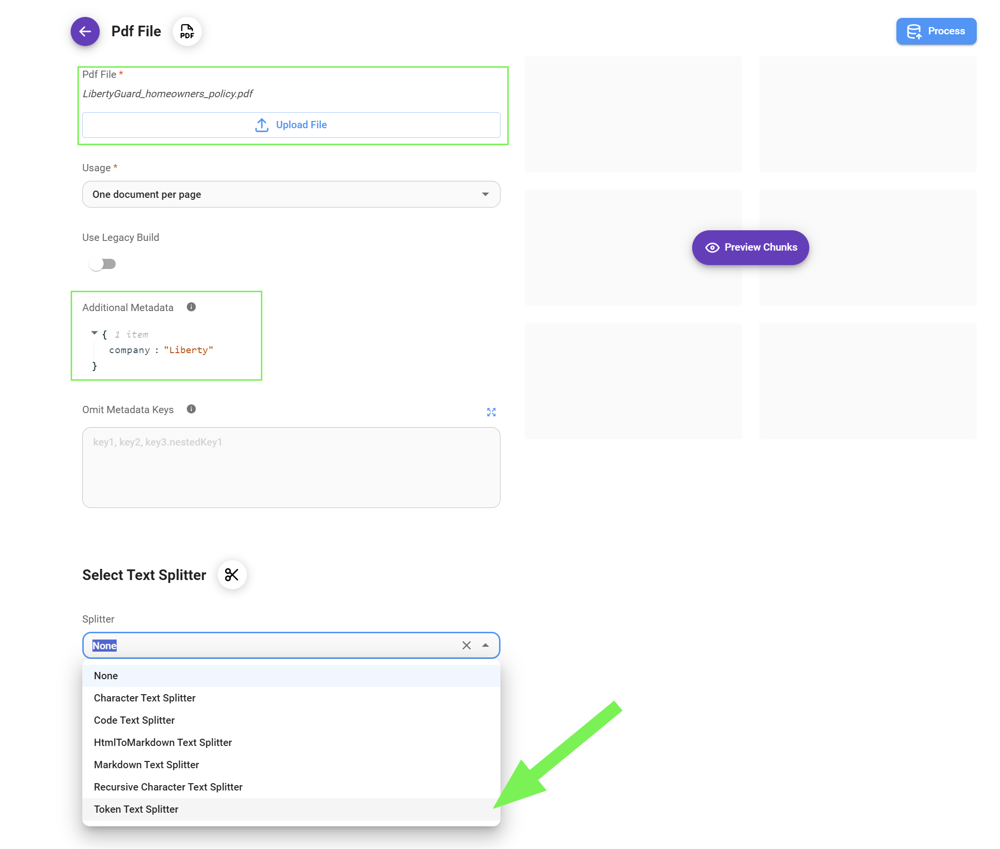<figcaption></figcaption></figure>

* 最后，选择要使用的 [文本分割器](../integrations/langchain/text-splitters/) 来分割您的数据。在本例中，我们将使用 [递归字符文本分割器](../integrations/langchain/text-splitters/recursive-character-text-splitter_zh.md)。


在本指南中，我们添加了一个较大的 **分块重叠** 大小，以确保不会错过分块之间的任何相关数据。但是，最佳重叠大小取决于数据的复杂性。您可能需要根据您的特定数据集和要提取的信息的性质来调整此值。有关此主题的更多信息，请参阅此 [指南](../use-cases/upserting-data_zh.md)。


<figure>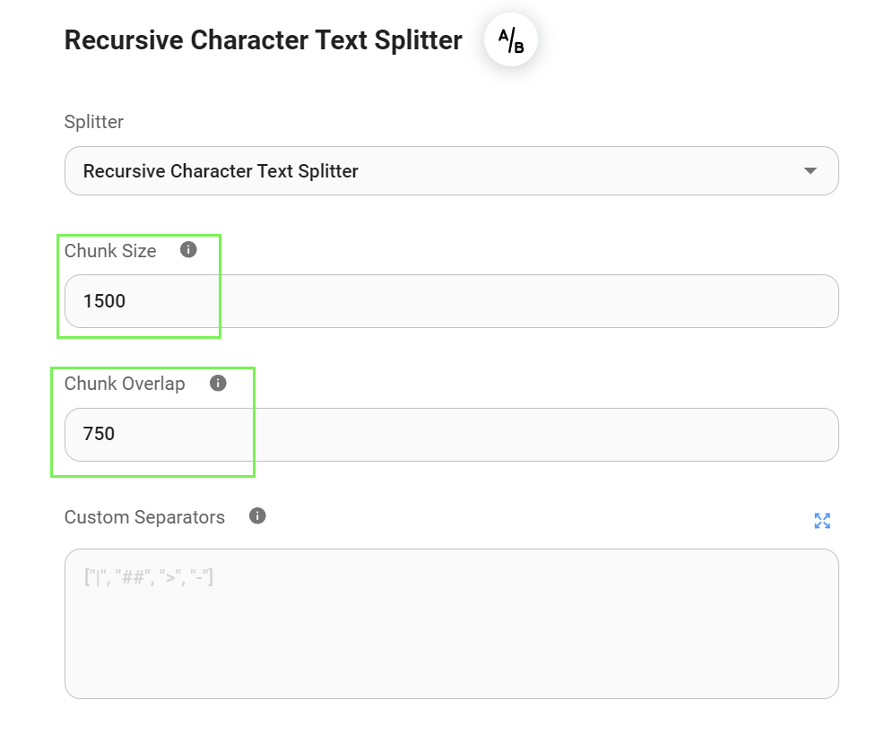<figcaption></figcaption></figure>

## 4. 预览您的数据

* 现在，我们可以预览使用当前 [文本分割器](../integrations/langchain/text-splitters/) 配置（`chunk_size=1500` 和 `chunk_overlap=750`）如何分割数据。

<figure>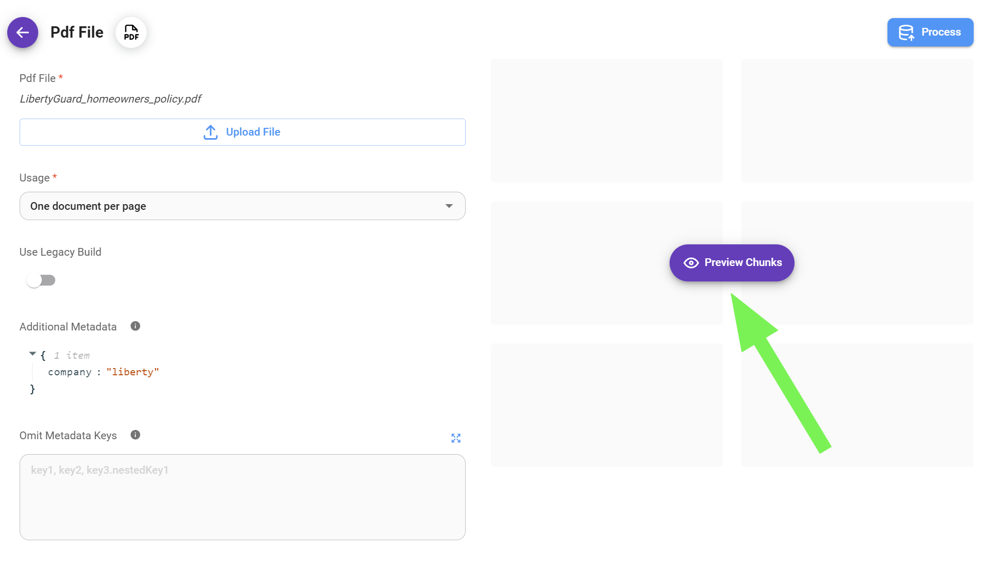<figcaption></figcaption></figure>

* 重要的是要尝试不同的 [文本分割器](../integrations/langchain/text-splitters/)、分块大小和重叠值，以找到适合您特定数据集的最佳配置。此预览允许您优化分块过程，并确保生成的块适合您的 RAG 系统。

<figure>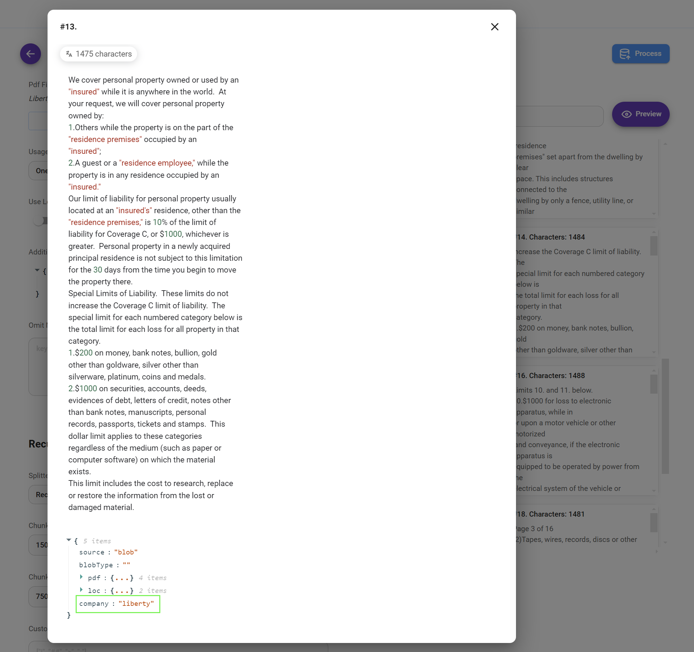<figcaption></figcaption></figure>


请注意，我们的自定义元数据 `company: "liberty"` 已插入到每个块中。此元数据允许我们轻松过滤和检索来自此特定数据集的信息，即使我们对其他数据集使用相同的向量存储索引。


## 5. 处理您的数据

* 一旦您对分块过程满意，就可以处理您的数据了。

<figure>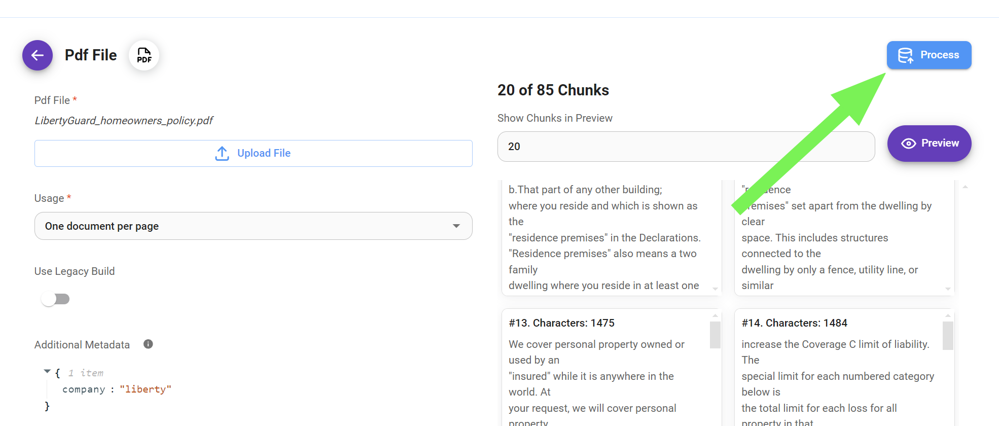<figcaption></figcaption></figure>

<figure><figcaption></figcaption></figure>

处理数据后，您可以通过删除或添加内容来优化各个块。这种细粒度的控制提供了几个优势：

* **提高准确性：** 识别和纠正原始数据中存在的不准确之处或不一致之处，确保应用程序中使用信息可靠。
* **提高相关性：** 优化块内容以强调关键信息并删除不相关部分，从而提高检索过程的精度和效率。
* **查询优化：** 调整块以更好地与预期的用户查询对齐，使其更具针对性并改善整体用户体验。

## 6. 配置上载过程

* 通过文档加载器加载并适当分割我们的数据后，我们现在可以继续配置上载过程。

<figure>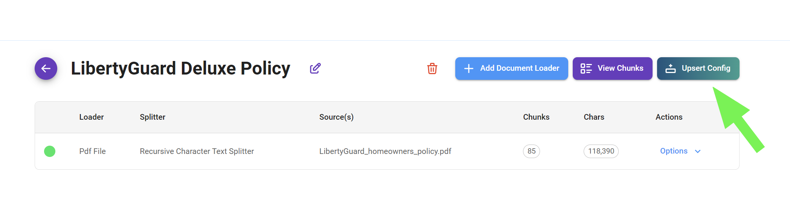<figcaption></figcaption></figure>

上载过程包括三个基本步骤：

* **嵌入选择：** 我们首先选择合适的嵌入模型来编码我们的数据集。此模型会将我们的数据转换为数值向量表示。
* **数据存储选择：** 接下来，我们确定数据集将驻留的向量存储。
* **记录管理器选择（可选）：** 最后，我们可以选择实现记录管理器。此组件提供管理数据集的功能，一旦它存储在向量存储中。

<figure>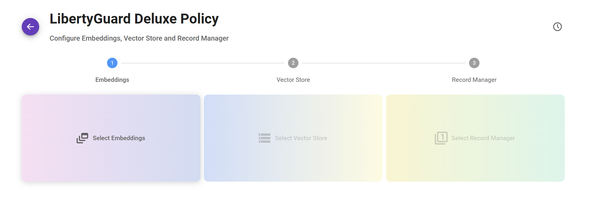<figcaption></figcaption></figure>

### 1. 选择嵌入

* 点击“选择嵌入”卡片并选择您首选的 [嵌入模型](../integrations/langchain/embeddings/)。在本例中，我们将选择 OpenAI 作为嵌入提供程序，并使用具有 1536 维的“text-embedding-ada-002”模型。

<figure>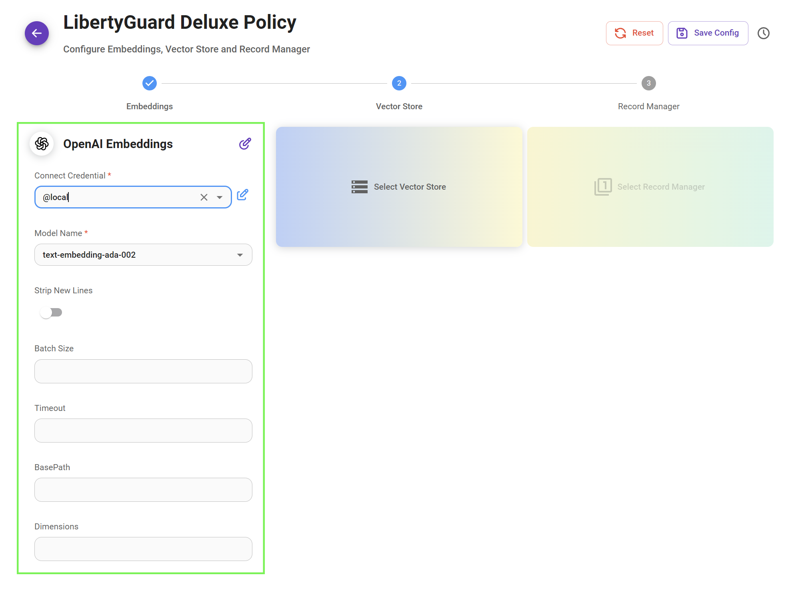<figcaption></figcaption></figure>

### 2. 选择向量存储

* 点击“选择向量存储”卡片并选择您首选的 [向量存储](../integrations/langchain/vector-stores/)。在本例中，由于我们需要一个可用于生产的环境，我们将选择 Upstash。

<figure>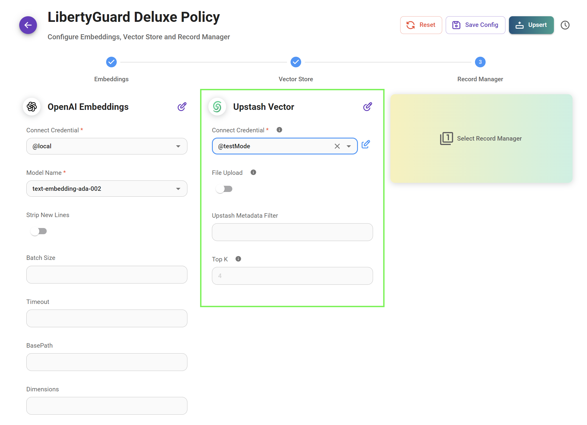<figcaption></figcaption></figure>

### 3. 选择记录管理器

* 为了在向量存储中进行高级数据集管理，您可以选择配置 [记录管理器](../integrations/langchain/record-managers_zh.md)。有关如何设置和使用此功能的详细说明，请参阅专用 [指南](../integrations/langchain/record-managers_zh.md)。

<figure>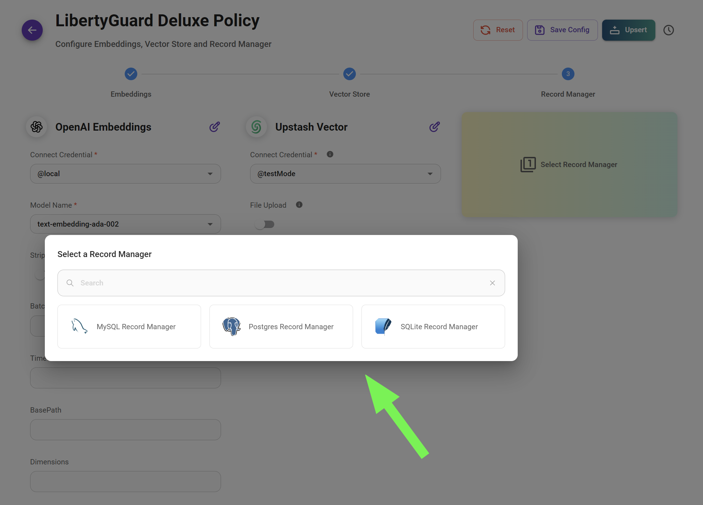<figcaption></figcaption></figure>

## 7. 将您的数据上载到向量存储

* 要开始上载过程并将数据传输到向量存储，请点击“上载”按钮。

<figure>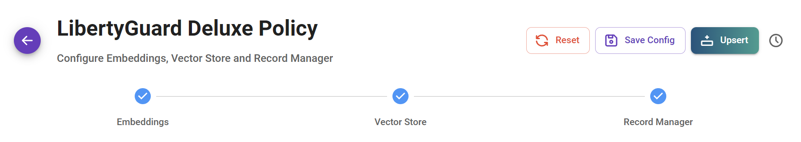<figcaption></figcaption></figure>

* 如下图所示，我们的数据已成功上载到 Upstash 向量数据库。数据被分成 85 个块以优化上载过程并确保高效的存储和检索。

<figure>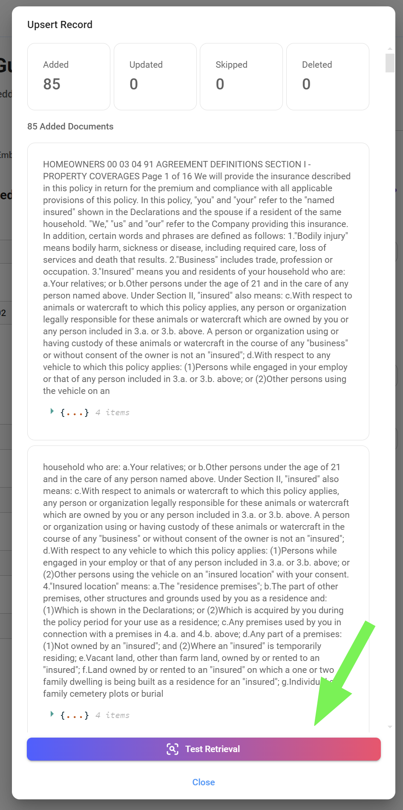<figcaption></figcaption></figure>

## 8. 测试您的数据集

* 要快速测试数据集的功能，而无需离开文档存储，只需使用“检索查询”按钮。这将启动测试查询，允许您验证数据检索过程的准确性和有效性。

<figure>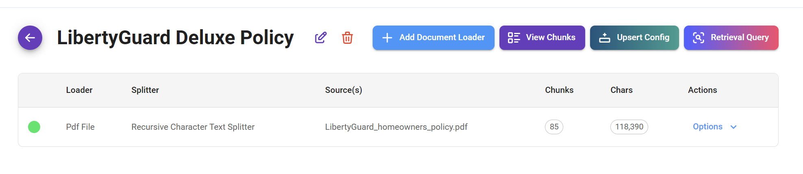<figcaption></figcaption></figure>

* 在我们的例子中，我们看到当查询我们的保险单中关于厨房地板覆盖范围的信息时，我们从 Upstash（我们指定的向量存储）检索到 4 个相关的块。此检索限于 4 个块（根据定义的“top k”参数），确保我们收到最相关的信息，而不会出现不必要的冗余。

<figure>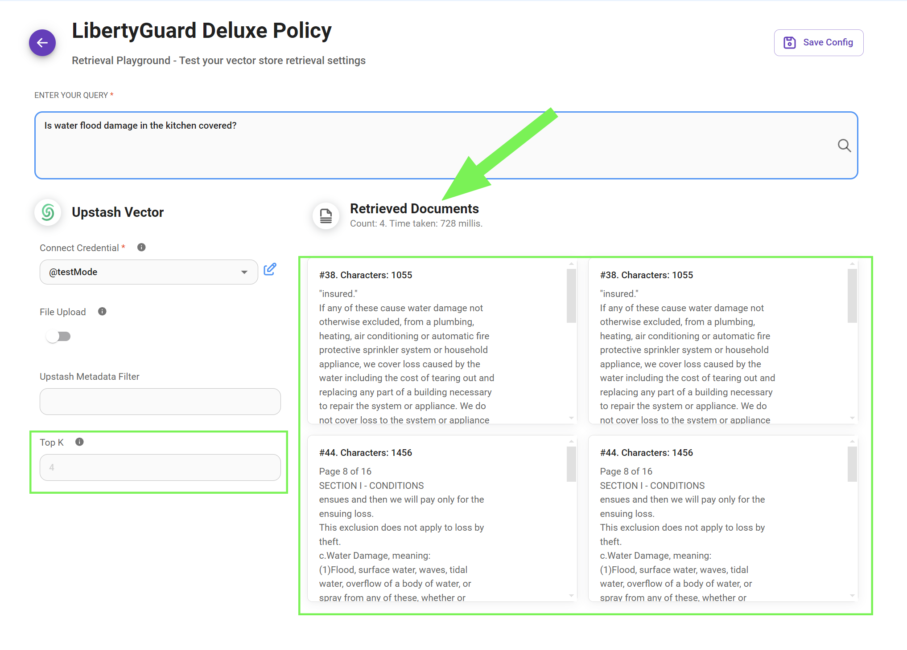<figcaption></figcaption></figure>

## 9. 测试您的 RAG

* 最后，我们的检索增强生成 (RAG) 系统正在运行。值得注意的是，LLM 如何有效地解释查询并成功利用来自分块数据的相关信息来构建全面的响应。

您可以使用之前配置的向量存储：

<figure>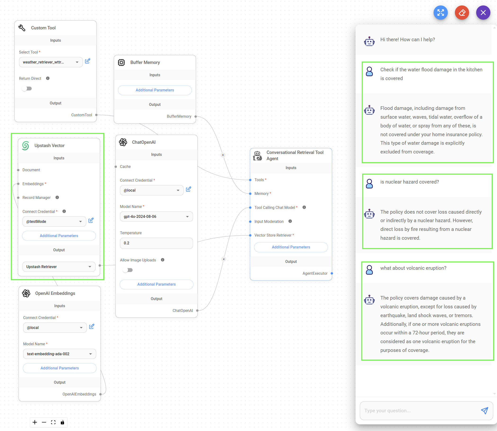<figcaption></figcaption></figure>

或者，使用文档存储（向量）：

<figure><figcaption></figcaption></figure>

## 10. API

还支持用于创建、更新和删除文档存储的 API。有关更多详细信息，请参阅 [文档存储 API](../api-reference/document-store_zh.md)。在本节中，我们将重点介绍两个最常用的 API：上载和刷新。

### 上载 API

上载过程有几种不同的场景，每种场景的结果都不同。

#### 场景 1：在同一个文档存储中，使用现有的文档加载器配置，作为新的文档加载器上载。

<figure>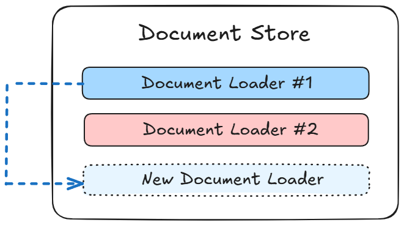<figcaption></figcaption></figure>


**`docId`** 代表现有的文档加载器 ID。此场景的请求正文中需要它。




```python
import requests
import json

DOC_STORE_ID = "your_doc_store_id"
DOC_LOADER_ID = "your_doc_loader_id"
API_URL = f"http://localhost:3000/api/v1/document-store/upsert/{DOC_STORE_ID}"
API_KEY = "your_api_key_here"

form_data = {
    "files": ('my-another-file.pdf', open('my-another-file.pdf', 'rb'))
}

body_data = {
    "docId": DOC_LOADER_ID
}

headers = {
    "Authorization": f"Bearer {BEARER_TOKEN}"
}

def query(form_data):
    response = requests.post(API_URL, files=form_data, data=body_data, headers=headers)
    print(response)
    return response.json()

output = query(form_data)
print(output)
```



```javascript
const DOC_STORE_ID = "your_doc_store_id"
const DOC_LOADER_ID = "your_doc_loader_id"

let formData = new FormData();
formData.append("files", input.files[0]);
formData.append("docId", DOC_LOADER_ID)

async function query(formData) {
    const response = await fetch(
        `http://localhost:3000/api/v1/document-store/upsert/${DOC_STORE_ID}`,
        {
            method: "POST",
            headers: {
                "Authorization": "Bearer <your_api_key_here>"
            },
            body: formData
        }
    );
    const result = await response.json();
    return result;
}

query(formData).then((response) => {
    console.log(response);
});
```



#### 场景 2：在同一个文档存储中，用新文件替换现有的文档加载器。

<figure>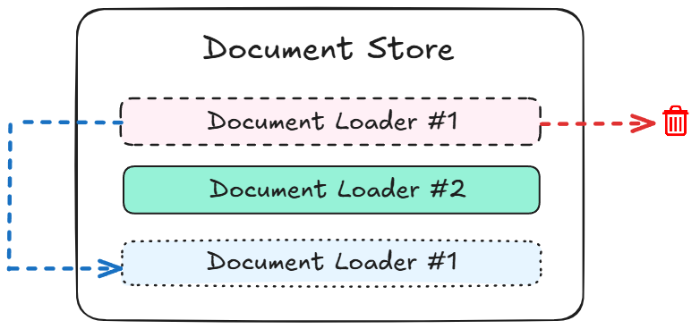<figcaption></figcaption></figure>


**`docId`** 和 **`replaceExisting`** 在此场景的请求正文中都是必需的。




```python
import requests
import json

DOC_STORE_ID = "your_doc_store_id"
DOC_LOADER_ID = "your_doc_loader_id"
API_URL = f"http://localhost:3000/api/v1/document-store/upsert/{DOC_STORE_ID}"
API_KEY = "your_api_key_here"

form_data = {
    "files": ('my-another-file.pdf', open('my-another-file.pdf', 'rb'))
}

body_data = {
    "docId": DOC_LOADER_ID,
    "replaceExisting": True
}

headers = {
    "Authorization": f"Bearer {BEARER_TOKEN}"
}

def query(form_data):
    response = requests.post(API_URL, files=form_data, data=body_data, headers=headers)
    print(response)
    return response.json()

output = query(form_data)
print(output)
```



```javascript
const DOC_STORE_ID = "your_doc_store_id";
const DOC_LOADER_ID = "your_doc_loader_id";

let formData = new FormData();
formData.append("files", input.files[0]);
formData.append("docId", DOC_LOADER_ID);
formData.append("replaceExisting", true);

async function query(formData) {
    const response = await fetch(
        `http://localhost:3000/api/v1/document-store/upsert/${DOC_STORE_ID}`,
        {
            method: "POST",
            headers: {
                "Authorization": "Bearer <your_api_key_here>"
            },
            body: formData
        }
    );
    const result = await response.json();
    return result;
}

query(formData).then((response) => {
    console.log(response);
});
```



#### 场景 3：在同一个文档存储中，从头开始作为新的文档加载器上载。

<figure>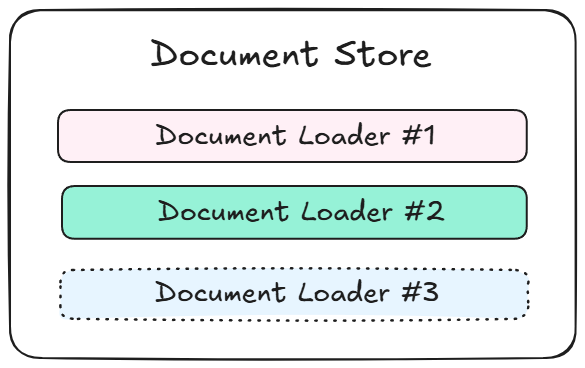<figcaption></figcaption></figure>


在此场景的请求正文中，**`loader`**、**`splitter`**、**`embedding`** 和 **`vectorStore`** 都是必需的。**`recordManager`** 是可选的。




```python
import requests
import json

DOC_STORE_ID = "your_doc_store_id"
API_URL = f"http://localhost:3000/api/v1/document-store/upsert/{DOC_STORE_ID}"
API_KEY = "your_api_key_here"

form_data = {
    "files": ('my-another-file.pdf', open('my-another-file.pdf', 'rb'))
}

loader = {
    "name": "pdfFile",
    "config": {} # you can leave empty to use default config
}

splitter = {
    "name": "recursiveCharacterTextSplitter",
    "config": {
        "chunkSize": 1400,
        "chunkOverlap": 100
    }
}

embedding = {
    "name": "openAIEmbeddings",
    "config": {
        "modelName": "text-embedding-ada-002",
        "credential": <your_credential_id>
    }
}

vectorStore = {
    "name": "pinecone",
    "config": {
        "pineconeIndex": "exampleindex",
        "pineconeNamespace": "examplenamespace",
        "credential":  <your_credential_i
    }
}

body_data = {
    "docId": DOC_LOADER_ID,
    "loader": json.dumps(loader),
    "splitter": json.dumps(splitter),
    "embedding": json.dumps(embedding),
    "vectorStore": json.dumps(vectorStore)
}

headers = {
    "Authorization": f"Bearer {BEARER_TOKEN}"
}

def query(form_data):
    response = requests.post(API_URL, files=form_data, data=body_data, headers=headers)
    print(response)
    return response.json()

output = query(form_data)
print(output)
```



```javascript
const DOC_STORE_ID = "your_doc_store_id";
const API_URL = `http://localhost:3000/api/v1/document-store/upsert/${DOC_STORE_ID}`;
const API_KEY = "your_api_key_here";

const formData = new FormData();
formData.append("files", new Blob([await (await fetch('my-another-file.pdf')).blob()]), "my-another-file.pdf");

const loader = {
    name: "pdfFile",
    config: {} // You can leave empty to use the default config
};

const splitter = {
    name: "recursiveCharacterTextSplitter",
    config: {
        chunkSize: 1400,
        chunkOverlap: 100
    }
};

const embedding = {
    name: "openAIEmbeddings",
    config: {
        modelName: "text-embedding-ada-002",
        credential: "your_credential_id"
    }
};

const vectorStore = {
    name: "pinecone",
    config: {
        pineconeIndex: "exampleindex",
        pineconeNamespace: "examplenamespace",
        credential: "your_credential_id"
    }
};

const bodyData = {
    docId: "DOC_LOADER_ID",
    loader: JSON.stringify(loader),
    splitter: JSON.stringify(splitter),
    embedding: JSON.stringify(embedding),
    vectorStore: JSON.stringify(vectorStore)
};

const headers = {
    "Authorization": `Bearer BEARER_TOKEN`
};

async function query() {
    try {
        const response = await fetch(API_URL, {
            method: "POST",
            headers: headers,
            body: formData
        });

        const result = await response.json();
        console.log(result);
        return result;
    } catch (error) {
        console.error("Error:", error);
    }
}

query();

```




不建议从头开始创建，因为它会公开您的凭据 ID。推荐的方法是创建一个占位符文档存储并在 UI 上配置参数。然后使用占位符作为添加新文档加载器或创建新文档存储的基础。


#### 场景 4：为每次上载创建新的文档存储

<figure>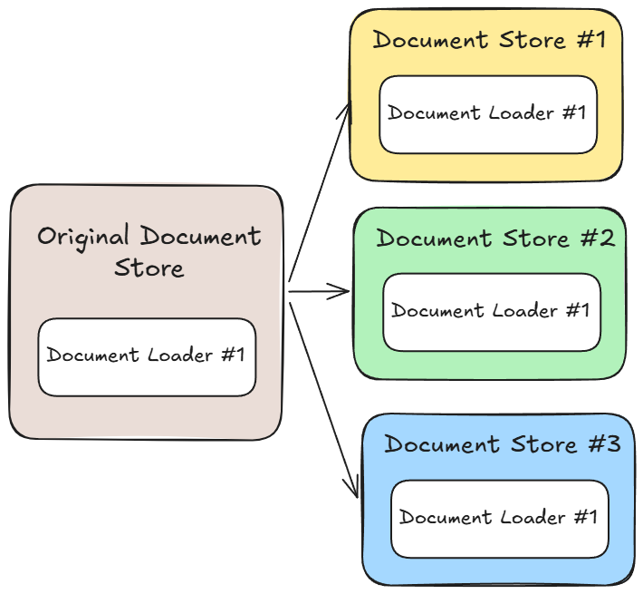<figcaption></figcaption></figure>


在此场景的请求正文中，**`createNewDocStore`** 和 **`docStore`** 都是必需的。




```python
import requests
import json

DOC_STORE_ID = "your_doc_store_id"
DOC_LOADER_ID = "your_doc_loader_id"
API_URL = f"http://localhost:3000/api/v1/document-store/upsert/{DOC_STORE_ID}"
API_KEY = "your_api_key_here"

form_data = {
    "files": ('my-another-file.pdf', open('my-another-file.pdf', 'rb'))
}

body_data = {
    "docId": DOC_LOADER_ID,
    "createNewDocStore": True,
    "docStore": json.dumps({"name":"My NEW Doc Store"})
}

headers = {
    "Authorization": f"Bearer {BEARER_TOKEN}"
}

def query(form_data):
    response = requests.post(API_URL, files=form_data, data=body_data, headers=headers)
    print(response)
    return response.json()

output = query(form_data)
print(output)
```



```javascript
const DOC_STORE_ID = "your_doc_store_id";
const DOC_LOADER_ID = "your_doc_loader_id";

let formData = new FormData();
formData.append("files", input.files[0]);
formData.append("docId", DOC_LOADER_ID);
formData.append("createNewDocStore", true);
formData.append("docStore", JSON.stringify({ "name": "My NEW Doc Store" }));

async function query(formData) {
    const response = await fetch(
        `http://localhost:3000/api/v1/document-store/upsert/${DOC_STORE_ID}`,
        {
            method: "POST",
            headers: {
                "Authorization": "Bearer <your_api_key_here>"
            },
            body: formData
        }
    );
    const result = await response.json();
    return result;
}

query(formData).then((response) => {
    console.log(response);
});
```



#### 问：在哪里可以找到文档存储 ID 和文档加载器 ID？

答：您可以从 URL 中找到相应的 ID。

<figure>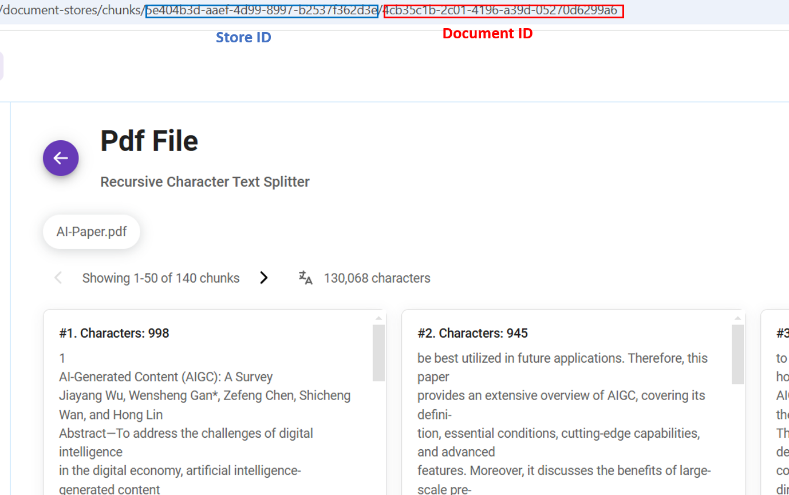<figcaption></figcaption></figure>

#### 问：在哪里可以找到可覆盖的可用配置？

答：您可以在每个文档加载器的“查看 API”按钮中找到可用的配置：

<figure>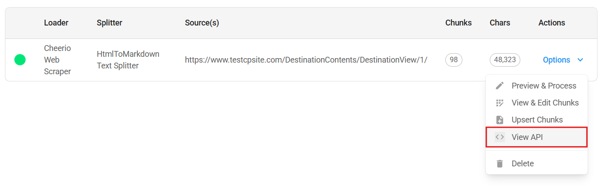<figcaption></figcaption></figure>

<figure><figcaption></figcaption></figure>

对于每次上载，都涉及 5 个元素：

* **`loader`**
* **`splitter`**
* **`embedding`**
* **`vectorStore`**
* **`recordManager`**

您可以使用元素的 **`config`** 主体覆盖现有配置。例如，使用上面的屏幕截图，您可以使用新的 **`url`** 创建一个新的文档加载器：



```python
import requests

API_URL = "http://localhost:3000/api/v1/document-store/upsert/<storeId>"

def query(payload):
    response = requests.post(API_URL, json=payload)
    return response.json()

output = query({
    "docId": <docLoaderId>,
    # override existing configuration
    "loader": {
        "config": {
            "url": "https://new-url.com"
        }
    }
})
print(output)
```



```javascript
async function query(data) {
    const response = await fetch(
        "http://localhost:3000/api/v1/document-store/upsert/<storeId>",
        {
            method: "POST",
            headers: {
                "Content-Type": "application/json"
            },
            body: JSON.stringify(data)
        }
    );
    const result = await response.json();
    return result;
}

query({
    "docId": <docLoaderId>,
    // override existing configuration
    "loader": {
        "config": {
            "url": "https://new-url.com"
        }
    }
}).then((response) => {
    console.log(response);
});
```



如果加载器有文件上传怎么办？没错，我们必须使用表单数据作为主体！

以以下图像为例，我们可以覆盖 PDF 文件加载器的 **`usage`** 参数：

<figure><figcaption></figcaption></figure>



```python
import requests
import json

API_URL = "http://localhost:3000/api/v1/document-store/upsert/<storeId>"
API_KEY = "your_api_key_here"

form_data = {
    "files": ('my-another-file.pdf', open('my-another-file.pdf', 'rb'))
}

override_loader_config = {
    "config": {
        "usage": "perPage"
    }
}

body_data = {
    "docId": <docLoaderId>,
    "loader": json.dumps(override_loader_config) # Override existing configuration
}

headers = {
    "Authorization": f"Bearer {BEARER_TOKEN}"
}

def query(form_data):
    response = requests.post(API_URL, files=form_data, data=body_data, headers=headers)
    print(response)
    return response.json()

output = query(form_data)
print(output)
```



```javascript
const DOC_STORE_ID = "your_doc_store_id";
const DOC_LOADER_ID = "your_doc_loader_id";

const overrideLoaderConfig = {
    "config": {
        "usage": "perPage"
    }
}

let formData = new FormData();
formData.append("files", input.files[0]);
formData.append("docId", DOC_LOADER_ID);
formData.append("loader", JSON.stringify(overrideLoaderConfig));

async function query(formData) {
    const response = await fetch(
        `http://localhost:3000/api/v1/document-store/upsert/${DOC_STORE_ID}`,
        {
            method: "POST",
            headers: {
                "Authorization": "Bearer <your_api_key_here>"
            },
            body: formData
        }
    )
    const result = await response.json();
    return result;
}

query(formData).then((response) => {
    console.log(response);
});e
```



#### 问：何时使用表单数据与 JSON 作为 API 请求的主体？

答：对于具有文件上传功能的 [文档加载器](../integrations/langchain/document-loaders/)，例如 PDF、DOCX、TXT 等，主体必须作为表单数据发送。


确保发送的文件类型与文档加载器预期的文件类型兼容。

例如，如果使用 [PDF 文件加载器](../integrations/langchain/document-loaders/pdf-file_zh.md)，则应仅发送 **.pdf** 文件。

为了避免为不同文件类型使用单独的加载器，我们建议使用 [文件加载器](../integrations/langchain/document-loaders/file-loader_zh.md)




```python
import requests
import json

API_URL = "http://localhost:3000/api/v1/document-store/upsert/<storeId>"

# use form data to upload files
form_data = {
    "files": ('my-another-file.pdf', open('my-another-file.pdf', 'rb'))
}

body_data = {
    "docId": <docId>
}

def query(form_data):
    response = requests.post(API_URL, files=form_data, data=body_data)
    print(response)
    return response.json()

output = query(form_data)
print(output)
```



```javascript
// use FormData to upload files
let formData = new FormData();
formData.append("files", input.files[0]);
formData.append("docId", <docId>);

async function query(formData) {
    const response = await fetch(
        "http://localhost:3000/api/v1/document-store/upsert/<storeId>",
        {
            method: "POST",
            body: formData
        }
    );
    const result = await response.json();
    return result;
}

query(formData).then((response) => {
    console.log(response);
});
```



对于其他没有文件上传功能的 [文档加载器](https://docs.flowiseai.com/integrations/langchain/document-loaders) 节点，API 主体采用 **JSON** 格式：



```python
import requests

API_URL = "http://localhost:3000/api/v1/document-store/upsert/<storeId>"

def query(payload):
    response = requests.post(API_URL, json=payload)
    return response.json()

output = query({
    "docId": <docId>
})
print(output)
```



```javascript
async function query(data) {
    const response = await fetch(
        "http://localhost:3000/api/v1/document-store/upsert/<storeId>",
        {
            method: "POST",
            headers: {
                "Content-Type": "application/json"
            },
            body: JSON.stringify(data)
        }
    );
    const result = await response.json();
    return result;
}

query({
    "docId": <docId>
}).then((response) => {
    console.log(response);
});
```



#### 问：可以添加新的元数据吗？

答：您可以通过在请求正文中传递 **`metadata`** 来提供新的元数据：

```json
{
    "docId": <doc-id>,
    "metadata": {
        "source: "abc"
    }
}
```

### 刷新 API

通常，您可能希望重新处理文档存储中的每个文档加载器以获取最新数据，并将其上载到向量存储，以保持所有内容同步。这可以通过刷新 API 来完成：



```python
import requests

API_URL = "http://localhost:3000/api/v1/document-store/refresh/<storeId>"

def query():
    response = requests.post(API_URL)
    return response.json()

output = query()
print(output)
```



```javascript
async function query(data) {
    const response = await fetch(
        "http://localhost:3000/api/v1/document-store/refresh/<storeId>",
        {
            method: "POST",
            headers: {
                "Content-Type": "application/json"
            }
        }
    );
    const result = await response.json();
    return result;
}

query().then((response) => {
    console.log(response);
});
```



您还可以覆盖特定文档加载器的现有配置：



```python
import requests

API_URL = "http://localhost:3000/api/v1/document-store/refresh/<storeId>"

def query(payload):
    response = requests.post(API_URL, json=payload)
    return response.json()

output = query(
{
    "items": [
        {
            "docId": <docId>,
            "splitter": {
                "name": "recursiveCharacterTextSplitter",
                "config": {
                    "chunkSize": 2000,
                    "chunkOverlap": 100
                }
            }
        }
    ]
}
)
print(output)
```



```javascript
async function query(data) {
    const response = await fetch(
        "http://localhost:3000/api/v1/document-store/refresh/<storeId>",
        {
            method: "POST",
            headers: {
                "Content-Type": "application/json"
            },
            body: JSON.stringify(data)
        }
    );
    const result = await response.json();
    return result;
}

query({
    "items": [
        {
            "docId": <docId>,
            "splitter": {
                "name": "recursiveCharacterTextSplitter",
                "config": {
                    "chunkSize": 2000,
                    "chunkOverlap": 100
                }
            }
        }
    ]
}).then((response) => {
    console.log(response);
});
```



## 11. 总结

我们首先创建一个文档存储来组织 LibertyGuard Deluxe Homeowners Policy 数据。然后通过上传、分割、处理和上载来准备这些数据，使其准备好用于我们的 RAG 系统。

**文档存储的优势：**

文档存储为管理和准备检索增强生成 (RAG) 系统的数据提供了诸多好处：

* **组织和管理：** 它们提供了一个中心位置来存储、管理和准备您的数据。
* **数据质量：** 分块过程有助于构建数据以进行准确的检索和分析。
* **灵活性：** 文档存储允许根据需要优化和调整数据，从而提高 RAG 系统的准确性和相关性。

## 12. 视频教程

### 像老板一样使用 RAG - Flowise 文档存储教程

在此视频中，[Leon](https://youtube.com/@leonvanzyl) 提供了有关使用文档存储轻松管理 FlowiseAI 中的 RAG 知识库的分步教程。




This translation maintains the original formatting and structure, including code blocks, images, and hints.  All placeholders like `<your_api_key_here>`, `<your_credential_id>`, `<storeId>`, and `<docLoaderId>` are preserved.  Remember to replace these with your actual values.
