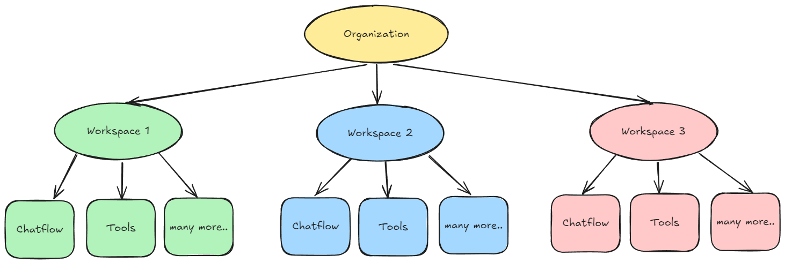

# 工作区


工作区目前仅适用于企业版。云专业版即将推出


首次登录后，系统会自动为您创建一个默认工作区。工作区用于在各个团队或业务部门之间划分资源。在每个工作区内，基于角色的访问控制 (RBAC) 用于管理权限和访问，确保用户只能访问其角色所需的资源和设置。

<figure><figcaption></figcaption></figure>

## 设置管理员帐户

<details>

<summary>对于自托管企业版，必须设置以下环境变量</summary>

```
JWT_AUTH_TOKEN_SECRET
JWT_REFRESH_TOKEN_SECRET
JWT_ISSUER
JWT_AUDIENCE
JWT_TOKEN_EXPIRY_IN_MINUTES
JWT_REFRESH_TOKEN_EXPIRY_IN_MINUTES
PASSWORD_RESET_TOKEN_EXPIRY_IN_MINS
PASSWORD_SALT_HASH_ROUNDS
TOKEN_HASH_SECRET
```

</details>

默认情况下，Flowise 的新安装需要进行管理员设置，类似于您最初为数据库设置 root 用户的方式。

<figure><figcaption></figcaption></figure>

设置完成后，用户将进入 Flowise 仪表板。在左侧边栏中，您将看到“用户和工作区管理”部分。系统已自动创建了一个默认工作区。

<figure><figcaption></figcaption></figure>

## 创建工作区

要创建新的工作区，请单击“添加新工作区”：

<figure><figcaption></figcaption></figure>

您将看到自己被添加为所创建工作区的组织管理员。

<figure><figcaption></figcaption></figure>

要邀请新用户加入工作区，您需要先创建一个角色。

## 创建角色

导航到左侧边栏中的“角色”，然后单击“添加角色”：

<figure><figcaption></figcaption></figure>

用户可以指定对每个资源的细粒度权限控制。唯一的例外是**用户和工作区管理**中的资源（角色、用户、工作区、登录活动）。目前这些资源仅供帐户管理员使用。

这里，我们创建一个具有所有访问权限的编辑器角色，以及另一个只有查看权限的角色。

<figure><figcaption></figcaption></figure>

## 邀请用户

<details>

<summary>对于自托管企业版，必须设置以下环境变量</summary>

```
INVITE_TOKEN_EXPIRY_IN_HOURS
SMTP_HOST
SMTP_PORT
SMTP_USER
SMTP_PASSWORD
```

</details>

导航到左侧边栏中的“用户”，您将看到自己作为帐户管理员。这由带有星号的人物图标指示：

<figure><figcaption></figcaption></figure>

单击“邀请用户”，然后输入要邀请的电子邮件地址、要分配的工作区以及角色。

<figure><figcaption></figcaption></figure>

单击“发送邀请”。被邀请的电子邮件将收到邀请：

<figure><figcaption></figcaption></figure>

单击邀请链接后，被邀请的用户将进入注册页面。

<figure><figcaption></figcaption></figure>

注册并以被邀请用户身份登录后，您将位于已分配的工作区中，并且不会看到“用户和工作区管理”部分：

<figure><figcaption></figcaption></figure>

如果您被邀请加入多个工作区，您可以从右上角的下拉按钮切换到不同的工作区。这里我们被分配到具有**只读**权限的工作区 2。您可以注意到“聊天流程”的“添加新”按钮不再可见。这确保用户只能查看，而不能创建、更新或删除。相同的 RBAC 规则也适用于 API。

<figure><figcaption></figcaption></figure>

现在，回到帐户管理员界面，您将能够看到被邀请的用户、其状态、角色和活动工作区：

<figure><figcaption></figcaption></figure>

帐户管理员还可以修改其他用户的设置：

<figure><figcaption></figcaption></figure>

## 登录活动

管理员将能够查看所有用户的每次登录和注销记录：

<figure><figcaption></figcaption></figure>

## 在工作区中创建项目

在工作区中创建的每个项目都与其他工作区隔离。工作区是逻辑上对组织内的用户和资源进行分组的一种方式，确保资源管理和访问控制的单独信任边界。建议为每个团队创建不同的工作区。

这里，我们在**工作区 1**中创建一个名为**聊天流程 1**的聊天流程：

<figure><figcaption></figcaption></figure>

当我们切换到**工作区 2**时，**聊天流程 1**将不可见。这适用于所有资源，例如代理流程、工具、助手等。

<figure><figcaption></figcaption></figure>

下图说明了组织、工作区以及与工作区相关联和包含在工作区内的各种资源之间的关系。

<figure><figcaption></figcaption></figure>

## 共享凭据

您可以将凭据共享到其他工作区。这允许用户在不同的工作区中重用相同的凭据集。

创建凭据后，帐户管理员或具有 RBAC 中“共享凭据”权限的用户将能够单击“共享”：

<figure><figcaption></figcaption></figure>

用户可以选择要共享凭据的工作区：

<figure><figcaption></figcaption></figure>

现在，切换到共享凭据的工作区，您将看到共享的凭据。用户无法编辑共享的凭据。

<figure><figcaption></figcaption></figure>

## 删除工作区

目前只有帐户管理员才能删除工作区。默认情况下，如果工作区内仍有用户，则无法删除该工作区。

<figure><figcaption></figcaption></figure>

您需要先取消链接所有被邀请的用户。如果您只想从工作区中删除某些用户，这将提供灵活性。请注意，创建工作区的组织所有者无法从工作区中取消链接。

<figure><figcaption></figcaption></figure>

取消链接被邀请的用户后，并且工作区中唯一剩下的用户是组织所有者，则“删除”按钮现在可以单击：

<figure><figcaption></figcaption></figure>

删除工作区是不可逆的操作，并将级联删除该工作区内的所有项目。您将看到一个警告框：

<figure><figcaption></figcaption></figure>

删除工作区后，用户将返回到默认工作区。开始时自动创建的默认工作区无法删除。
